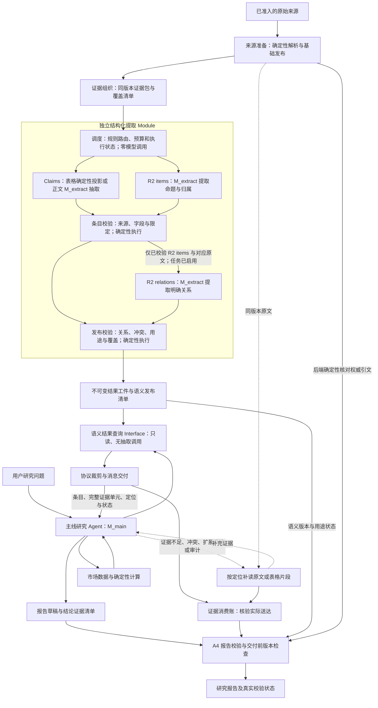

# Claims／R2 独立结构化提取：节点职责、数据契约与实施方案

- 日期：2026-09-28；修订：2026-10-02；执行约束补充：2026-10-08；状态校正：2026-10-09
- 状态：本文是原始架构方案基线；实现与多轮有界真实开发试验已经发生，当前执行真源为
  [实施规格](spec.md)和[任务 11](issues/11-bounded-live-trial.md)。截至 2026-10-09，质量门、relations、
  正向发布/query/delivery/context_use 与 M_main 消费仍未闭环，不得按本文旧时点描述为“尚未实施”，
  也不得据局部修复宣布生产可用。
- 依据：当前仓库实现、既有语料执行计划，以及 20260925-182401+0800-react-75c6 运行审计。

> **2026-10-08 当前执行约束**：本报告中“完整表格”“可验证表格”均须解释为已经独立核验完整、
> 并在不可变快照 unit metadata 中显式标记
> `table_consumption_status=verified_complete` 的表格。`reader-pdf-*` 产生但未经该核验的表格默认
> 仅供审计，packet 状态为 `partial`、原因为 `table_untrusted_or_incomplete`；不得进入 Claims、
> R2 items/relations、语义发布、查询或 M_main 上下文，也不得通过 prose dependency context 旁路。
> 这项限制不增加 OCR/reader 特例；表格目标若属于评分范围，仍按解析/路由/抽取缺口或 FN 计入，
> 不能因禁止消费而从分母删除。旧段落描述的是设计前提，与本补充冲突时以本补充及
> [实施规格](spec.md)为准。

## 1. 决策摘要

建议按以下顺序推进：**先固定来源、抽取角色和上下文，再用单独配置的结构化提取模型打通结果消费，最后比较候选提取模型。** 结构化提取模型独立于主线研究 Agent；主线模型只负责研究对话、证据选择和报告生成，不被抽取任务隐式复用。模型分工由准确率、遗漏率和最终研究效果决定，成本与延迟在质量过门后比较。

这不是重新发明 Claims／R2，也不是将 LLM 加入基础清洗成功条件。已有抽取规则、证据模型、用途校验继续复用；需要补齐的是统一证据输入、独立模型配置、受控执行与结果保存，以及研究 Agent 的查询路径。

本方案明确三个层次：**独立抽取 Module 是包含调度、角色执行和校验的整体；Claims、R2 items、R2 relations 是内部业务角色；M_extract 必须由用户在 `.env` 中通过独立的提取模型变量配置，不沿用主线 Agent 的 `OPENAI_*` 配置。首轮仅三个抽取角色共用这套 M_extract，后续可按角色显式绑定不同提取模型。** 调度节点本身不做一轮通用模型抽取。Claims 管理指标断言及其比较/计算资格，R2 管理命题、表达者、条件、风险和关系；主线研究 Agent 使用 M_main 消费发布结果。“共用”不包含主线 Agent，也不等于一次请求，混合材料可能需要多个角色分别调用，但每次调用都有明确任务和独立账目。

执行核查采用“一份冻结任务计划、两路执行记录、一个只读核查入口”，纳入现有调度和发布流程。记录按任务、调用、批次分层，支持单模型或多模型；首轮不建设第三条常驻处理链，也不增加重复抽取或逐条模型复判。核查执行与工件一致性，语义准确率和召回率仍由质量评测负责。

本轮核查判断的首要失败风险是：**流程全部成功，语义却不完整**。两路可能共同遗漏包外条件或脚注，而任务、引文和计账检查全部通过；这是设计风险判断，不是已测得的故障率。为此收紧五项契约：证据依赖与降级、两路同源快照、独立发布与查询一致性、items/relations 独立执行及派生任务、查询到主线上下文的召回。详见第 3.5—3.6、4.4、5.1、5.4、6.4 节，并纳入 W1—W5 验收；不以增加第三条模型复判链或主线一律重读原文替代这些要求。

首个交付目标：对一篇已准入研报，在来源版本不变的条件下，独立抽取并保存结构化字段、原文证据片段、精确定位和校验状态；研究 Agent 按问题直接使用已发布且证据充分的记录形成报告。原文补读仅在证据不足、冲突、语境歧义、需要扩展引用或显式审计时触发。抽取未完成时，Agent 明确看到缺口，仍可使用原文路径。

项目接线结论：**基本架构可接通，当前代码尚未形成新链路的完整闭环。** 不能以“抽取函数可调用”或“新查询返回了 JSON”作为接通标准。目标闭环是：同源快照 → 独立角色执行 → 语义工件发布 → 跨研究运行查询 → 实际上下文送达及证据消费登记 → 报告证据清单 → 最终报告校验。复用当前原文取证、消费账和 A4 报告检查，不增加平行报告校验系统；先用零模型回放验证接线，再在获准预算内验证真实模型。首轮产品入口及具体代码接缝见第 6.5 节，最小接通门见第 7.4 节。

本报告只提出方案、候选阈值和实施拆分。模型名称、试验样本、实际调用预算和生产存储方案未在本次执行中确定；没有新模型调用、数据库写入、配置变更或生产代码修改。本报告是专项设计输入，**不替代现有唯一跨层执行计划**，各实施项应并入其 R2-S0—S5 台账。

## 2. 当前事实、已有能力与待补项

| 项目 | 当前核验事实 | 对方案的影响 |
|---|---|---|
| 本次研究运行 | 20 轮、35 次工具调用；走 corpus_search → corpus_fetch → 主线阅读 → 市场数据与计算 → 报告。未执行 Claims／R2 抽取，也未消费其结果 | 不能把本次上下文开销全部归因于抽取角色混用；收益必须新增对照验证 |
| Claims 输入 | extract_claims 根据文件哈希查活动来源 units；build_evidence_run_from_units 将每个 unit 投影为 prose packet，context 为空 | 需要修复语境与表格结构传递，不能仅换模型 |
| Claims 抽取 | 有候选筛选、提示词、字段规范化、引文校验、冲突及用途检查；当前也接受 opinion 与定性候选；默认正文预算为 0 | 复用规则，将本试点默认职责收敛到指标断言，定性覆盖交给 R2；旧能力不因文档修订自动删除；deferred 不是无数据 |
| Claims 表格分支 | extract_evidence 对真正的 table packet 可按已有 cells 确定性生成记录；当前同源 units 入口却把全部 unit 投影为 prose | “表格无需 LLM”以结构化表格证据确实保留为前提，W1 必须先恢复类型、行列及脚注传递 |
| R2 抽取 | 有 MaterialRun、items/relations/speakers、JSON／JSONL／槽位模式；文件入口仍可独立构建证据；table packet 在材料抽取中被跳过 | 先归并同源输入；不能声称已有表格和全文关系理解 |
| 同源快照 | Claims 的活动 units 与发布日期分开查询；同源构建入口没有显式 build_id 参数，R2 文件入口仍独立解析 | 相同文件哈希不足以证明相同解析快照；W1 固定来源、build、publication 及证据清单，禁止两路各自解析“当前版本” |
| R2 角色拆分 | extract_relations=False 的处理仅位于 staged_jsonl 与 slot_protocol 同时启用的分支；关系执行仍嵌在整体抽取函数中 | 不能仅加并行调度或开关就声称角色独立；W2 提供独立 items/relations 执行契约，不支持的模式须在调用前拒绝 |
| 模型调用 | 抽取已有离线 SDK 调用入口，与 Agent 主循环不同；默认客户端仍读取 OPENAI_MODEL、OPENAI_BASE_URL、OPENAI_API_KEY，`.env.example` 和集中配置中尚无结构化提取专用模型项 | “调用路径分开”已经部分成立；需要把用户单独配置的结构化提取模型接入独立 profile，禁止继承主线模型和预算 |
| llm 注入 | Claims／R2 接受 llm 参数 | 可在现有接缝接入配置化 Adapter；只传 model 字符串不保证实际请求换模型 |
| 保存与回读 | save_evidence_run 拒绝旧 corpus_evidence_runs 写入；load_evidence_run 仍读旧表；现行评测可导出 EvidenceRun 工件 | 文件试点需要新的受控读取 Adapter 和发布索引；导出 JSON 不会自动接通旧加载器，不恢复旧写链 |
| Agent 消费 | 默认注册有 corpus_search/corpus_fetch，无 Claims／R2 专用消费工具 | 需要查询 Interface、工具注册、profile 和研究调用流程共同接线 |
| Claims 查询投影 | project_claims 主要按主体、类型、质量和用途过滤，并按 limit/offset 分页 | 不是完整的问题相关检索；W5 补关联证据成组返回、快照分页和查询召回验收 |
| 执行核查 | Claims 有 packet_runs、诊断和哈希；R2 有逐包记录及依模式产生的槽位覆盖账；旧 audit.py 面向旧表，私有 R2 审计仅支持 fake/replay | 当前尚无统一双路核查入口；复用已有状态与校验能力，补任务计划、真实 attempt 账及只读对账，不能把实验审计描述成生产能力 |
| 取证身份 | Claims 同源构建的 doc_id 使用 `cv2:<source_id>`；现行原文取证要求 `cv2:<build_id>` 与 `chunk:<chunk_id>` | 包 ID、页码或相同 cv2 前缀不能替代可解析句柄；必须建立精确引用映射 |
| 消费账与报告检查 | ConsumptionLedgerObserver 只采集 search/fetch；publish_boundary 对无 offered/fetched 的运行可直接 skip；默认 A4 模式为观测 | 新查询须接入送达登记和报告清单；skip/observe 不是校验通过，不能伪装成 fetch 调用来绕过适配 |
| 研究纪律 | research_discipline 仍要求写 evidence.quote 前先 corpus_fetch | 为携带已验证原文且确已送达的语义查询增加合法引用路径，保留搜索 snippet 不可直接引用的规则 |
| 工具返回裁剪 | _STRUCTURED_FITTERS 目前仅专门适配 corpus_search/corpus_fetch，通用运行时可回退字符截断 | 新工具须适配全程协议裁剪，验收位置是实际模型输入消息，不是工具函数返回值 |
| 产品入口 | apodex react 指向 stateful-react-agent/tui，工具来自 workflow profile；清单工具按检索工具伴随绑定 | 首轮锁定该入口，并验证注册、白名单、提示词、消费观察者和报告检查；不能假定只改注册表就全入口可用 |

特别说明：claims-interface 等早期文档里“默认抽取后保存到旧表”的描述已不能当作当前操作说明。以当前实现和退休矩阵为准。当前没有证据证明本次茅台研报之前完全没做过离线语义抽取；能确认的是这次运行没有展示生成或消费该结果。

## 3. 目标架构：节点、角色与模型的关系

### 3.1 默认数据路径与模块范围



这是目标数据依赖图，不是当前已注册 workflow 节点清单，也不要求每个框新增一个类或服务。调度节点管理 Module 内所有角色，包括满足条目依赖后执行 relations；图中省略预算与状态的控制连线。Claims 和 R2 items 可以并列执行，relations 必须等待其使用的 R2 items 通过条目校验。关系尚未完成不阻断可独立使用的条目发布，但该发布范围必须标注关系未覆盖。

三个需要 LLM 的角色默认通过同一个 `structured_extraction` profile 使用 M_extract。调度、证据组织、确定性校验、工件保存、查询和定位补读均不增加通用抽取 LLM 调用。Claims 表格分支在结构充分时使用确定性投影，也不消耗模型调用次数。

图中的 M_extract 表示首轮默认配置；改为多模型时按角色解析其冻结 profile，不改变上述数据依赖。调度和执行过程写统一执行账，轻量核查读取计划、执行账及结果工件；它位于业务数据路径之外，不是第三个抽取分支，也不是两个角色之间的新串行依赖。详见第 4.4—4.5 节。

实线表示默认数据或校验依赖，虚线表示有条件的主线原文补读。主线直接读取已保存且实际送达的证据片段即可分析和引用；核心结论、关键数字或生成引用本身不要求重新读原文。后端确定性解析权威原文核对引文不增加主线阅读上下文，不属于例行 Agent 补读，也不是另一条模型链。消费账须在真实消息交付后核验，不因工具返回成功就标为 delivered。离线抽样复核仍由评测流程负责；基础语料发布、语义结果发布和研究报告发布分别维护状态，任何一层发布都不等于语义绝对正确。

### 3.2 各节点的输入、输出和责任

| 节点/角色 | 输入 | 负责的输出 | 模型调用与责任限制 |
|---|---|---|---|
| 来源准备 | 已准入来源及元数据 | build、units/chunks、页码/表格/来源映射和解析缺口 | 零模型；不猜缺失内容；完成基础发布不依赖语义提取 |
| 证据组织 | 精确 build 的原文 units、表格结构、邻接语境 | 带类型、位置、内容指纹的证据包及覆盖分母 | 零模型；保留原文，不生成中间摘要，不丢限定条件 |
| 抽取调度 | 证据包、冻结路由规则、角色配置及批次预算 | 逐角色任务、输入引用、执行方法、attempt 与覆盖状态 | 零模型；不先做通用抽取，不执行研究判断 |
| Claims | 指标断言相关的正文或结构化表格包 | ClaimRecord/EvidenceFact：主体、指标、期间、值、单位、事实/预测、必要限定及证据 | 正文使用 M_extract；仅显式 `verified_complete` 的表格用确定性投影；不查询行情，不产生投资结论 |
| R2 items | 含命题、表达者、观点、条件、风险、否定或关系端点的证据包 | MaterialItem、MaterialSpeaker 及原文证据 | 使用 M_extract；保留必要数值语义，不负责标准数值的计算许可，不替来源补论据 |
| 条目校验 | Claims/R2 候选及同版本证据包 | 可用/待复核/拒绝条目与原因；供关系抽取使用的合格 R2 items | 零模型；检查来源、字段、归属/限定等可验证条件；不能声称覆盖所有语义错误 |
| R2 relations | 已校验 R2 items、对应原文及显式组织的必要语境 | MaterialRelation：端点 ID、方向、类型和关系证据 | 使用 M_extract；不重新生成 items，不靠共现推导因果；Claims fact_id 不直接充当 R2 端点 |
| 发布校验 | 已校验条目、候选关系、执行/覆盖记录 | 关系校验结果、跨角色关联/冲突、用途许可和可发布范围 | 零模型；不择优掩盖矛盾，不以两次模型输出相同作为真实正确的证明 |
| 结果保存与发布 | 通过发布条件的版本封装 | 不可变工件及候选/可用/待复核/撤回清单 | 零模型；文件存在不等于已发布，发布不覆盖来源 |
| 执行记录与轻量核查 | 冻结任务计划、逐任务/attempt 记录、结果及发布清单 | 两路进度、失败/未知、预算与模型分项账、工件一致性报告 | 写账由调度和执行端负责；核查只读、零模型，复用校验规则；不自动重试、重抽或代替质量评测 |
| 语义结果查询 | 来源/build、研究问题或筛选条件、用途、分页预算 | 相关记录、所附原文证据、版本、用途与覆盖状态 | 无抽取调用；只读已发布结果，不隐式补跑、不改变发布状态 |
| 消息交付与证据消费登记 | 查询/原文工具返回、各层预算及实际模型输入消息 | 完整证据单元与待确认/已送达/被裁剪状态，关联语义版本及原文范围 | 零模型；复用消费观察者，不把抽取成功、后端校验读取或函数返回当成 Agent 已读 |
| 报告清单与 A4 检查 | 报告锚点、证据引用、消费账、权威原文和语义发布状态 | 逐结论核验、引用/用途/版本问题及最终发布状态 | 确定性核验零模型；主线按反馈修订可消耗 M_main 预算；不代替抽取质量评测 |
| 原文补读 | 同版本来源句柄/locator、所需范围 | 精确原文/表格及必要邻接语境 | 零模型读取；仅按需调用；补读不自动修复持久化抽取结果 |
| 主线研究 Agent | 用户问题、已发布记录、必要市场观测 | 比较、推理和来源归属清晰的研究报告 | 使用 M_main；不接管后台抽取，不覆盖 M_extract 配置 |
| 市场数据与计算 | 明确标的、期间、指标和获准使用的数值 | 独立市场观测与可复核的确定性计算结果 | 不把报告预测自动当作市场实际值；跨层比较先做口径匹配 |

上述校验和发布步骤是责任划分，Implementation 可复用现有函数。调用方只接触有界抽取、已发布结果查询及按定位补读等小 Interface，内部路由、模型配置和版本校验不散落到主线提示词中。

### 3.3 Claims 的业务流程与能力范围

Claims 将来源中的指标断言变成可引用、在条件满足时可比较或计算的记录。其处理顺序为：

1. **绑定来源**：固定 source_id、build_id、原始 unit/cell 和来源元数据，保证引文与数值来自同一版本。
2. **选择执行方式**：仅显式 `verified_complete` 的完整表格按已解析 cell 投影；未经核验的 PDF reader 表格仅审计留存并记明确缺口。相关正文在预算允许时由 M_extract 按 Claims 契约抽取；依赖受阻表格的正文同步降级，无预算记 deferred。
3. **保留原始语义**：提取主体、指标、期间、数值/单位原文、事实/预测分类、必要限定和证据。`fact` 表示来源将其陈述为事实，不表示已经获得外部财报或市场数据认证。
4. **确定性规范化**：保留原始字段的同时解析标准指标、数值、单位和期间。明确的单位换算不等于推算来源未给出的增长率或利润率。
5. **校验与用途裁决**：核对引文、主体、期间、数值与单位绑定、指标注册情况及版本；产生质量状态、原因和 cite/compare/calculate 许可。缺字段仍可保留候选，不强补；指标未注册不等于没抽到，但不能自动放行通用计算。
6. **处理冲突并交付**：保留重复、分类或数值冲突及诊断，经发布流程选择可用范围，再由查询 Interface 返回给主线。

当前代码的 Claims 仍能生成 `opinion`，候选筛选也接受纯定性内容。本试点的目标路由把纯观点、评级、条件与风险的覆盖责任交给 R2，Claims 默认承担指标断言；历史 opinion 记录和旧契约保留，不在本次文档修改中删除。新路由须经过回归和覆盖验收，不能仅改提示词名称就宣称完成分工。

当前已有表格投影函数，但同源 units 入口尚未保留 table packet；当前 R2 也跳过 table packet。W1 必须补齐结构传递，并为确有语义提取需要的表格标题、脚注和说明组织可定位的原文输入。未完成前显式标注这部分未覆盖，不宣称所有表格均已零模型抽取或语义理解。

### 3.4 路由规则与允许的重叠

| 来源内容 | Claims 默认任务 | R2 默认任务 | 执行原则 |
|---|---|---|---|
| 单纯的指标、数值、期间表格，行列/单位齐备且已显式核验完整 | 按 cell 确定性投影 | 无独立语义需求时不调度 | 未标 `verified_complete` 的 PDF reader 表格仍禁止消费；同一获准 cell 不再用 Claims LLM 重抽；表格说明另按内容路由 |
| 正文中的指标数值陈述 | 抽取指标断言 | 需要归属、条件或关系端点时提取对应命题 | 记录是否需要双角色及原因 |
| 纯观点、评级、风险、条件、否定 | 默认不承担该语义范围 | 提取命题和归属，必要时提取关系 | 不为纯定性内容例行增加 Claims 调用 |
| 数值预测与风险/条件混合 | 保留数值预测及适用于它的限定 | 保留命题、表达者、风险/条件及明确关系 | 可双角色读取同一证据包，避免切割后丢掉条件 |
| 类型不明但可能有相关内容 | 作为候选保留 | 作为候选保留 | 有界规则可保守双路；预算不足记 deferred，不把不确定当作无内容 |
| 噪声、解析缺口或范围外材料 | 按原因不执行 | 按原因不执行 | 覆盖账区分筛选排除、不可读、范围外和预算未处理 |

首轮路由采用可版本化的确定性规则和冻结范围，不增加一个 LLM 分类/通用抽取前置节点。规则需要依赖结构、邻接语境和任务要求，不以“有数字”作为唯一判断；无法确认归属或关系需求时保守保留候选。路由漏选仍计入对应角色的召回损失，不能通过缩小分母掩盖。

Claims 与 R2 items 各自读取同源原文，不把 Claims 摘要作为 R2 的唯一输入，也不把 R2 的 value 字段直接投影为已获计算许可的 Claim。**一个模型配置可以对应多个请求；角色数、请求数、结果数必须分别统计。** 双角色处理混合语句属于有业务原因的重叠，调度节点先通用抽取再让两角色重抽属于本方案禁止的额外调用。首轮不引入单次联合输出替代两角色的协议；未来若试验联合抽取，须作为新的协议方案单独评测。

### 3.5 跨角色关联、冲突与失败传播

Claims 负责标准数值与用途许可，R2 负责表达者、命题和关系语义；共同来源字段均以原文和固定 build 为准。两角色都必须保留影响本条含义的否定、条件和事实/预测属性，不能借分工丢掉必要语义。

发布校验根据同一 build、原文位置及语义坐标建立跨角色关联；仅 locator 相同不足以断定是同一命题。同一段可以包含多个主体、指标和期间，无法确定映射时保留未关联状态。关联保留 Claims fact_id、R2 item_id 和各自运行版本，在发布封装中表达，不另造第三套断言 Schema，也不覆盖两个原始结果。

关联分为“确认对应同一来源命题”和“比较对应字段”两步。前者至少要求同一证据快照、可定位的命题跨度/cell，以及有原文支持的主体、指标/命题对象和期间绑定；再比较值、单位、事实/预测、否定、条件与归属。不同值或分类不得因匹配键不同而绕过冲突检测；若连主体或期间都存在歧义，保留疑似关联/待复核及原因，不强行合并。R2 缺少可验证的标准字段时，不能把自由文本 value 当作已规范化 Claims 字段。确定性映射规则、别名及允许的一对多拆分须版本化并有夹具；不得为了关联再隐式调用模型。**未关联或另一角色未完成不等于一致性检查通过**，也不自动否决本角色独立满足条件的用途。

对于确定可比且一致的记录，查询可合并展示原文证据，保留两类视图和 ID；不能把同一来源的两次提取当成两份独立证据。发生事实/预测、值、期间、否定或归属冲突时，保留冲突状态，撤去受影响的比较/计算资格；不能因为某角色是字段负责人就自动判它正确，也不能通过查询或主线补读静默改写发布结果。修复需经过受控重验/重抽并形成新版本。

Claims 失败不阻断独立合格的 R2 items，R2 items 失败也不阻断独立合格的 Claims；各自发布范围和覆盖状态必须清楚。relations 仅依赖其涉及的已校验 R2 items 与证据，端点缺失/被拒绝时不发布该关系；关系失败不使已有合格条目消失。一个角色的成功不能抵销另一个角色的遗漏。

例如来源写道：“本报告预计甲公司2026年营业收入100亿元；若需求恢复不及预期，上述预测存在下调风险。”Claims 保留收入、2026年、100亿元、预测属性及相关条件；R2 保留报告作者的预测、条件与下调风险，relations 只连接原文明确支持的命题。二者通过原文位置与命题匹配关联。主线可以直接使用所附证据，但不能把“本报告预计”改成“甲公司承诺”，也不能把同源 Claims/R2 当成双重独立确认。此例仅说明目标契约，不是已完成的抽取结果。

### 3.6 items 与 relations 的独立执行契约

以下是 Module 内部角色 Interface 的目标，不增加面向主线的抽取工具，也不要求新增常驻进程：

| 角色入口 | 固定输入 | 输出及禁止事项 |
|---|---|---|
| R2 items | 第 5.1.1 节证据快照、角色任务范围、冻结配置和预算 | items、speakers、逐范围覆盖及校验结果；只执行 items，不连带调用 relations |
| R2 relations | 明确 items run/校验版本及端点 ID 集合、同一快照的原文证据、候选关系清单和冻结配置/预算 | relations、关系范围及失败原因；不得重新生成 items、读取最新 items 替换输入或使用 Claims fact_id 充当端点 |

单独运行 relations 可以消费已保存且合格的 items，不要求先重跑 Claims 或 items；独立 items 结果可以在关系未覆盖状态下发布。items 被重抽、拒绝或撤回时，依赖旧端点的关系不得自动挂到新版本。支持的输出协议都必须满足相同角色隔离测试；尚不支持的模式在真实调用前明确拒绝，不能静默退回联合抽取。现有 MaterialRun 可继续作为工件容器，但必须明确其角色范围和上游版本，不能用容器名称掩盖耦合。派生关系任务的登记与预算约束见第 4.4 节。

## 4. 独立上下文、配置和执行预算

### 4.1 上下文隔离

每次抽取请求只携带：固定角色契约、当前证据包、必要邻接上下文、来源元数据、允许字段/关系类型、输出和覆盖要求。

不携带主线完整对话、用户资金持仓、主线投资倾向、其他材料结论、实时市场查询结果、参考答案和评分标签。用户问题只用于查询结果；首轮后台抽取不因主线看多或看空而改变处理范围。

相邻上下文只用于消歧。需要跨包引用时，必须由证据组织层先提供带来源位置的显式复合证据包，不能让模型把上下文拼接成伪连续引文。抽取返回只保留结构化结果、实际原文和运行诊断，不把中间对话或推理文本塞回研究上下文。

文档文本作为不可信数据处理；抽取角色不注册搜索、shell、写文件等自主工具。专用抽取不是启动另一个有完整权限的研究 Agent。

### 4.2 配置隔离

**配置来源固定为 `.env` 中独立的提取模型变量；profile 负责绑定和冻结这些配置，不替代独立配置要求。** 以下变量名是本方案的拟新增契约，尚未接入当前代码；实施时同步补充 `.env.example` 和配置加载/校验，不读取或改写用户真实密钥。

```dotenv
# 结构化提取专用；由用户独立填写，不引用或回退 OPENAI_*。
STRUCTURED_EXTRACTION_PROVIDER=
STRUCTURED_EXTRACTION_MODEL=
STRUCTURED_EXTRACTION_BASE_URL=
STRUCTURED_EXTRACTION_API_KEY=
```

主线仍使用自己的 `OPENAI_*` / Agent profile 配置；抽取配置加载器仅将上述专用变量绑定到 `structured_extraction`。provider、model、端点和认证按所选 Adapter 契约校验，必需项为空或无效时将模型任务标为未配置，零请求、零调用预算消耗；确定性处理、已发布结果查询和主线原文研究不因此被禁用。禁止缺值时读主线环境变量、复用主线客户端，或把专用变量写成对 `OPENAI_*` 的隐式别名。`.env` 是用户填写位置，不要求另外创建一份 env 文件。

在此基础上定义两层 profile，以下均为设计名称，不是当前已有配置键：

- 一个结构化提取模型 profile `structured_extraction`，从专用 `.env` 变量绑定 provider、model、端点与凭据引用，并管理请求参数、超时、输出上限及 Adapter 版本；
- 三个角色执行 profile：`claims`、`material_items`、`material_relations`，默认引用 `structured_extraction`，分别声明提示词/输出契约、调用预算、并发上限和角色级覆盖要求。

这样用户首轮在 `.env` 中独立填写一套提取模型配置，三个抽取角色共用其模型身份，各自记录预算与执行状态，并共同受抽取批次总预算约束；“首轮共用”绝不表示共用主线 Agent 配置。Claims 的确定性表格任务只记执行状态，不创建模型 attempt。若以后按角色拆分模型，必须为每个新增提取 profile 绑定明确的专用环境变量/凭据引用，再由角色 profile 显式选择；不能借修改全局 `OPENAI_*`、调用方默认值或运行中环境变化隐式切换。

多模型示例：`claims` 引用模型 A 的 profile，`material_items` 引用模型 B 的 profile；`material_relations` 也须显式引用选定 profile，可与 B 相同。A/B 是占位符，不预设供应商。两路仍使用相同执行记录契约，统一计账表示统一格式和汇总规则，不要求共用模型、客户端、价格或供应商配额。

任务启动前冻结有效模型配置快照及指纹，快照只含非敏感配置和凭据引用。运行中配置文件更新不改变已启动任务；恢复任务使用原快照，无法恢复时明确阻塞，不改用当前默认值。主动换模型重抽须生成新的 task_id/运行版本，关联原任务，并独立保留产物。批次汇总不能只用一个 model 字段概括全部调用。

首轮使用用户配置的结构化提取模型验证隔离；“与主线使用同一模型”仅可作为额外对照实验，不是默认方案，也不应成为缺少提取模型配置时的回退路径。主线 Agent 不能在查询语义结果时动态指定或覆盖提取模型。

有效模型身份从实际请求 Adapter 取得，记录请求模型、供应商响应模型（若提供）、模型 profile 指纹、角色 profile 指纹、提示词/输出契约版本。提取模型 profile 按整体解析，provider、model、端点和凭据引用不能逐字段回退或与主线配置拼接。禁止只修改 EvidenceRun.model 而实际请求仍读取主线 OPENAI_MODEL。结构化提取模型 profile 缺失或无效时返回明确的未配置状态，不创建调用、不消耗预算、不静默继承主线模型；需要有意复用同一物理模型时，也必须在提取模型 profile 中显式配置。

复用已有 provider/凭据管理能力，不在报告或结果工件中保存密钥。能力参数由 Adapter 显式适配；本地参数转换不计网络 attempt，实际发出的兼容重试必须重新核准并计账。首轮零自动重试同样适用于 SDK、包装器和参数兼容分支。

### 4.3 执行与资源隔离

首轮可采用独立任务/命令执行，无须立即新增常驻服务。批次级预算独立于主线研究预算，初始并发为 1，禁止从主线等待期间自动扩大到全库抽取。

模型调用由调度统一核准，在角色限额与批次总限额同时满足时执行；三个角色各自有剩余额度也不能突破批次上限。总模型请求数按 Claims 正文、R2 items、R2 relations 及获准的额外 attempt 求和，不把一个模型配置或一个证据包等同于一次请求。同源双角色调用记录路由原因和分别消耗的 token；调度、确定性表格投影、校验、保存及查询的抽取调用数均为零。

即使结构化提取模型与主线模型恰好来自同一供应商，也可能争抢限流配额，因此上下文独立不等于资源独立。抽取需要自己的信号量和速率上限；共享配额时主线优先，后台排队，不以主线延迟恶化换取后台吞吐。

请求前预留预算，完成后记录实际输入/输出/推理 token（供应商提供时）、延迟和费用。调用前计入 attempt，即使空响应、超时、参数兼容失败也不能漏账。进程中断后未完成 attempt 保留为不确定支出，不假定没有计费。首轮试验默认零自动重试；后续重试政策单独冻结。

并发时，角色与批次额度的检查和预留必须作为一次原子操作，避免两路同时使用同一剩余额度。限流按实际供应商/共享账户配额控制，模型 A/B 不同不代表配额一定独立。初始并发 1 是试点限制，不是两路的数据依赖；开放并发前用假响应验证预留、状态写入和汇总的一致性。

### 4.4 统一执行账：任务、调用与批次

以下字段是拟议记录契约，具体存储格式在 W2/W3 收敛；优先引用现有 PacketRun、MaterialPacketRun 和工件信息，避免复制一套抽取结果。Claims 与 R2 items 分别保留任务记录，R2 relations 作为有明确 items 依赖的角色任务记录在同一账中。

| 层次 | 最少记录内容 | 绑定原则 |
|---|---|---|
| 批次/计划 | batch_id、计划版本/指纹、证据快照、初始角色任务及路由理由、关系任务派生规则/范围/上限、角色到冻结 profile 的映射、总预算 | 执行前固定初始任务及派生规则，不预造尚不存在的 items ID；保留未开始及待依赖范围；汇总以 task_id/attempt_id 去重，按角色、模型和供应商分别统计 |
| 任务 | task_id、batch_id、角色、包/槽位范围、输入指纹、上游依赖、执行方式、冻结 profile 快照/指纹、状态及原因、开始/更新时间/截止时间、产物 ID/路径/哈希 | 角色与模型是独立维度；保存执行、协议/校验及发布状态，不用单一 complete 覆盖所有含义；确定性任务无模型 attempt |
| 调用 | attempt_id、task_id、尝试序号、配置指纹、实际请求模型及供应商、响应模型（若提供）、请求指纹、原始响应引用/哈希、时间、结果/错误、用量及费用口径 | 每次实际请求单独留账，兼容重试也计入；凭据及含密钥的端点不落账；响应模型不可得时记未知，不伪装成已确认 |

调用前持久化预留记录，收到响应后保存响应工件并关联 attempt，再记录解析、校验与产物。至少能区分未开始、执行中、延期、成功、失败、取消和结果未知，并保留原因；这些是设计语义，实施时映射到已有状态。没有响应或持久化中断时保留未知 outcome，不将其费用记零，也不由核查入口自动补发。恢复时使用既有 ID 和记录对账，避免重复计费统计和重复消费；需要另发请求时必须形成新的获准 attempt。

关系任务采用“冻结派生规则，依赖就绪后追加登记”：批次开始时固定关系启用范围、候选生成/分批规则版本、配置快照及任务/调用上限；items 校验后生成候选清单，记录父任务、items run/校验指纹、端点及证据快照，在任何关系请求前登记派生 task。清单追加留版本，不改写原始计划；恢复时按父依赖、规则和候选范围的稳定身份去重。无候选、items 不完整、关系关闭和超预算分别留原因，未就绪不能冒充“无关系”。派生任务仍受角色/批次原子预算约束，超出冻结范围须另立获准计划；核查入口只读规则与清单重放，既能发现漏登记/重复任务，也不把合规派生误报为计划外调用。

费用按每次调用对应的模型/供应商、价格版本和计费类别核算后汇总。保留输入、输出、缓存、推理 token 的供应商口径，避免把已包含在输出中的推理 token 再加一次。实付/供应商报告费用与本地估算分别标识；不同币种分开汇总，换算时记录汇率依据。缺用量、价格或费用时标为未知，显示已知小计及未知调用数，不能把不完整小计当成完整总费用。启用金额硬限额时，缺少可靠预留依据的调用不能假定零成本继续。

### 4.5 轻量核查入口及职责范围

首轮提供一个面向开发/运维的只读命令或 Interface，按 batch_id/task_id 读取上述记录，在执行中按需查询、执行后或发布前对账；不要求常驻监控服务，也不默认注册为研究 Agent 工具。核查功能复用现有解析/校验规则及版本，通过以下对照形成报告：

1. **计划对执行**：预期两路任务是否都有状态，哪些未开始、延期、失败或结果未知；不以成功产物数量作为覆盖分母。
2. **任务对调用**：每个 attempt 是否归属正确角色、配置和输入，调用/预算是否越限，实际模型是否与快照一致；保留分模型与供应商明细。
3. **响应对产物**：请求、响应、结果的引用/哈希是否闭合；需要复核时离线重放解析与校验，不再次调用模型。
4. **产物对发布**：来源版本、校验状态、关系端点及发布清单是否一致，跨角色检查是通过、冲突还是因另一路缺失而尚未完成。

报告分别展示执行状态、协议/校验状态、发布状态，并引用单独的质量评测结论；没有评测时标为未评测。执行成功、JSON 合法、哈希一致都不能推出语义准确或召回达标。超出截止时间且无结束记录时标为需核查/结果未知，不能仅凭日志缺少更新断言进程已经死亡。

旁路可以发现“计划中的任务没执行”，不能仅凭同一份计划证明“计划没有漏掉原文内容”。上游漏页、错误切包、未识别限定、错误路由可能被两路共同继承；即使离线重放结果一致，也不能消除这种共享盲点。证据依赖检查、独立于路由结果制作的原文金标，以及第 8.2 节查询交付召回共同补足验证，不把执行账的绿色状态升级为语义完整证明。

核查只报告问题，不改写账目、自动重试、重抽或发布；修复由已有调度/发布流程执行并留新记录。常规发布校验消费其一致性检查结果，受影响范围未通过时不得宣称完整可用；另一路独立合格范围仍按第 3.5 节处理。原文抽样和金标评测继续承担语义质量检验，不建设第三条模型复判链。

## 5. 抽取输入与返回内容的具体契约

### 5.1 先修证据组织，再比较模型

| 场景 | 证据包应提供 | 质量要求 |
|---|---|---|
| 正文 | 完整句子、必要小节标题、明确来源位置 | 不把否定、条件、年份与数值拆散 |
| 表格 | 表名、行名、完整列头、单位、年份、脚注和 cell 定位 | 数值与行列关系由来源支持；不能仅传扁平数字序列 |
| 跨页或续表 | 两端来源位置及明确连接依据 | 无法确认时保持部分可用/待复核 |
| 图形 | 可定位的图题、文字和已验证数据；无法读取的图形单独记缺口 | 刻度、图例不等于曲线数据 |
| 多表达者 | 已知署名/角色及所在范围 | 未知身份保留未知，不按出版社推断每条观点作者 |

试点先支持正文和可验证的原生表格，不引入自动 OCR、视觉理解或新的解析供应商。涉及这些能力的材料记作解析缺口，不让模型用常识补足，也不将此类失败全部归咎于抽取模型。

报告的 36 个 context_locators 不是天然的“必须抽 36 次”计划。应按完整论述和表格组织有界证据包，并保存从包到原始 units 的映射；覆盖分母来自所选材料范围，不来自成功调用数量。

#### 5.1.1 两路共用的不可变证据快照

来源准备后，通过一个快照入口固定 source_id、build_id、publication/准入元数据版本、声明处理范围、units/cells 及位置、解析缺口、证据包清单和 parser/packetizer/router 版本。快照指纹覆盖内容、类型、位置、上下文关联和元数据，不只计算正文字符串；相同文件哈希不能代替 build 身份。先保存快照再调度两路，角色仅接受精确快照引用，不各自查询 active build 或重新解析文件。

读取时使用一致性事务，或先固定不可变 build/元数据引用并完成一致性复验后封存；不得把不同时间读取的“当前正文”和“当前发布日期”拼成快照。构建中发生版本切换且无法证明一致时，快照失败、零模型调用，不降级拼接。快照形成后来源更新不改变进行中的任务；旧结果仅属于旧 build，是否仍可用于当前研究由查询选版决定。

Claims 与 R2 可以按职责选择不同证据包子集，但共享同一快照和原文坐标体系；子集及排除理由可追溯。来源证据的准备不依赖 Claims 已完成：即使沿用 EvidenceRun 容器，也要区分其 document 输入与 Claims facts 产物，不能以先完成 Claims 作为 R2 启动条件。

#### 5.1.2 证据依赖、可观测缺口与用途降级

“证据充分”限定为：本条记录已识别且影响其用途的必要依赖均有同版本原文支持；它不表示算法证明全文不存在其他限定。证据组织先按文档结构收集依赖，抽取/校验再核对记录所需依赖，至少执行以下规则：

- 正文保留所在标题层级、完整句子及有界邻接段；遇到“上述”“该预测”“仅在”“除非”等指代/条件线索，保存候选目标、查找范围及解析依据，不能只截取含数值的句子。
- 表格绑定表名、行列头、期间、单位、脚注标记与对应说明；续表依据表标识、列结构及位置连接。无法唯一连接、脚注目标缺失或预算装不下必要语境时保留缺口，不按最近文本猜测。
- 必要证据分散在多处时生成带各自 locator 的复合证据包；记录“条目—必要片段/限定”的关联和来源，不伪造连续引文，不仅依赖 relations 成功才保留条目自身限定。

发布封装逐条保存依赖引用、检查规则版本、已检查范围、未解决原因和语境状态，语义为“已识别依赖闭合／存在缺口／存在歧义”，具体枚举在实施时冻结。有缺口或歧义的条目不得取得受影响的 compare/calculate 许可；cite 仅可用于明确展示不确定性的原文摘引，不能作为已确认的完整预测或无条件结论。默认可用结果查询不把它们混成正常记录，应返回紧凑缺口提示和可补读定位；诊断路径可查看候选全文。状态闭合仍需通过字段、用途及质量门，不能单独作为正确性证明。

主线补读由这些可观测状态和当前问题的证据需求触发，不一律重读。规则未识别到的隐含依赖仍是残余风险，必须由原文独立金标、包外条件反例和离线抽样检测；不能承诺确定性检查发现所有语义遗漏。

### 5.2 复用已有结果 Schema，补充版本封装

Claims 继续使用 EvidenceRun / EvidenceFact；R2 继续使用 MaterialRun / MaterialUnderstanding，不重新创造第三套断言 schema。拟新增的发布封装至少绑定：

- source_id、精确 build_id、publication 引用和处理范围；
- 证据快照 ID/指纹，以及逐条必要证据依赖、语境状态、检查范围和未解决原因；
- 实际 evidence_run_id / material_run_id，角色、模型/profile、Adapter 和提示词版本；
- batch_id、task_id、关联 attempt_id 及冻结模型配置指纹，支持从发布条目追到实际调用；确定性产物标明执行方式，不虚构模型调用；
- parser/packetizer/router/validator 版本和输入内容指纹；
- 逐包/逐槽的角色任务、路由原因、执行方式、覆盖范围、缺口、失败原因及实际预算账；确定性执行与 LLM attempt 分开记录；
- 可验证的跨角色记录关联、一致/冲突/未关联状态，以及 relations 对已校验 items 和原文的版本依赖；
- 与同一 build 绑定的精确 locator、实际原文证据片段、字段质量及用途许可；片段保留必要否定、条件和归属，表格证据保留行列头、期间、单位及相关脚注；
- 工件校验和、候选/可用/待复核/撤回状态。
- 发布清单版本/父版本、条目与关系的精确版本组合，支持一致查询和撤回检查。

候选记录不能仅因 JSON 合法就发布。结构校验通过和抽取质量试验通过分别记录；当前程序的 complete 只代表限定范围执行状态，不能命名为“全文已理解”。

覆盖账按角色和所选范围分别解释：规则认定不属于该角色任务的范围记录路由理由；应处理但缺预算/配置的任务保留未处理状态；解析缺口保持 unknown；调用/协议失败保持 failed；关系未启用显式标为未覆盖。不能把这些状态合并成“无断言”，也不能因 Claims 已成功就把同包 R2 标为完成。确切状态枚举在实施时与现有契约对齐。

#### 5.2.1 对接现行取证句柄与坐标

发布封装中的 source_id 是来源身份，原文工具的 doc_id 必须是由固定 build 生成的 `cv2:<build_id>`，locator 必须映射到有效 `chunk:<chunk_id>`；不能直接转交现有 EvidenceDocument 的 `cv2:<source_id>`，也不能把 packet_id、页码或 element 当作 chunk 句柄。映射由证据准备/发布端从权威结构生成，不交给模型猜测。复用 preparation/read_pg.py 的句柄规则、ChunkEvidence 的 units/spans/source_ranges 和现有 cell 取证能力。

每段证据保存 build/chunk、unit/cell 身份、权威原文中的 code point 区间和逐字 quote，明确偏移所在文本；不要混用清洗文本、拼接文档、JSON 转义文本或 UTF-8 字节偏移。跨块条件、表头与脚注分段记录各自句柄，不能伪造一段连续引文；同一引文多次出现时用精确区间消歧。报告校验和消费账须使用同一映射，不能仍用首次字符串命中替代指定区间。无法映射或无法解析的条目保留候选/缺口，不发布为可引用证据；“每条已发布引用能经现有 resolver 回取并校验”是 W1/W3/W5 共同验收项。

### 5.3 面向研究 Agent 的返回格式

返回先放相关语义条目及足以支持该条目的原文证据片段，再放紧凑来源句柄、精确 locator、校验/用途状态和覆盖状态。证据片段必须来自已定位的原文，不能用模型改写的摘要代替；表格条目附必要行列头、期间、单位和脚注。大体量 spans/units 元数据按需获取。响应预算由 Interface 统一管理，不能截断 JSON，也不能把否定、条件或来源从条目中切掉；放不下则少返回条目并提供分页，不能只返回裸字段迫使主线逐条回取原文。

R2 条目返回表达者和必要关系；Claims 返回原始期间/单位、归一结果及用途状态。关联结果按第 3.5 节保留各自 ID、版本和冲突状态，复用证据展示不转移用途许可。它们不混入 market_quote 的市场观测，也不自动取得 cite/compare/calculate 全部权限。

主线无须知道提示词、JSONL、批大小和重试细节。拟提供两类操作：查询携带证据的相关语义结果、按明确记录的 locator 扩展读取相邻原文或表格片段。前者是默认路径；后者用于证据不足、冲突、语境歧义、扩展引用或显式审计，并记录触发原因与补读范围。已有证据和定位足以引用时，直接生成可追溯引用。生产选版和验证封装留在抽取结果 Module 内；诊断 Interface 允许固定 run_id 重放。拟议操作名称与签名在开发时收敛，本报告不把它们描述为已注册工具。

### 5.4 查询交付与证据成组返回

查询固定来源/build、发布清单版本、用途、问题/筛选条件和检索规则版本。首轮可复用现有词法与字段检索，不引入隐式 LLM 查询改写或重排；具体策略在 W5 冻结并单独测召回。后台已正确抽取不代表主线已经取得证据，不能只测工件而跳过实际查询 Interface。

相关条目命中后，沿已验证依赖带回其必要条件、否定、归属、脚注、冲突提示及明确关联风险，组成一个消费单元。必要限定即使没有命中查询词，也不能因排名低而丢弃；未建立的关系不凭空补齐，相关范围仍不确定时返回缺口。预算按消费单元裁剪；单个单元放不下时显式返回预算缺口和扩展读取方式，不能把没有限定的核心数字先当完整结果交付。查询排序不能默认只保留支持性观点，独立风险/反方条目仍需纳入检索验收。

返回同时说明角色处理覆盖、查询范围、筛选/用途排除原因、分页状态和未解决缺口，区分：未抽取或抽取失败；本次查询未命中；有匹配但本页未返回；声明范围已检查且未抽出支持条目。最后一种也不是“全文不存在风险”的证明；任何空数组都不能代替这些状态。分页游标绑定发布版本、查询指纹和排序版本，续页不静默换版；最终实际送入 Agent 的工具响应是查询交付召回的计量位置。

查询内部预算之外，还要适配 `plugins/tools/_overflow.py` 的结构化结果分派及选定 workflow 的结果后处理。新工具不得因未登记而落入字符 head-cap；每层均保持合法协议、完整证据单元、缺口和游标，放不下则返回明确预算错误。以经过所有裁剪、消息装配后交给模型的消息核验送达，测试覆盖“工具返回完整、运行时再次裁剪”的反例。只给函数结果做 JSON 校验或加大其 limit 不构成接通。

## 6. 结果保存、版本选择与 Agent 消费

### 6.1 首轮保存方式

采用独立实验目录下的不可变 JSON 工件和 manifest，复用现行评测工件回读经验。先保存原始响应及诊断，再生成候选语义结果，校验后生成可用清单。写入采用临时文件后原子替换；相同输入版本重复执行可识别已有结果，失败任务只补未完成范围。任务/attempt 账与结果工件分开持久化并互相引用；执行账需支持原子预留和恢复，不能只在结束时写 summary。结果未知的请求按第 4.4 节对账，不自动当作未执行重发。

不同模型或参数试验即使输入相同也保留独立 run；开发缓存命中不能被伪装成新的模型稳定性试验。存储中有内容并不代表已发布。撤回通过状态与发布清单控制，保留历史审计，不改写原工件。

后续生产 PG 保存设计须明确新对象、读写职责、版本迁移与回滚，再接入现有统一计划。不恢复已退休的 corpus_evidence_runs 写入口。文件试点也必须经过相同查询与用途检查，不能通过 read_file 让 Agent 直接吞未校验原始输出来冒充产品接线。

#### 6.1.1 启动、工件发现与跨运行读取

首轮由显式命令或受控调用启动抽取，输入至少包含精确来源/build 或快照、处理范围、角色配置、获准预算和工件根目录。具体命令名在 W2 冻结；当前语料 CLI 的基础准备命令和私有 fake/replay runtime 不应被描述为已经具备该真实双路入口。计划/检查可零模型执行，真正执行另经预算门；搜索、查询和研究启动不能隐式发起抽取。

工件根目录由项目级显式配置提供并记录在运行元数据中，抽取进程可写，查询进程只读同一受控目录；不得依赖临时 cwd、某次研究的 scratch 或仅抽取进程知道的路径。目录位于双方实际可访问的文件系统/挂载范围；缺配置或不可访问时返回明确错误，不尝试全盘搜索、旧表兜底或隐式重抽。具体目录尚未选定，本报告不修改权限或创建生产目录。

写端保存快照、raw 响应、运行工件、抽取执行账及语义发布清单；按 source/build/角色/运行版本建立可验证的发布索引，索引切换遵循第 6.4 节。读端通过文件 Adapter 解析精确版本，检查 schema、哈希、来源、用途及发布状态。不要调用仍读取旧表的 load_evidence_run 来加载新 JSON。缺失、损坏、版本不支持、权限不足、未发布和已撤回分别返回原因，不合并成“未抽出内容”。

模型 raw 响应、凭据引用及后台日志不作为普通 Agent 查询内容；研究运行只记录所用工件身份/哈希和语义发布版本。验收必须关闭抽取进程，再从不同研究运行目录启动查询，证明可跨运行发现和读取，而非依赖内存对象或私有路径。研究运行产生的证据消费账和报告清单仍归该研究 run，不写进语义发布目录。

### 6.2 来源版本与语义版本

显式建立 source_id → build_id → semantic_run_id 的关联，不能只靠字符串都带 cv2 前缀就认为句柄等价。选择规则应绑定来源版本、所需范围、角色/验证版本和发布状态，不直接取“最新一次”覆盖旧合格结果。

原文更新时旧语义结果不用于新 build；重抽失败保留旧版历史能力，但不能拿它冒充当前版本。解析或校验规则升级只使依赖它的语义结果需要重验，不触发无差别全库模型重跑。

### 6.3 Agent 的完整使用过程

1. 根据用户问题检索材料，取得明确来源和 build。
2. 查询该 build 范围内已发布的相关语义记录及覆盖状态，经协议裁剪进入实际模型消息，由消费观察者确认原文证据的送达范围。
3. 直接使用已送达的关键预测、观点、风险、归属及其原文证据片段；版本、用途和证据满足当前问题时，可据此分析、引用并形成报告草稿，无须重复读取原文。
4. 若记录冲突、语境存在歧义、证据不足以支持当前判断、需要更大引用范围或显式审计，按 locator 补读必要原文/表格及邻接语境，并记录原因。若语义结果不存在、过期或部分完成，明确未验证范围，按当前 build 的原文路径继续必要研究；无记录时使用来源句柄定位，不套用旧版 locator，也不推断“没有风险”。
5. 市场观测独立获取；跨层比较只有在标的、指标、期间、单位及必要时点匹配后进行。
6. 通过 corpus_submit_manifest 提交结论锚点、原文证据及依赖，并关联所用语义条目/发布版本；待送达确认后处理校验问题，修订草稿并按现有契约重新提交。
7. 最终报告经过 A4 检查，并按第 6.4 节只读检查已用记录的撤回/用途变化，记录检查时点、使用版本和真实校验状态；系统分析与来源陈述分开归属。

“语义失败不阻断原文研究”不等于“总能给出投资结论”；核心证据缺失时仍输出数据不足。主线没有权限通过查询动作隐式启动无预算模型抽取。

### 6.4 独立发布、后到冲突与查询快照

不可变工件之外，每次发布生成带父版本的不可变 manifest，明确 Claims/items/relations 的运行组合、用途、依赖、跨角色核查状态及未覆盖范围。首轮由单一发布写入者串行提交清单，完整校验后原子切换当前指针；以后若允许多写入者，必须校验预期父版本，防止后完成的一路覆盖另一条路刚发布的结果。单个 JSON 原子替换不等于多个工件和状态天然一致。

Claims 可以先形成部分发布 P1；R2 后到发现冲突时，发布 P2 保留冲突和证据、撤去受影响用途，并使依赖被撤回/拒绝 items 的关系失效，不改写 P1 历史。跨角色核查待完成不标为已通过，但独立满足证据和用途条件的条目仍可使用；“未关联”遵循第 3.5 节，不伪装成一致。

一次查询及其续页固定同一 manifest，缓存键也包含发布版本、查询及用途。旧快照可用于诊断复现，不自动代表当前仍可使用；续页遇到所需条目已撤回/用途收紧时，返回版本失效提示并要求显式重新查询，不能悄悄混入新版本或继续无提示交付失效内容。

报告交付前通过拟接入的查询/校验 Interface 批量只读检查实际使用的记录是否被撤回、用途收紧或依赖失效；这仅检查元数据，不触发原文重读或模型重抽。若发生变化，仅重新查询、修订受影响结论，证据确有缺口时才补读；无法确认状态时明确标记未确认，不能宣称完成有效性检查。记录检查时点与使用版本，不承诺其后永不撤回；已交付报告保留历史，不在首轮引入常驻追踪或自动改写。

上述“仅检查元数据”专指语义版本有效性检查，不替代 A4 对权威原文、引文区间、实际送达和报告锚点的确定性校验。后台 resolver 读源不回灌主线上下文，也不记录成主线 corpus_fetch 或已送达证据；后台读取开销与 Agent 补读分别统计。

### 6.5 接入现有证据消费与报告检查

#### 6.5.1 两类账目、两类清单

| 对象 | 回答的问题 | 归属与关联 |
|---|---|---|
| 抽取执行账 | 谁用哪个模型、预算和输入生成了什么？ | 后台 batch/task/attempt；关联语义工件，不证明 Agent 已阅读 |
| 语义发布清单（semantic publication manifest） | 哪些角色结果及用途可供查询？ | 工件根目录内的版本化发布索引；绑定来源/build/run 和撤回状态 |
| 证据消费账（ConsumptionLedger） | 哪些片段实际进入了本次 Agent 上下文？ | 研究 run 内；关联工具调用/消息、原文句柄/范围及语义记录/发布版本；仅出现字段或记录 ID 不算原文送达 |
| 报告证据清单（report evidence manifest） | 报告的哪些结论使用了这些证据？ | 由 corpus_submit_manifest 写入研究 run 的 corpus/manifests/，绑定 report_quote、消费证据及必要依赖 |

这些对象不是四条处理链，也不复制四份抽取结果。引用桥接复用现有消费账与报告清单，保留各自状态真源；语义发布 manifest 不能直接冒充报告清单，抽取成功也不能代替 delivered。报告证据的 `purpose=value/period/unit/header/footnote` 表示证据承担的作用，与 Claims 的 `cite/compare/calculate` 用途许可不是同一枚举；必须分别记录。条件、否定与归属依赖的受控表示在 W5 冻结，并贯通提交校验和报告检查，不把未知依赖标签静默丢弃。

#### 6.5.2 首轮入口与必须适配的代码接缝

首轮验收锁定 `apodex --mode react` 所用的 `stateful-react-agent` / `tui` 路径；不改默认主线模型，不由本次文档自动启用新工具。Agent Team、通用终端循环和其他 profile 在各自完成同等验收前均标为未验证，不宣称注册后全入口可用。

| 接缝 | 现有落点 | 必须满足的接线要求 |
|---|---|---|
| 工具注册与启用 | plugins/tools/__init__.py；workflows/stateful_react_agent/profiles/tui.yaml；apodex/profiles/react.yaml | 新查询既入注册表也入实际 workflow 白名单；react 的工具不由终端 profile 中另写 tools 列表控制；如扩展通用终端入口，另核 apodex/agent_tools.py 的注册及权限分类 |
| 清单工具伴随绑定 | plugins/tools/corpus_manifest.py::with_manifest_tool / CORPUS_RETRIEVAL_TOOLS | 仅启用新语义查询也能绑定 corpus_submit_manifest，不能靠同时启用旧 fetch 才偶然生效 |
| 合法引用路径 | plugins/corpus/research_discipline.py；MANIFEST_PROMPT_NOTE 及工具说明 | 允许“原文取证”或“已发布语义查询携带且已送达的原文”；保留 search snippet 禁止直接引用，不对充分证据继续要求例行 fetch |
| 协议交付 | plugins/tools/_overflow.py；workflows/stateful_react_agent/_runtime.py | 新工具进入结构化裁剪分派；必要限定/游标不会被后续 head-cap 破坏，见第 5.4 节 |
| 消费采集 | plugins/corpus/ledger.py::ConsumptionLedgerObserver | 识别新查询及其版本、证据区间与调用身份，按真实消息确认 pending/delivered；保留实际工具名，不伪造 fetch 事件，不把后台校验读取计作送达 |
| 结论证据与最终检查 | corpus_submit_manifest；ledger.py::verify_manifest / publish_boundary；stateful_react_agent/nodes/main_agent.py | 报告引用精确原文范围并关联语义条目/发布版本，检查送达、引文、用途和撤回；仅新查询活动也不能被识别成无 corpus 活动而 skip |

现有 A4 默认观测、部分异常 fail-open 的产品行为不在本次文档中擅自改成全局硬阻断。但本专项验收必须要求正例实际 verified，负例得到预期缺口/降级；skip、observe、基础设施错误或“报告已输出”均不等于过门，观测与 enforce 两种模式都要测试。若上线需要调整阻断策略，另列明确配置与行为决议。

查询适配不能绕过现有逐字取证和消息送达检查；校验失败时按问题类别修复：送达 pending 等待消息确认，版本失效重新查询，证据不足按需补读，无法支持则修改/移除结论。引文在原文中存在也不能证明整句报告被语义支持，报告支持率仍由第 8 节质量验收负责。

## 7. 分阶段试验：分别验证隔离、消费和模型选择

### 7.1 四组对照

| 组别 | 设定 | 回答的问题 |
|---|---|---|
| A：原文基线 | 主线模型 M_main、原文工具和冻结市场响应；不注入结构化结果 | 当前报告质量、原文补取量和上下文开销是多少？ |
| B：独立模型抽取 | 抽取使用单独配置的结构化提取模型 M_extract，固定独立角色、上下文、证据包和预算；结果先离线验收 | 独立提取模型是否能可靠产出？ |
| C：独立模型结构化辅助 | 主线仍使用 M_main；默认消费 M_extract 的合格结果及所附证据，仅在第 6.3 节条件触发时补读原文 | 结构化辅助相对 A 是否实际改善研究？ |
| D：候选模型替换 | 主线保持 M_main；抽取分别换候选 M_candidate_1、M_candidate_2，其余同 C | 哪个提取模型能替换 M_extract 而不损害质量？ |

A→C 衡量隔离抽取与消费的整体效果，不能单独归因于更换模型；C→D 才是抽取模型替换的对照。B 是离线质量检查，不与 A 的报告质量直接相减。

M_main 是主线模型，M_extract 是用户单独配置的结构化提取模型，M_candidate_1/M_candidate_2 是候选提取模型；它们都是占位符，不是具体产品推荐，也不与统一计划里的 M0—M6 阶段编号混用。先修好证据包与输出契约，再冻结模型对照输入。每次只换一个角色的提取模型：Claims → R2 items → R2 relations；避免同时换三个角色导致无法归因。若只配置一个 M_extract，则三个抽取角色默认共用它，但仍通过独立角色 profile 和预算执行。

### 7.2 控制变量

各组使用相同来源版本、原文工具、市场响应、用户问题、主线模型及主线预算。工具返回格式的改进先共同应用于 A/C/D，再冻结，避免把“正文前置”带来的改善算到结构化模型上。

C/D 使用相同的按需补读规则，记录是否触发及原因，不额外要求 C/D 对核心结论统一重读原文。离线质量评测中的原文复核单独计账，不混入主线消费 trace。

模型对照固定提示词、schema、证据快照、路由规则、关系任务派生规则和调用上限。Claims 只换其 LLM 分支，确定性表格处理保持不变；比较 R2 relations 模型时固定已校验的 items、实际关系候选清单与证据输入。替换 items 模型若改变候选任务或后续关系结果，应单列为上游变化的端到端影响，不能声称实际关系任务完全相同。必要的供应商协议适配记录版本；专门为某模型调提示词的试验另列为“模型+配置系统优化”，不混入只换模型的对照。

首次报告冷启动总成本和已有结构化结果时的查询成本。即使 temperature=0，也不假设完全确定；协议冒烟可单次，正式比较建议在预算允许时每个条件重复 3 次，报告均值、范围及关键错误是否复现。没有重复预算时标注单次结果，不能宣称稳定性优势。

### 7.3 样本与防止评测泄漏

先用本次茅台研报作为已知问题开发样本，重点检查首页、预测表、风险段落及附录标题/表格区别；它不能作为独立留出样本。

建议的试点目标为 12 份开发材料（公司 6、行业 3、宏观 3）和 8 份独立留出材料（公司 4、行业 2、宏观 2）。这是规模建议，不代表当前已具备相应文件和准入；不足时缩小可声称范围，不能重复使用同一材料充数。独立留出由单独流程维护，不打开仓库既有受保护留出集。

拆分按来源家族进行：同一报告修订、相同模板高重复正文、同标的紧邻重复报告优先放在同侧。留出不参与提示词、规则或门槛调优。所有原子断言/关系金标在看到候选模型输出前冻结；争议条目单列并裁定，不根据模型错法临时改分母。

覆盖：有/无数字观点、实际/预测混合、否定和条件、作者转述、单位量级、年/季/半年、表格脚注、证据不足、纯噪声和解析缺口。现行默认范围仍为公司/行业/宏观研报；纪要和个人记录可作为历史回归，不借本试点扩展正式准入。

### 7.4 最小链路接通门：先回放，再真实调用

零模型接线验收使用合成或已获准的固定 build/取证夹具，抽取与主线两侧均使用 fake/replay Adapter，不访问真实模型或生产库；主线回放仍经过首轮选定 workflow 的真实工具绑定、结果后处理、消费观察者和报告检查，而不是直接调用几个内部函数后手工填账。明确回放身份，不宣称验证了模型能力。

1. 固定证据快照和两路计划，回放生成 Claims/R2 items；需要的关系按固定 items 派生，未启用关系明确未覆盖。
2. 经实际文件 Adapter 校验、保存并发布；关闭写端，在不同研究运行目录重新发现同一版本工件。
3. 通过实际注册的查询工具取结果，经全部协议裁剪进入主线请求消息；消费账验证逐段原文实际送达，而非仅收到记录 ID。
4. 回放主线草稿和 corpus_submit_manifest 调用，完成 pending 到送达确认及报告锚点校验；语义版本/用途检查和 A4 引文检查均经过实际接缝。
5. 正例最终 verified，后台无模型请求，充分证据路径无例行 Agent corpus_fetch；另测仅启用新查询时既不漏清单工具也不跳过报告检查。
6. 用缺脚注、错误句柄、后处理截断、工件不可见、撤回和 resolver 故障验证失败状态；需要补读时确实走原文路径，不能把缺口改成无数据或自动重抽。

这部分属于 W1—W3 及 W5 接线夹具，可前置纳入 S2/S3 零模型门，不改变 S4 真实调用准入，也不宣告 S5 已完成。通过后再在分别获准的 M_extract/M_main 预算内运行真实单文档闭环；报告分开声明“回放接通”“真实模型接通”“语义质量过门”“生产验收”，不能互相代替。

## 8. 准确率、遗漏率及验收门槛

### 8.1 明确定义分母

对冻结范围先按角色制作人工参考集合 G（Claims 指标断言、R2 items 命题、R2 relations 关系），在对应角色内将候选集合 R 与金标一对一匹配：TP 为正确匹配，FP 为错误/无依据/重复输出，FN 为参考集合中未被正确覆盖的条目。Claims 的确定性表格结果与 LLM 正文结果分别报告后再汇总，不能把前者当作模型能力。

- 精确率 P = TP / (TP + FP)。
- 召回率 R = TP / (TP + FN)。
- 遗漏率 = FN / (TP + FN)。
- Claims 严格匹配要求主体、指标、值、单位、期间、事实/预测及必要限定一致，同时引文支持；不能只按数字相同匹配。
- R2 命题匹配要求含义、归属、否定和条件正确；关系匹配还要求方向、类型、端点与证据正确。
- 一条混合输出不能抵扣多个金标命题；重复输出单列重复率，并计入候选 FP，不以堆叠猜测提高召回。

同一来源陈述在 Claims 与 R2 中提供不同用途视图，不自动算作角色内重复，也不能在综合证据统计中算成两份独立来源。跨角色关联与冲突检测单独评估；因路由未选中本应处理的条目仍计该角色 FN，不能用另一角色命中来抵扣。

分别报告“模型原始候选质量”和“校验后可用结果质量”。校验拒绝错误候选可以提高可用精确率，但被拒绝而未补齐的必要条目仍计遗漏。非法响应/全空不能从运行统计删除；适用金标条目计 FN，协议失败单列。零输出的精确率记 N/A，召回为 0（有金标时），不能写成 100%。

### 8.2 抽取、原始材料覆盖与查询交付分别验收

1. **抽取召回**：输入证据包确实可读且在声明范围内的金标条目分母。用于比较模型能力；固定预筛跳过的可读范围也必须计入，防止只挑容易包。
2. **端到端覆盖召回**：原始材料中本次研究所需条目的分母。解析漏页、丢表或缺单位造成的遗漏也计入，另标原因。
3. **查询交付召回**：对冻结研究问题，以“已正确抽取、满足用途且与问题相关的金标条目”为分母，统计实际进入 Agent 工具响应的完整证据单元；缺少必要条件/归属的裸条目不算完整命中。另以原始材料中该问题所需金标为分母报告“原文到上下文”的整体召回，避免因为上游少抽而让查询指标虚高。分母为零记 N/A，不能写成满分。

因此，解析失败不会被误判为模型能力差，也不会从业务验收中消失。公司/行业/宏观、正文/表格、风险/条件等分组同时报告微平均和按文档宏平均，不用大量简单数字掩盖复杂材料失败。

逐项区分解析/切包遗漏、路由遗漏、抽取错误或遗漏、校验排除、检索未命中、排序/分页/响应预算遗漏，以及主线取得后未使用；人工原文参考集合不从候选包或成功任务反推。W0 冻结问题所需证据与关键限定，W5 冻结响应预算、排序/分页策略和查询验收标准；关键包外条件、脚注、反方及风险反例不得漏交付后仍判消费通过。查询参数的调整属于检索试验，不混入单纯模型替换收益。

### 8.3 候选阈值（实施前冻结，尚非已达成结论）

| 层次 | 建议试点门槛 | 不允许的解释 |
|---|---|---|
| 来源与关键正确性 | 发布记录来源匹配、引文可回取检查全部通过；受测样本中无关键错误漏放 | 零观测错误不等于真实错误率为零 |
| Claims | 可用条目严格精确率 ≥98%，抽取召回 ≥95% | 只测字段格式、不测期间与单位不算通过 |
| R2 命题 | 语义精确率 ≥95%，召回 ≥90%；风险/条件召回 ≥95% | 只抽观点、不抽反方和限制不能达标 |
| R2 关系 | 关系精确率 ≥95%，召回 ≥85% | 任意共现连边不算召回；未启用关系须显式未覆盖 |
| 协议/发布 | 空响应、截断、预算不足、错误引用、过期版本均不被标为完整可用 | 部分成功可以保留，但只能发布明确限定的部分范围 |
| Agent 端到端 | 无新增关键错误；关键证据召回相对 A 不下降；报告支持率达到预先冻结标准 | 主线上下文减少不能抵消事实错误增加 |

关键错误包括错主体、错年份/期间、单位量级错误、实际/预测混淆、否定/条件反转、错误归属、伪造引文、将未知覆盖说成没有数据。表内百分比仅是试点候选，不能据小样本直接宣布生产达标；各分组不足以评估时记“证据不足”。零错误时应附样本数及置信上界，例如独立近似下 95% 上界约为 3/n；同文档记录相关，正式区间按文档聚类估计。

质量分由人工校验参考集合与确定性规则共同产生；候选抽取模型不能同时充当唯一裁判。可用另一模型辅助找差异，但关键争议必须回原文裁定。

### 8.4 主线干扰与总成本

记录主线输入 token、工具返回字符、补读次数及原因/范围、无需补读即可完成研究的比例、上下文压缩次数、端到端延迟、报告证据支持率、关键遗漏，以及用户是否需要额外补问。查询结果携带的证据片段计入工具返回和主线上下文，不算额外补读；主线补读、后台 resolver 确定性核验及离线审计成本分别计账，报告清单驱动的主线修订计入 M_main 消耗。上下文 token 降低而证据支持下降属于失败。

分别列出：一次性/增量抽取成本、失败与重试成本、模型验证成本、每次研究成本和缓存命中率。抽取成本按角色拆分，另报同源双角色读取量及其路由原因、确定性表格处理量，便于识别无业务必要的重复调用。以模型候选在试验时的实际计费记录核算，不在本报告预设模型价格。

多模型成本按第 4.4 节从 attempt 逐项汇总，同时保留角色、模型和供应商三个维度。统一 token 数仅用于用量统计，不能乘一个统一单价作为批次费用；费用缺项或币种不可比时不得据此宣称已实现成本收益。

简化盈亏模型：若某来源抽取与校验总成本为 E，原文路径单次研究成本为 B，结构化辅助路径为 S，则忽略其他成本时复用 q 次的差额为 E + qS − qB。仅当 B>S 且 q>E/(B−S) 时才出现成本收益；报告规则升级、材料更新和缓存失效的敏感性。主线成本下降不代表总成本下降。

## 9. 模型分工与失败处理规则

先保持所有抽取角色使用用户配置的 M_extract，让隔离架构和消费路径可测。随后逐角色尝试候选提取模型：

| 试验结果 | 分工决定 |
|---|---|
| Claims 小模型达到质量门且总成本/延迟更优 | 可用于已验证材料范围内的 Claims |
| R2 items 达标但 relations 不达标 | items 与 relations 分开选型；不强行统一 |
| 平均分高但某类型风险/条件遗漏明显 | 限定适用范围，或该类继续使用更强模型 |
| 数值正确但归属或期间经常错误 | 不通过，不以格式正确率抵扣 |
| 结构化辅助对报告无明显收益 | 检查输入、查询相关性与展示；暂不扩大入库 |
| 原文缺失或证据矛盾 | 标记缺口/冲突，回来源处理，不靠模型升级补事实 |

首轮不做自动模型级联，避免成本和质量归因不清。后续若引入升级策略，只能基于已验证的可观测失败条件，并在独立预算内运行；保留两次输出和选择原因。程序可能发现协议错误，却未必发现语义遗漏，因此不能用“没触发升级”证明小模型结果正确，仍需抽样复核。

模型切换、提示词或验证规则更新都形成新版本；停用某角色/候选模型时停止调度并切回明确合格版本或原文路径，不修改已有来源与历史记录。

## 10. 实施工作包与验收产物

以下为专项工作包，不是新的并行进度真源。执行时映射进现有 R2-S0—S5。

已按 [本地 issue 规范](../../docs/agents/issue-tracker.md) 编制 [实施规格与任务索引](spec.md)，工作包细化为 `issues/01—11` 的独立任务文件。每票包含分诊状态、执行状态、R2-S0—S5 映射、依赖与外部门、范围/非目标、预期文件、交付/验收条件、命令及调用额度。具体状态和证据留在各票，阶段放行仍以唯一主计划为准；本报告不复制任务进度。

本段最初编制时只完成了任务拆分；当前执行状态以各 issue 的追加 Comments、证据 manifest 和第 13 节
为准。01—10 的零模型基础契约已实现，11 及后续有界开发试验曾在独立授权下执行；这不转授生产库、
发布或 M_main 消费权限。不能再把下表中的“交付物”文字当成未执行，也不能仅凭文件存在判定验收。

| 工作包 | 内容与主要代码落点 | 交付物 | 通过条件与依赖 |
|---|---|---|---|
| W0：冻结试点 | 核对来源版本、准入、范围、角色职责、路由规则、评测问题和分角色参考集合 | sample manifest、角色/路由矩阵、评分定义、批次及角色预算计划 | 开发/留出隔离；纯数值、纯定性、混合、类型不明均有预期；只读材料与标注范围明确。对应 S0 |
| W1：统一证据输入 | service.py、evidence_pipeline.py、material_semantics.py、preparation/read_pg.py；固定同源快照、表格/语境依赖及现行取证坐标映射 | 快照、包规划、依赖/路由夹具、build/chunk/unit/cell 和引文区间映射 | 不混读版本；只有显式 `verified_complete` 表格可达 Claims table 分支，其他 PDF 表格审计留存并显式降级；R2 脚注/说明不静默跳过；包外限定保留或降级；引用可被现有 resolver 解析，无模型。对应 S1 |
| W2：角色配置与执行 | 专用 `STRUCTURED_EXTRACTION_*` 环境变量加载/校验、配置 Schema/profile loader、`.env.example`、llm 注入接缝、claims.py 客户端及角色调度；独立角色入口、配置冻结、派生任务、执行账和原子预算预留 | 独立 env 配置示例、单/多模型 profile、冻结计划/派生规则、持久执行记录、回放 Adapter、分项费用账 | 主线配置完整也不能补齐缺失的提取配置；不隐式跨角色调用；固定 items 可独立生成关系；派生任务去重、配置不漂移、双限额有效、未知 outcome 不自动补发；主线配置不变。对应 S2 |
| W3：校验及工件回读 | 条目用途、跨角色映射/冲突、受控工件根目录与文件 Adapter、发布索引及第 4.5 节核查 | 不可变结果、覆盖/依赖账、semantic publication manifest、跨运行回读、对账报告 | 不走旧表加载器；漏任务/错来源/损坏/权限/撤回状态可区分；歧义不误合并、后到冲突及依赖失效可传播；发布无丢更新，核查零模型无修复。对应 S2/S3 |
| W4：独立提取模型有界试验 | B 组，先协议、后条目与关系 | 每包 raw/诊断/结果/成本、失败归因 | 先完成零模型检查，再使用 M_extract 依据冻结预算运行；不因结果差无限重试。对应 S4 |
| W5：Agent 最小接线 | 第 6.5 节接缝：react/tui 工具与伴随清单绑定、研究纪律、全程裁剪、ConsumptionLedger、报告清单和 A4；查询/分页及按需补读 | 零模型跨运行闭环夹具、实际送达 trace、查询召回、report evidence manifest 与验证结果 | 仅新查询不 skip、不伪造 fetch；充分证据无例行重读，引用和用途仍核验；裁剪/版本/缺口可见；正例 verified，observe 不冒充过门；市场响应固定。零模型夹具前置 S2/S3，真实消费验证归 S5 |
| W6：候选模型和独立留出 | C/D 组、逐角色替换与重复试验 | 模型分工矩阵、质量/成本/延迟对照 | 开发门先过；留出不调参；不足样本不得宣称普遍优势 |
| W7：生产化与增量 | 明确生产存储、语义发布、重新抽取、撤回与恢复 | 对象清单、迁移/恢复方案、运维指标 | 仅扩大通过范围；独立验收后接入常规后台流程 |

不并行改动主线默认模型、证据分块、提示词、检索策略和评分规则。W1—W3 的改动可以集中验证，但开始模型对照前必须冻结版本。

五项契约的实施门分别落在 W1（证据依赖及同源快照）、W2（角色入口与派生任务）、W3（关联与发布一致性）、W5（查询交付及消费有效性）。先做共享输入和用途降级，再验证独立执行与发布；开放两路并发前必须通过同源快照、派生任务去重和预算/发布并发夹具。不可把这些保障全部后移到 W7，也不要求先扩大模型矩阵才验证确定性契约。

项目接线细项沿用这些工作包，不新增平行主计划：W2 冻结显式启动入口和工件目录配置契约，W3 实现写入/发现/跨运行回读，W5 按第 6.5 节逐接缝验收。开发中可前置 W5 的回放接线测试；修订研究纪律仅为消除强制重复读取和清单冲突，不借此变更主线研究策略。真实 A/C/D 对照前共同冻结提示词与工具契约，避免收益归因混淆。

现有总计划的 S4 写有“建议最多 8 调用含 preflight、零重试”的首轮门。它是历史有界建议，不是本报告已经取得的新调用额度，也不足以完成上述整个模型矩阵。先计算每包 Claims、R2 items、关系和兼容请求的实际容量，再单列各轮预算；预算未定不启动真实调用。

## 11. 验证清单与具体例子

测试跨调用方实际使用的 Interface，不为内部每个小函数重复铺测试。优先锁定这些行为：

| 测验 | 期望 |
|---|---|
| 主线 M_main、抽取 M_extract 配置 | 录制请求证明各自命中正确模型；主线设置不变 |
| `.env` 只有完整主线 `OPENAI_*`，未配置或未完整配置 `STRUCTURED_EXTRACTION_*` | 模型抽取明确未配置、零请求，不读主线值补齐；原文研究、确定性处理与已有结果查询仍可运行 |
| 两套 env 使用不同测试模型/端点/凭据，再仅修改主线配置 | 录制 Adapter 证明抽取只接收专用变量，主线变更不影响抽取；测试用假凭据，日志和快照不暴露密钥 |
| 三个角色引用同一 `structured_extraction` | 请求审计显示相同提取模型身份、不同角色 profile/预算；用户无须重复配置凭据 |
| Claims 使用模型 A，R2 items 使用模型 B | 相同记录契约可按角色、模型、供应商汇总；每个 attempt 对应实际配置/请求/产物，relations 的配置也显式可查 |
| 执行期间更新模型 profile，随后恢复或换模型重抽 | 恢复沿用冻结快照；不能恢复则明确阻塞；主动换模型建立新任务/运行版本并关联历史，不重标旧结果 |
| 不同模型单价/币种、推理 token 已包含在输出中，或费用字段缺失 | 分模型及计费类别核算、不重复累计；币种分列或注明换算依据；显示已知小计及未知项，不按统一单价或零费用填补 |
| 两路并发争用最后一个调用额度 | 原子检查与预留只允许一个获准 attempt；另一个明确延期，批次及角色账无超额或重复汇总 |
| 调用预留后中断、响应收到但工件未成功保存 | 留存未决记录，不宣称成功或零费用；恢复核查不自动发请求，获准重试使用新 attempt_id |
| 冻结计划含未启动任务、缺失产物或实际模型不匹配 | 只读核查能定位差异；不能只读取成功 summary 宣称两路完成；不修改执行账或发布结果 |
| 调度、校验、保存和查询的调用账 | 无通用前置抽取、隐式补跑或校验 LLM；总请求可归属到已核准的角色 attempt |
| 行列头/期间/单位齐备的表格数值 | 同源入口保留 table 类型；Claims 确定性投影，无同一 cell 的重复 Claims LLM 调用 |
| 纯观点/评级/风险与混合数值条件句 | 纯定性默认进入 R2；混合句按需要双路并保存理由与限定；路由漏选计 FN |
| 任一角色仍有余额但批次总预算耗尽 | 不发生新模型调用，受影响任务显式未处理；确定性任务单独计账 |
| R2 items 被拒绝、缺失或版本不匹配 | 不生成/发布依赖无效端点的关系；不直接以 Claims fact_id 替代 R2 item_id |
| Claims 或 R2 单路失败，relations 关闭/失败 | 合格的独立条目仍可按范围发布；失败与关系未覆盖在查询结果中可见 |
| 同一 locator 包含多个主体/期间；同一命题有双视图 | 不凭位置误合并；保留事实/命题 ID 和版本；不把双视图算成两个独立来源 |
| 提取模型 profile 缺失、字段无效或凭据引用为空 | 返回明确未配置状态；零调用、零预算消耗；不回退到 M_main |
| max_calls=0、预算耗尽、SDK 兼容重试 | 计账准确；未处理范围显式 deferred；不发生隐式超额请求 |
| 文档含指令样式文本 | 只作为抽取内容；没有外部工具能力，不污染主线角色 |
| 2026E EPS 与 2025A EPS 同表 | 年份/预测归属正确；交换列或缺列头能被识别/降级 |
| “并未改善”“若复苏不及预期” | 否定与条件保留；不改写成无条件利好 |
| 引文出现两次、错误 packet/build、单位缺失 | 唯一定位失败或缺字段不放行成可计算记录 |
| 输出一半后截断、空数组、错误 JSON | 保留原始诊断；不能把协议失败算成无断言 |
| 进程中断后恢复、来源更新 | 不覆盖已完成结果；不把旧语义版本匹配到新正文 |
| 已发布记录含充分证据、有效定位和用途许可 | 主线可直接完成核心结论与引用；trace 无例行重复原文读取，引用绑定相同来源/build/记录 |
| 证据片段缺少必要条件、归属或表格脚注；需要扩展引用/审计 | 按 locator 补读必要片段及邻接语境，记录触发原因；仍无法消歧则保留不确定状态 |
| 查询响应预算不足 | 减少条目并分页，保留每条必要证据和限定；不以裸字段代替证据，不截断 JSON |
| 语义结果没有或关系未抽取 | Agent 能回原文并解释范围，不宣称无风险/无反方 |
| Claims 与 R2 对同一引文分类不一致 | 保留冲突，撤去不满足条件的用途，不择优掩盖 |
| 正文有“预计2026年收入100亿元”，包外脚注限定“仅在并购完成情况下”；两路响应、引文及执行账均合格 | 原文金标包含该条件；验证依赖组织能携带条件，缺失/歧义则降级并提示补读；仅因执行绿色就允许无条件结论的路径判失败 |
| “上述预测”有多个可能指向，续表脚注目标缺失或必要语境超预算 | 不猜最近目标，不补事实；保留定位/范围/原因，限制受影响用途，不假装依赖闭合 |
| 快照构建期间 active build 或 publication 切换；相同文本但 locator/表格类型改变 | 固定一致版本或在调度前失败；两路共享已封存快照；位置/类型变化进入指纹，不混合元数据 |
| 所有受支持协议执行 items-only；独立 relations 读取已保存 items | items-only 无关系请求；relations 不重抽 items/Claims；错误快照/端点版本或不支持模式在请求前拒绝 |
| items 就绪后派生关系任务，登记后中断再恢复；另有无候选/未就绪/超预算范围 | 派生规则与输入可重放，重复登记不新增逻辑任务；各种未执行原因分开；不绕过调用预留，不漏记任务也不误报计划外 |
| 同一命题两路数值不同；R2 字段不足以确认对应；同 locator 多命题 | 已确认对应者报冲突；歧义者保留疑似/未关联而非一致；字段差异不通过匹配键被静默丢掉 |
| Claims 先发布 P1，R2 后到发现冲突形成 P2；两个角色同时提交 | P2 收紧受影响用途且保留历史，失效 items 的依赖关系不可继续用；发布串行化或校验父版本，无丢更新 |
| 查询 P1 后发布 P2，继续分页或准备交付报告；已用条目被撤回/降权 | 不混版；受影响续页明确失效，交付前只读核验并修订相关结论；未受影响的证据不要求重读，检查时点可追溯 |
| 核心条目命中但限定不含查询词，或风险排序落在页外；完整证据单元超过响应预算 | 必要限定成组交付或明确预算缺口；独立风险计入查询召回；不能只凭后台已抽取判通过 |
| 未抽取、查询未命中、有匹配但未翻页、范围已检查但未抽出支持条目都产生空结果 | 返回不同覆盖/查询状态；没有一种空结果可直接推出全文无风险；在实际 Agent 工具响应计量召回 |
| 首轮 react/tui 真实绑定仅启用新语义查询，未调用旧 search/fetch | 伴随清单工具仍可用，消费账识别语料活动；报告检查不得 skip，充分证据正例 verified |
| 查询返回完整，通用工具层/运行时再次降预算或压缩消息 | 实际模型输入仍保留完整证据单元和合法协议，或显式预算缺口；未送达片段不记 delivered |
| Claims 旧式 `cv2:<source_id>`、页码 locator，或重复引文/跨块表头脚注 | 由确定性映射产生有效 build/chunk 和精确分段区间；无法映射则拒绝发布；不让模型猜句柄或按首次命中误认送达 |
| 充分证据语义查询 → 清单提交 → A4 核验，后端 resolver 读取原文 | 无例行 Agent corpus_fetch，后台读取不记作 Agent 已读；引文/用途/撤回校验仍执行，snippet 仍不能直接引用 |
| 抽取成功但新查询原文未送达，或清单只有语义记录 ID 没有证据链 | 不以执行账或语义发布清单冒充消费账/报告清单；报告不能 verified |
| 工件写完退出，切换 cwd 和研究 run 再查询；目录缺失/权限不足/哈希错误 | 通过显式根目录及发布索引读取；错误分类可追踪；不回旧表、不全盘找文件、不隐式重抽 |
| A4 观测与 enforce 模式、resolver 故障、引用已撤回 | 测得真实校验/发布状态；observe、skip、故障均不冒充成功，负例按预期降级/标明未验证；不擅改全局策略 |

茅台首样本至少检查：目标价/EPS 的来源归属；2025A/2026E 的区分；风险提示和宏观限制；正文现金流陈述与实际财报接口核验的区分；标题读取不冒充附录表格读取。审计中的 130 自然日/92 根日线、年末锚点错误另归市场口径与计算输入验证，不能用语义抽取成绩宣布它们已修复。

文档方案本身检查引用、状态表述、数量/公式和内部一致性。2026-10-02 的项目接线核查曾在现有 WSL 虚拟环境运行 `.venv/bin/python -m pytest tests/test_corpus_ledger.py tests/test_corpus_manifest_tool.py -q`，结果 **50 passed**；仅证明现有消费账和报告清单测试通过，不涵盖新查询、跨运行语义工件读取或新模型端到端闭环。本次整合未修改生产代码、未执行全仓测试、真实模型 preflight 或生产入库发布检查；后续实现须新增上述接线反例并按影响执行仓库检查。

## 12. 风险、继续条件与建议决定

首要风险假设是共享上游遗漏造成“流程全部成功，语义却不完整”：两路都只看到“预计2026年收入100亿元”，却未取得包外“仅在并购完成情况下”的限定；引文真实、数值正确、账目闭合，主线仍可能生成错误的无条件结论。旁路不是这种语义盲点的完整探测器。优先用第 5.1 节依赖/降级契约和第 11 节反例验证，再衡量模型与并行收益；不能根据文档已经补充这些要求就宣布风险消除。

| 风险 | 处理方式 |
|---|---|
| 两路共享不完整证据，执行成功被当成语义完整 | 必要依赖与已检查范围显式记录、缺口降级；金标来自原文而非任务计划；包外限定反例和查询交付验收共同把关 |
| 同文件被解析成不同输入或混读活动版本 | 单一不可变快照入口，绑定 build/元数据/位置/类型；一致性失败先阻断调度 |
| 单路先发布、后到冲突未传递给消费方 | 版本化 manifest、发布串行化/父版本检查、快照分页、撤回传播及交付前只读状态核验 |
| items-only 隐式跑关系，或派生任务漏账/重复 | 独立角色 Interface、协议能力前置检查、冻结派生规则、先登记后调用、稳定任务身份去重 |
| 正确抽取的条件/风险被查询排序或响应裁剪丢掉 | 必要证据成组返回、区分空结果原因、在实际工具响应测查询召回和原文到上下文召回 |
| 新查询绕过消费账/A4，或旧提示词强迫重复 fetch | 接通实际工具绑定、伴随清单、合法引用路径与消费观察者；仅新查询也进入报告检查；后台核验与主线补读分账 |
| 保存的 JSON 对下一次研究不可见，或取证句柄无法解析 | 显式工件根目录、文件 Adapter/发布索引、跨运行回读和 build/chunk/区间映射，缺失时明确降级 |
| 结构化 JSON 使 Agent 过度相信结果 | 返回实际原文证据、未知和用途限制；证据不足或冲突时按需补读，离线抽样复核检验质量；报告分清来源与系统判断 |
| 把独立抽取 Module 实现成额外通用模型节点 | 明确其包含调度和三类业务角色；调度零调用，所有 attempt 归属明确角色 |
| 过度去重使混合句丢掉条件，或双路输出被当成独立证据 | 保留必要双角色读取；按来源/命题关联，分别验收角色召回，不累加同源证据数 |
| 解析缺口被模型猜测填补 | 独立解析覆盖账；缺图、缺表明确保留，不升级为 source fact |
| 小模型高精确率来自少抽或全拒绝 | 同时统计召回、拒绝、失败和原始材料端到端覆盖 |
| 模型试验污染主线预算/配额 | 独立执行与并发控制、attempt 预算、后台优先级 |
| 多模型只记录批次 model 或核查扩成重复处理链 | 模型身份落到每次 attempt，任务冻结配置；核查只读既有计划/记录/工件，复用校验，零模型调用 |
| 来源或规则升级后错误复用 | 绑定精确版本和依赖指纹；缓存命中也检查用途与发布状态 |
| 方案扩成新的解析系统或知识图谱 | 首轮限定现有来源和单篇/两篇研究场景，复用 EvidenceRun/MaterialRun |
| 一个成功样本被当成全面验收 | 开发与独立留出分开；列出各类型样本量、失败和适用范围 |

建议执行顺序为 W0 → W1/W2/W3 与 W5 零模型接线夹具 → W4 有界真实抽取 → W5 真实研究消费 → W6 → W7。首轮接通范围为 react/tui 的单文档闭环，不等于全部入口或生产验收。进入下一步的依据是可复现的证据，不是模型输出看起来更整齐，也不是已有 50 项基础测试全绿。

最终交付应能回答四个问题：

1. 同一材料范围中，必要断言、风险和关系是否被准确取得，漏了哪些？
2. 抽取模型更换后，哪些能力保持，哪些类型需要更强模型？
3. Agent 是否实际使用这些结果，并在原文支持下改善报告？
4. 加上后台抽取、失败和更新成本之后，复用是否带来实际收益？

达到这些条件后，才将合格范围内的语义抽取接入常规后台处理。基础原文链始终保留独立可用性，主线研究不依赖某次抽取必然成功。

## 13. 2026-10-09 执行增补：material extractor 收敛状态

Issue 18 已不再停留在方案阶段。selector v1/v2 的真实执行证明：确定性微批和顶层终态账可以覆盖
487/487 槽，主要失败从“漏终态”收敛到模型/控制器字段轴不一致、结构残片和一个 transport
`outcome_unknown`。后续只对 35 个未闭合槽做了 4 次有界重试，没有再次重跑全部 487 槽；P4 与 P5
合计正好用完该轮 27 次授权尝试，relations 始终为 0 calls。

P6 将 P4 成功响应与 P5 修复响应按冻结坐标做零调用合成，得到 469 items、420 extracted、67
no-supported、0 failed，四包 completed。P7 将通用规范升到 `material-atomic-selector-jsonl-v5` /
`material-semantics-32` / `material-items-validation-v11`，并用同一 23 份 immutable responses 建立正式
plan/replay ledger：items parent 为 `succeeded / valid / accepted / candidate`，模型调用、生产库、发布、
query、delivery、context_use 均为 0。

原冻结 copper 目标金标未改：11 items / 4 relations。P7 的 items target recall、critical recall 与
attribution 都是 100%，历史严格 scorer 的 semantic target accuracy 为 9/11（81.82%），所以尚不能宣告
R2 命题质量过门。剩余差异不是继续扩大 prompt 词典的理由：一条是主持人 clarification 的真实
fact/opinion 与 claim/answer 分歧；另一条是“历史供货事实 + 未来合作预测”被新原子接口拆成两个 item，
而历史 compound-gold scorer 只选择一个 item。旧金标不是整篇负例全集，因此其余 458 个非目标候选
不能自动记作 FP，也不能据此声称整篇 precision。

逐条 items 裁定已写入
`evidence/18-material-extractor-replacement-20261009/p7-copper-selector-v5-zero-call/candidate-adjudications.agent-draft.json`，
状态明确为 agent draft，未冒充 xyl 签认。下一步顺序固定为：先签认或修订这 11 条裁定并决定原子组
评分口径；再单独授权最多 4 次 relation-only live trial；关系过门前继续禁止发布和主线消费。Claims
继续复用既有 xyl 签认，不重做金标。

本轮回归为核心/合约 137 passed，publication 回归并入后 150 passed；全量 corpus 1379 passed、17
skipped，仅保留两个既有环境失败（本地检索金标库 Recall@5=0/20；测试期待 reader-pdf-10 而当前为
reader-pdf-11）。Ruff 与 Pyright 均通过。完整执行证据位于
`evidence/18-material-extractor-replacement-20261009/p4-*` 至 `p7-*`。

## 14. 2026-10-09 执行增补：relation-only 门与 v4 零调用修复

P7 items 裁定经 xyl 签认后，P8 复用同一 accepted items artifact，没有重跑 23 个 items batch。关系
阶段冻结 269 个候选对，按 4 个 packet 各发送一次：4/4 succeeded、0 retry、96,046 tokens，四包均
completed，得到 190 条 present relation。整个阶段仍为 0 production database、0 publish、0 query、
0 delivery、0 context_use。

冻结的 4 条 copper relation target 中，历史 scorer 只报 1/4。逐条按原子端点核对后，capex answer
连接到同一主持人 turn 的重复 capex question atom；yield answer 由设备精度与工艺归因两个 atom 共同
实现；quoted yield 证据连接到工艺归因 atom。因此前三条都成立，人工草案口径为 3/4。Mitsui 的问题、
历史供货事实和未来合作预测三个 item 都存在，但 v3 未生成任何 answers candidate，属于确定性候选漏边，
不是 selector 把候选判错。候选存在条件下 selector 为 3/3。

这仍未达到关系召回 floor，也不能报告 precision。原 gold 是 selected target gold，不是整篇负例全集；
190 条 present 中的非目标边不能自动当假阳性。与此同时 70.63% 总接受率和 10/31、58/58、3/60、
119/120 的包间差异是明确校准警报，故继续阻断发布。

零调用回溯发现通用 bug：v3 在进入一个 answer turn 时预先收集该 turn 的所有 question item，导致末尾
“不知道这样讲您能理解吗”覆盖上一 turn 的真实业务问题。`material-relation-candidates-v4` 改为按原文
顺序更新 pending question。对相同 items artifact 的反事实结果是旧 269 边全部保留，新增 71 边，Mitsui
两个答案 atom 均获得正确 answers candidate。相关 211 tests passed，Ruff、Pyright 通过。下一步先在
零调用下剪枝新增边、修复 endpoint-group scorer，并补 formal ledger 的 accepted-artifact import seam；
不得把本次签认扩张成新的模型调用额度。

完整 corpus 回归为 1388 passed、18 skipped；仅保留此前两项环境失败：本地 golden Recall@5=0/20，
以及测试固定期待 reader-pdf-10 而当前环境为 reader-pdf-11。v4 未引入新的回归失败。

## 15. 2026-10-09 执行增补：v5 剪枝、原子端点评分与正式导入计划

xyl 已以“签认草案，开始执行”签认 P8 relation 裁定。随后所有工作均为零模型调用。v5 对 v4 新增的
71 条边做逐类反事实检查，没有用词频或目标金标做过拟合删除：仅删除 7 条指向同一个会务邀请
“下面有请电话尾号6161的参会人提问，请发言，谢谢”的 answers 边；其余 333 条候选全部保留。三井
真实业务问题仍与“历史供货事实”和“未来合作预测”两个答案原子分别形成候选，因此 v3 的漏边已在
确定性候选层修复。

历史 scorer 同时存在两个口径错误。第一，它把 compound gold endpoint 只映射到单个最高相似 item，
导致正确连接到同一问答 turn 内另一原子项的边被漏记；第二，一条 gold relation 被多个正确原子边实现时，
它按预测边累加 recall，可能超过 100%。`material-development-scorer-4` 保持 item 字段的一对一评分不变，
仅为 relation 建立同 speaker、speech role、statement role、packet/locator 和引文相似度约束下最多四项的
端点组，并按 gold relation 去重。重新读取 P8 不可变 payload 后，自动 relation recall 为 3/4（75%），
与签认人工裁定一致；缺失的第 4 条仍是 v3 没有候选的 Mitsui 边，不能把 v5 的反事实候选冒充已执行
selector 决定。

formal batch ledger 现已补上 accepted-artifact import seam。`AcceptedMaterialItems` 在 plan 内自包含
P7 的源 `RoleArtifact` 与 hash-bound `MaterialRun`，验证 snapshot、items-only、执行/协议/语境/质量均
通过；`method=imported` 的父任务预算恒为 0，执行时只生成带源 artifact ID 的新 ledger artifact，不会
调用 items 模型。合成 formal-ledger 回归证明一次完整流程只有 relation attempt，没有 items attempt。

P9 已冻结为 batch `batch:bf9f350d72d0d430be0eb8ede8c53a3ff07b1d40f6794bf4d223575929a5001e`：
claims=0、items=0、relations≤4，strict `complete_parent`，候选规则 v5。计划冻结产生 0 model requests，
尚未 execute。由此已消除“为了继续 relations 必须重跑 23 个 items batch”的架构负担；下一门只需决定
是否执行这一个有界 relation-only 计划。即使执行通过，整篇 relation precision 仍须另建可复用抽样分母，
不能从 selected-target gold 或 333 个未全量裁定候选反推。publication/query/delivery/context_use 仍为 0。
相关回归 231 passed；全量 corpus 文件测试为 1353 passed、48 skipped，仅保留 reader-pdf-10/11 的既有
环境版本断言失败。Ruff 与 Pyright 均通过。

## 16. 2026-10-10 执行增补：formal-ledger v5 relation live gate

P9 第一次 execute 验证了 imported items task：P7 payload 在同一 formal ledger 内成为
`succeeded / valid / accepted` 父工件，items attempt 为 0。但 P9 计划冻结时 CLI 没有显式 dotenv 参数，
三个公开 profile 都是 unconfigured，relation 因而在 attempt 预留前以 `CS_CONFIG_MISSING` 阻断；
reserved/actual attempts 均为 0。该计划保留为失败证据，没有在原地改写或重试。

为关闭这一接口缺口，CLI 增加 `--config-env-file`，只读取调用方显式给出的
`STRUCTURED_EXTRACTION_*` 文件；执行器改为仅验证实际会发模型请求的角色，不再要求未启用 Claims 或
`method=imported` 的 Items 恢复凭据。回归同时覆盖“只有 relation profile 配置、其它 profile 未配置”的
正式导入执行，证明角色隔离不是依赖全局配置偶然通过。

新冻结 P10 batch `batch:da6a70bbc4152430bf01a75201e198a1846146d51e0a99f1c2639b82559e3b78`
随后完成：items 仍为 0 attempt；relations 恰好 4 次，4/4 succeeded、0 retry、无 ledger finding。
usage 为 prompt 91,087、completion 30,924、reasoning 22,616、total 122,011 tokens；provider 未返回
可核成本，故成本记 unavailable 而非 0。

v5 冻结 333 个候选，selector 判 present 217 条，四包分别为 14/31、79/84、3/91、121/127。Mitsui
历史供货事实与未来合作预测两个答案原子都连接到真实 caller question，4 条冻结 target relation 均被
召回，`material-development-scorer-4` 报告 target relation recall 4/4。P8 已签认的前三条直接复用，
Mitsui 增量决定已形成 agent draft。

该结果关闭的是 selected-target recall 和“重跑 items 才能跑 relations”的架构问题，不关闭整篇
precision。217 条 present 中有 207 条落在选定 gold 端点范围外；即使 selected-endpoint 诊断为 0.8，
其中两条未匹配边也具有合理的 answer 语义，不能按非穷尽 gold 自动判 FP。包间接受率约 45.2%、
94.0%、3.3%、95.3% 仍显示明显校准差异。下一门是签认/修订 P10 增量裁定并建立可复用 relation
precision 抽样，而不是再次重跑抽取。publication/query/delivery/context_use 保持 0。
相关回归为 140 passed；全量 corpus 为 1354 passed、48 skipped，只剩 reader-pdf-10/11 的既有环境
版本断言失败。Ruff、Pyright 与 diff check 通过。

## 17. 2026-10-10 执行增补：可复用 relation precision 抽样

P11 未增加模型调用，而是从 P10 冻结的 333 个候选与 217 个 `present` 决定建立可重复分母。precision
只对预测为 present 的边抽样：19 条非 `answers` 稀有关系全部纳入，三个含 answers 的 packet 分别按
`sha256(sample_version | candidate_pair_id)` 固定抽取 3、5、5 条；另按 packet/type 固定 12 条
`absent` 决定作为漏召回哨兵。每条样本同时冻结候选 pair、原子端点字段和 controller 生成的逐字
`pair_window`，因此在 snapshot、items artifact、candidate rule 和 selector 决定不变时可跨修复轮复用，
不需要每次重造全量人工金标。

agent draft 在 32 条 precision 样本中接受 27 条。由于抽样有意过采稀有类型，27/32=84.38% 不能作为
整体 precision；按各层纳入概率展开后，点估计为 118/217=54.38%，诊断标准误 15.10 个百分点，normal
95% 区间为 24.78%—83.98%。该区间过宽，且裁定尚未签认，所以不能作为发布门。它的价值是以 32 条
而非 217 条人工判断确定主要误差集中在高频 `answers` 层：同一回答 turn 的后续主题被错接到旧问题，
以及只解释付款/提供邻近信息的 atom 被当成完整回答。

12 条 `absent` 哨兵中有 4 条明确漏边：直接列举全球厂商、对问题错误前提的纠正、回答剩余资本开支
的数值 atom，以及说话人对自己假设的显式修正。这 4 条是可复现的 false-negative 实例，但哨兵抽样不
是 recall 概率样本，不能写成 4/12 recall error rate。下一步不重跑模型：先为上述三类误差添加候选/
selector 回归并收紧判断口径；修复后先在不可变 P10 工件上做零调用差分。只有仍需作发布判断时，才
顺序扩展高方差 answers 层的人审样本。P11 全程 model attempts=0，publication/query/delivery/
context_use=0，签名字段保持空值。

## 18. 2026-10-10 执行增补：relation selector v2 零调用修复与计划冻结

xyl 以“签认P11 草案，开始执行”签认 P11。回查 5 个 false-positive `present` 与 4 个
false-negative `absent` 后，九个 pair 均已存在于同一个 candidate v5 集合；因此根因不是候选召回，
也不适合增加词面重叠剪枝。P12 保持 `material-relation-candidates-v5` 不变，把修复限制在 selector
语义接缝。

新协议 `material-relations-selector-jsonl-v2` 不改变任何输出字段、relation index、端点、类型、证据
selector 或 controller 生成规则。它明确要求 `answers` 的源 atom 自身解决目标问题谓词，同时承认数值、
名单、是/否和错误前提纠正都是直接回答；同一回答轮、主题相似、邻接和仅解释邻近结论不再足以判
answer。`challenges` 增加显式自我修正口径，并区分可以同时成立的不同维度事实；supports/conditions
继续要求明示连接。v1 提示词与协议仍保留读写兼容，新计划才选择 v2。

零调用重建继续得到同一 333-candidate identity。只应用已签认九条 oracle delta 时，5 条 present 改
absent、4 条 absent 改 present，整体从 217/116 变成 216/117；被删除关系与四条 target relation ID
交集为空，因此签认差分保持 target recall 4/4。该数值只证明修复规范覆盖已知错误，不代表 v2 模型
已经做到，也不构成新 precision 质量门。

随后冻结 batch `batch:3728b5fb95633c916e70706827709ef3f80572a71aa41f733d7e46cbc01d5b23`。
与 P10 相比，snapshot、签认 items import、角色、模型、candidate v5、items validation v11、strict
`complete_parent` 和 attempts 上限均相同；唯一业务配置变化是 relation selector v1→v2，其余变化均为
派生身份 hash。items 上限为 0，relations 上限为 4，冻结过程 model requests=0，plan 只保留 credential
reference。该计划没有 execute，必须另获最多四次真实 relation 调用授权。

聚焦语义/角色/账本/CLI/合约回归为 206 passed。全量 `tests/test_corpus*.py` 为 1385 passed、17
skipped；失败仍是既有环境状态：本地 golden 语料存在但 Recall@5=0/20，以及测试固定期待
reader-pdf-10 而当前为 reader-pdf-11。Ruff 与 Pyright 通过。截至本节计划冻结阶段，P12 model calls=0，publication/
query/delivery/context_use=0。

## 19. 2026-10-10 执行增补：P12 relation selector v2 有界实跑与否决

按 xyl 对“P12 最多 4 次 relation 调用”的明确授权执行冻结 batch
`batch:3728b5fb95633c916e70706827709ef3f80572a71aa41f733d7e46cbc01d5b23`。第一次使用相对
store root 的 preflight 在 attempt 创建前以 `CS_PATH_OUTSIDE_ROOT` 拒绝，模型调用仍为 0；随后使用
已核验的绝对根目录执行同一冻结计划。最终 items/Claims attempts=0，relations 恰好 4 次、4/4
succeeded、0 retry、无 ledger finding。usage 为 prompt 92,095、completion 28,303、reasoning
19,995、total 120,398 tokens；provider 没有返回可核成本，因此成本为 unavailable，不记成 0。

协议成功没有转化成质量提升。v2 在同一 333 个候选上把 present 从 P10 的 217 降到 141；与 P10
相比有 87 条 present→absent、11 条 absent→present。P11 已签认的 44 条复用样本上，P10 为
35/44（TP=27、FN=4、TN=8、FP=5），P12 为 34/44（TP=24、FN=7、TN=10、FP=3），净退化
1/44。九个已知错误只修复四个：它减少了三条已知 FP 并恢复一条已知 FN，但同时删除四条原本成立的
关系，并新增一条错误 present。整篇 precision 仍不可由该条件抽样估计，不能把 141 条 present 的下降
解释为 precision 改善。

四条冻结 target relation 从 4/4 降为 3/4。Mitsui 的“历史供货事实”和“未来合作预测”两个答案原子
均不再连接到真实业务问题；因此 v2 同时未达到签认回归门和 target recall 门。按关系类型回看，
supports/conditions 决定稳定，主要振荡集中在 299 个 `answers` 候选及少量 `challenges`。这说明继续在
逐 pair 提示词上增加通用语义条款，仍会让同一问题的多个原子答案相互独立竞争，无法可靠控制过删与漏接。

P12 因此记为协议/结构有效但质量失败：v2 保留为可审计实验协议，不进入新发布计划，也不触发 query、
delivery、context_use 或 M_main。下一步不再追加 prompt-only live trial，而是先做零调用架构修复：按每个
question 聚合相邻回答原子，让模型一次返回该 question 对应的 answer atom indices，再由 controller 展开
为现有不可变 relation pairs；supports/conditions 继续走稳定路径。该设计可在相同 P10/P12 工件和 44 条
签认样本上离线验证，只有通过既有回归与 target 门后才有资格另行申请新的有界调用预算。为防止新直接
调用方误用被否决的版本，selector 默认/`latest` 指针已退回 v1；v2 仍在协议白名单中，只用于不可变
P12 工件的读取、审计与 replay。相关语义、执行和合约回归 130 passed，Ruff、Pyright 通过，且 P10/P12
冻结 plan identity 均未改变。

## 20. 2026-10-10 执行增补：question-group answer selector 零调用实现

P13 没有继续修改 pair-level prompt，而是在 relation 执行 seam 新增实验协议
`material-relations-question-group-jsonl-v1`。candidate-v5、items validation、冻结端点及 pair identity
均不变。controller 按问题端点聚合现有 `answers` 候选；模型接口对每个问题只返回一次本地
`selected_answer_indices`。一个问题允许选择多个互补原子，也允许空列表。非 `answers` 关系继续使用
既有 pair-level terminal。模型不返回 pair ID、item ID、证据或 relation ID；controller 将索引展开回
原冻结 pair，并生成相同的逐字 `pair_window` 与 relation identity。缺失、重复、越界、重复 answer index
或非法字段均使 packet partial，不能静默解释成 absent。

在 P10/P12 相同的 333 个 candidate-v5 pair 上，299 个 `answers` pair 被完整且无重叠地映射到 66 个
question group；另外 34 个非 answer pair 保持原义务。需要模型返回的终态记录从 333 降到 100，减少
233 条（69.97%）。四包 prompt 总字符数从 P12 pairwise-v2 的 195,046 降到 127,133，减少 34.82%；
如果未来获准实跑，packet/call 数仍为 4，不通过拆小包扩大调用预算。

零调用 oracle 使用 P10 决定，并以 P11 已签认 44 例覆盖对应 pair truth。新 controller 从每个 question
group 的局部索引精确展开为预期的 216 个 present pair，44/44 签认例、9/9 已知错误修正和 4/4 target
relation 均保留；两次独立生成得到相同 summary hash。该结果只证明分组接口、终态账、pair 映射和证据
所有权正确，不证明真实模型会作出 oracle 选择，也不形成 precision 发布门。

新协议不是默认协议；v1 仍是默认/`latest`，P12 v2 只读兼容，P13 只标记为 experimental。P13 未冻结
live plan、未读取凭据、未调用模型，publication/query/delivery/context_use 均为 0。聚焦语义、执行、
CLI 与合约文件回归为 146 passed；全量 corpus 为 1389 passed、17 skipped，只保留既有的本地 golden
Recall@5=0/20 与 reader-pdf-10/11 环境版本失败。Ruff 与 Pyright 通过。下一门是复核 P13 证据后，
再决定是否冻结独立的有界 relation-only plan；现有授权不自动延续。

## 21. 2026-10-10 执行增补：P14 最终 relation-only 计划冻结

P14 已冻结为独立、不可变且尚未执行的最终有界计划。冻结 batch 为
`batch:391150525103650ff49af17a251091c0908e00bd299553d7108643c174f27a58`，计划阶段模型调用为
0。它继续使用 P12 的相同 snapshot、已接受 items artifact/payload、candidate-v5、validation-v11、
`complete_parent` 依赖策略以及 provider/model；Claims 与 material_items 的预算均为 0，只有
material_relations 允许最多 1 个 task、4 个 attempts。相对被否决的 P12，唯一有意变化是 relation
协议切换为 P13 验证过的 `material-relations-question-group-jsonl-v1`；Claims/items 配置、输入和范围
均保持不变。冻结计划只保存 `env:STRUCTURED_EXTRACTION_API_KEY` 引用，不内嵌凭据。

最终门槛在执行前一并冻结：四包必须 4/4 成功且不得 partial/failed；44 条签认例至少 40 条正确；
9 条已知错误至少 7 条正确；35 条此前正确样本最多回归 2 条；4 条 target relation 必须 4/4；不得出现
supports/conditions 系统性退化。执行后不得修改 prompt、gold、candidate/items 或 schema 来适配结果。
通过则关闭当前修复项，并另行申请最小正向消费接线；失败则关闭当前 model+extractor 路线，后续替换视为
新任务。P15 不存在，也不得用更多 prompt-only trial 延长本修复。

P14 当前没有 live store、响应或执行记录；publication、query、delivery、context_use 均未授权且为 0。
冻结核验确认 P12→P14 的差异仅落在 relation protocol/role-profile hash；计划 identity、工件哈希、门槛
哈希和两次差异摘要均稳定。`verify_plan.py` 的 Ruff 与 Pyright 检查通过。本节只记录计划冻结，不把它
写成真实模型质量通过；下一步必须由用户另行明确授权最多 4 次 relation 调用。

## 22. 2026-10-10 执行增补：P14 最终执行与路线关闭

按 xyl 对“开始执行下一步任务”的授权，P14 使用冻结 batch
`batch:391150525103650ff49af17a251091c0908e00bd299553d7108643c174f27a58` 执行。Claims 与
items 调用仍为 0，relations 恰好 4 次，未自动重试或扩张预算；四次 HTTP/model attempt 均成功完成。
usage 为 prompt 53,370、completion 14,189、reasoning 11,657、total 67,559 tokens。provider 未返回
可核价格，成本记为 unavailable，而不是 0。

协议终态没有过门。第 1、4 包完整，第 2、3 包分别有 9、6 条 non-answer `relation_result` 把关系类型
写进 `status`：合计 8 条 `challenges`、5 条 `supports`、2 条 `conditions`。冻结 Schema 只允许
`present` 或 `absent`，因此严格 parser 正确拒绝这两包；这不是网络丢包，也不是 question/pair index
展开错误。controller 没有把类型值自动归一为 `present`，也没有放宽 Schema 或用修改后的规则 replay。
最终 packet 状态为 2 completed、0 partial、2 failed；两个完整包残留 92 条关系，但该 payload 不完整，
不能发布或当作质量结果。

P14 的第一道门要求 4/4 completed、0 failed，因此已经失败；44 条签认例、9 条已知错误、35 条既有正确
项和 4 条 target relation 不再作有效质量计分。按照执行前已经冻结的终止政策，当前 model+extractor
路线到此拒绝并关闭，P15 不允许，也不能在本任务中通过 prompt/schema 修补或追加调用继续试验。任何
模型替换、确定性 relation 算法或协议放宽都属于新任务，必须重新授权范围和预算。publication、query、
delivery、context_use 与 M_main 正向消费仍为 0。

执行现场、四份 response object、失败 payload 和账本保持不可变；新增零调用审计只读复核对象哈希，
输出 execution summary、protocol audit 与 final decision。审计脚本 Ruff、Pyright 均通过。原冻结
README、plan、final gate 与 plan manifest 保持逐字节不变。

## 附录：依据与源码入口

下列链接均相对本报告所在目录，可在仓库内解析；优先以符号名定位，行号仅对应本次审阅版本。

- [领域术语](../../CONTEXT.md)：Claim、Evidence、材料处理覆盖、来源归属与系统分析。
- [本次运行核验报告](../trace-audit-20260925-75c6/review.md)；[机器核验结果](../trace-audit-20260925-75c6/results.json)；[已获取原文](../trace-audit-20260925-75c6/fetched-text.md)。
- [统一执行计划](../../docs/plan/claims-market-closed-loop-plan.md)：R2-S0—S5 与首轮预算门；保留历史记录，不把旧阶段状态当新完成证明。
- [基础入库重构设计](../../docs/plan/corpus-ingestion-rebuild-architecture.md)：零模型基础准备、同源下游语义消费。
- [退休与保留矩阵](../../docs/corpus-ingestion-retirement-matrix.md)：旧写入口拒绝、历史读取和工件路线。
- [CorpusService](../../plugins/corpus/service.py)：2042 save_evidence_run；2081 extract_claims；2135 understand_material；2195 claims_of。
- [抽取客户端](../../plugins/corpus/claims.py)：1025 build_default_llm，使用全局模型/端点环境变量和独立 SDK 调用。
- [Claims 证据流程](../../plugins/corpus/evidence_pipeline.py)：205 project_claims；276 _fact；493 extract_evidence；616 unit 投影；629 同源构建。
- [Claims 字段与规则](../../plugins/corpus/claims_detail.py)：输出契约、triage、规范化和 lint。
- [R2 材料理解](../../plugins/corpus/material_semantics.py)：324 MaterialRun；754 提示词；1434 记录校验；1687 关系校验；1848 抽取主循环。
- [实验性 R2 runtime](../../plugins/corpus/_r2_runtime.py)：显式标为私有试验执行，不是默认 service/CLI 链路；可借鉴其审计思路，不另接一套平行生产路径。
- [实验性 R2 执行账](../../plugins/corpus/_r2_audit.py)：离线调用预留、响应持久化及快照核验；仅支持 fake/replay，不代表 Claims/R2 真实调用已有统一执行账。
- [历史语料审计](../../plugins/corpus/audit.py)：针对旧表的只读核查；不直接作为新双链路状态真源。
- [Agent 工具注册](../../plugins/tools/__init__.py)：已有 search/fetch、inventory、报告清单等工具，尚无本方案的语义查询工具。
- [权威取证与坐标](../../plugins/corpus/preparation/read_pg.py)：build/chunk 句柄、ChunkEvidence 的 units/spans/source_ranges；语义证据须映射到现有可解析坐标。
- [证据消费账与 A4 检查](../../plugins/corpus/ledger.py)：ConsumptionLedgerObserver、verify_manifest、publish_boundary；送达不是抽取完成，默认观测不是验证成功。
- [报告清单工具](../../plugins/tools/corpus_manifest.py)：corpus_submit_manifest、with_manifest_tool、MANIFEST_PROMPT_NOTE；不能与语义发布 manifest 混用。
- [研究纪律](../../plugins/corpus/research_discipline.py)：当前引用前 fetch 要求须适配新的合法证据路径，不放宽 snippet 的使用限制。
- [工具结果裁剪](../../plugins/tools/_overflow.py)；[ReAct 结果后处理](../../workflows/stateful_react_agent/_runtime.py)：结构化协议须经过所有预算层后仍可用。
- [react 启动配置](../../apodex/profiles/react.yaml)；[tui 工具白名单](../../workflows/stateful_react_agent/profiles/tui.yaml)；[ReAct 主节点](../../workflows/stateful_react_agent/nodes/main_agent.py)：首轮实际产品接线与发布入口。
- [消费账测试](../../tests/test_corpus_ledger.py)；[报告清单测试](../../tests/test_corpus_manifest_tool.py)：本轮核查可复用的 50 项现有基础测试，不是新链路已完成证明。
- [本地 issue 规范](../../docs/agents/issue-tracker.md)：专项实施按 `spec.md` 加逐 ticket 文件管理，不建立单一综合 tickets 文件。

编写时参考 codebase-design 技能：以小 Interface 隐藏配置、预算、版本、状态和校验复杂度；用真实调用方相同接缝测试，用可录制/回放 Adapter 验证模型替换。
