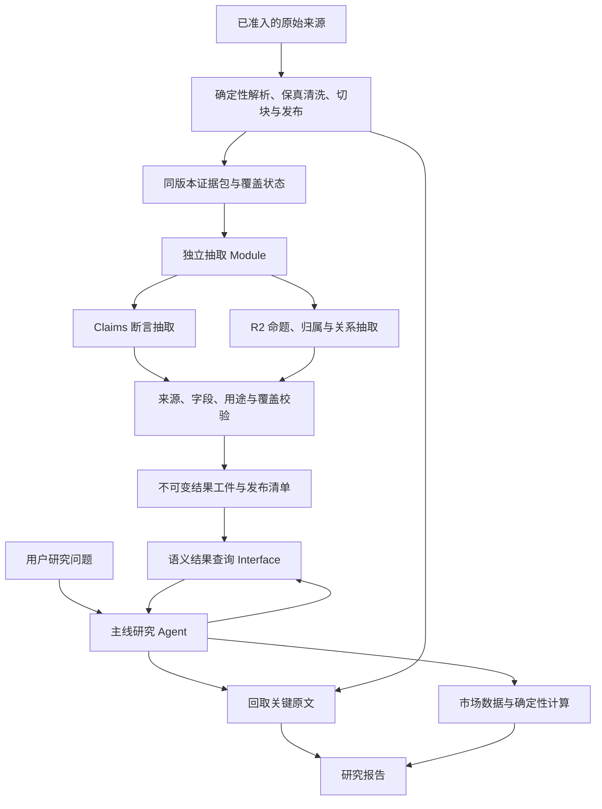

# Claims／R2 独立抽取角色与模型分工实施报告

日期：2026-09-28  
状态：方案细化，尚未实施、尚未进行新模型试验。  
依据：当前仓库实现、既有语料执行计划，以及 20260925-182401+0800-react-75c6 运行审计。

## 1. 决策摘要

建议按以下顺序推进：**先固定来源、抽取角色和上下文，再用同一模型打通结构化结果消费，最后比较不同抽取模型。** 模型分工由准确率、遗漏率和最终研究效果决定，成本与延迟在质量过门后比较。

这不是重新发明 Claims／R2，也不是将 LLM 加入基础清洗成功条件。已有抽取规则、证据模型、用途校验继续复用；需要补齐的是统一证据输入、独立模型配置、受控执行与结果保存，以及研究 Agent 的查询路径。

首个交付目标：对一篇已准入研报，在来源版本不变的条件下，独立抽取并保存可复核结果；研究 Agent 能按问题读取相关断言、观点、风险和来源，再回读原文形成报告。抽取未完成时，Agent 明确看到缺口，仍可使用原文路径。

本报告只提出方案、候选阈值和实施拆分。模型名称、试验样本、实际调用预算和生产存储方案未在本次执行中确定；没有新模型调用、数据库写入、配置变更或生产代码修改。本报告是专项设计输入，**不替代现有唯一跨层执行计划**，各实施项应并入其 R2-S0—S5 台账。

## 2. 当前事实、已有能力与待补项

| 项目 | 当前核验事实 | 对方案的影响 |
|---|---|---|
| 本次研究运行 | 20 轮、35 次工具调用；走 corpus_search → corpus_fetch → 主线阅读 → 市场数据与计算 → 报告。未执行 Claims／R2 抽取，也未消费其结果 | 不能把本次上下文开销全部归因于抽取角色混用；收益必须新增对照验证 |
| Claims 输入 | extract_claims 根据文件哈希查活动来源 units；build_evidence_run_from_units 将每个 unit 投影为 prose packet，context 为空 | 需要修复语境与表格结构传递，不能仅换模型 |
| Claims 抽取 | 有候选筛选、提示词、字段规范化、引文校验、冲突及用途检查；默认正文预算为 0 | 复用规则，显式计划有界抽取；deferred 不是无数据 |
| R2 抽取 | 有 MaterialRun、items/relations/speakers、JSON／JSONL／槽位模式；文件入口仍可独立构建证据；table packet 在材料抽取中被跳过 | 先归并同源输入；不能声称已有表格和全文关系理解 |
| 模型调用 | 抽取已有离线 SDK 调用入口，与 Agent 主循环不同；默认客户端仍读取 OPENAI_MODEL、OPENAI_BASE_URL、OPENAI_API_KEY | “调用路径分开”已经部分成立，“模型选择和资源配额独立”尚需接线 |
| llm 注入 | Claims／R2 接受 llm 参数 | 可在现有接缝接入配置化 Adapter；只传 model 字符串不保证实际请求换模型 |
| 保存 | save_evidence_run 拒绝旧 corpus_evidence_runs 写入；现行评测可导出 EvidenceRun 工件 | 先用明确的本地版本工件验证，不恢复旧写链 |
| Agent 消费 | 默认注册有 corpus_search/corpus_fetch，无 Claims／R2 专用消费工具 | 需要查询 Interface、工具注册、profile 和研究调用流程共同接线 |

特别说明：claims-interface 等早期文档里“默认抽取后保存到旧表”的描述已不能当作当前操作说明。以当前实现和退休矩阵为准。当前没有证据证明本次茅台研报之前完全没做过离线语义抽取；能确认的是这次运行没有展示生成或消费该结果。

## 3. 目标架构与角色职责

图中的独立抽取、结果发布和 Agent 语义查询是目标接线，不表示当前已实现。基础语料发布和语义结果发布分别维护状态。

| 角色 | 职责 | 不应承担的工作 | 主要结果 |
|---|---|---|---|
| 来源准备 | 保存原文身份、段落、表格、页码与缺口 | 用模型猜缺失数字或改写原文 | 已发布 build、units/chunks、来源映射 |
| Claims 抽取 | 识别断言、对象、指标、期间、原始数值和单位 | 查询行情、计算派生值、作投资判断 | 带引文的候选记录 |
| R2 命题抽取 | 识别表达者、事实/预测/观点、条件、风险、否定 | 把报告作者和被转述者混同；替来源补论据 | 原子命题及归属 |
| R2 关系抽取 | 判断限定范围内明确的支持、反驳、条件等关系 | 根据共现自由推导因果；构造跨文档结论 | 带证据的关系 |
| 确定性校验 | 来源定位、规范化、版本、冲突、用途与状态检查 | 宣称程序检查等于语义正确率认证 | 合格/待复核/拒绝记录与原因 |
| 主线研究 Agent | 选择证据、回读语境、比较来源、结合市场观测和用户约束 | 在研究对话中修复抽取协议或承担后台批处理 | 来源归属清晰的研究报告 |

Claims 与 R2 共用证据包，不是 Claims → R2 的串行摘要链。可并列处理；R2 关系必须基于已校验命题。两路对同一陈述有重叠时记录共同来源位置及一致/冲突状态，不覆盖来源、不自动合并成“唯一事实”。

## 4. 独立上下文、配置和执行预算

### 4.1 上下文隔离

每次抽取请求只携带：固定角色契约、当前证据包、必要邻接上下文、来源元数据、允许字段/关系类型、输出和覆盖要求。

不携带主线完整对话、用户资金持仓、主线投资倾向、其他材料结论、实时市场查询结果、参考答案和评分标签。用户问题只用于查询结果；首轮后台抽取不因主线看多或看空而改变处理范围。

相邻上下文只用于消歧。需要跨包引用时，必须由证据组织层先提供带来源位置的显式复合证据包，不能让模型把上下文拼接成伪连续引文。抽取返回只保留结构化结果、实际原文和运行诊断，不把中间对话或推理文本塞回研究上下文。

文档文本作为不可信数据处理；抽取角色不注册搜索、shell、写文件等自主工具。专用抽取不是启动另一个有完整权限的研究 Agent。

### 4.2 配置隔离

拟定义角色 profile：claims、material_items、material_relations。它们是配置设计名称，不是当前已有配置键。

每个 profile 显式绑定 provider、model、凭据引用、请求参数、超时、输出上限、并发上限、预算及 Adapter 版本。首轮三个角色可以使用同一模型，先验证隔离是否正确，不预设三个角色必须使用三种模型。

有效模型身份从实际请求 Adapter 取得，记录请求模型、供应商响应模型（若提供）、profile 指纹、提示词/输出契约版本。禁止只修改 EvidenceRun.model 而实际请求仍读取主线 OPENAI_MODEL。新角色缺配置时返回明确未配置状态，不静默继承主线模型；需要复用时在 profile 中显式引用。

复用已有 provider/凭据管理能力，不在报告或结果工件中保存密钥。能力参数由 Adapter 显式适配；不支持的参数转换、兼容重试都记录为真实 attempt。

### 4.3 执行与资源隔离

首轮可采用独立任务/命令执行，无须立即新增常驻服务。批次级预算独立于主线研究预算，初始并发为 1，禁止从主线等待期间自动扩大到全库抽取。

同模型同供应商也可能争抢限流配额，因此上下文独立不等于资源独立。抽取需要自己的信号量和速率上限；共享配额时主线优先，后台排队，不以主线延迟恶化换取后台吞吐。

请求前预留预算，完成后记录实际输入/输出/推理 token（供应商提供时）、延迟和费用。调用前计入 attempt，即使空响应、超时、参数兼容失败也不能漏账。进程中断后未完成 attempt 保留为不确定支出，不假定没有计费。首轮试验默认零自动重试；后续重试政策单独冻结。

## 5. 抽取输入与返回内容的具体契约

### 5.1 先修证据组织，再比较模型

| 场景 | 证据包应提供 | 质量要求 |
|---|---|---|
| 正文 | 完整句子、必要小节标题、明确来源位置 | 不把否定、条件、年份与数值拆散 |
| 表格 | 表名、行名、完整列头、单位、年份、脚注和 cell 定位 | 数值与行列关系由来源支持；不能仅传扁平数字序列 |
| 跨页或续表 | 两端来源位置及明确连接依据 | 无法确认时保持部分可用/待复核 |
| 图形 | 可定位的图题、文字和已验证数据；无法读取的图形单独记缺口 | 刻度、图例不等于曲线数据 |
| 多表达者 | 已知署名/角色及所在范围 | 未知身份保留未知，不按出版社推断每条观点作者 |

试点先支持正文和可验证的原生表格，不引入自动 OCR、视觉理解或新的解析供应商。涉及这些能力的材料记作解析缺口，不让模型用常识补足，也不将此类失败全部归咎于抽取模型。

报告的 36 个 context_locators 不是天然的“必须抽 36 次”计划。应按完整论述和表格组织有界证据包，并保存从包到原始 units 的映射；覆盖分母来自所选材料范围，不来自成功调用数量。

### 5.2 复用已有模型，补充版本封装

Claims 继续使用 EvidenceRun / EvidenceFact；R2 继续使用 MaterialRun / MaterialUnderstanding，不重新创造第三套断言 schema。拟新增的发布封装至少绑定：

- source_id、精确 build_id、publication 引用和处理范围；
- 实际 evidence_run_id / material_run_id，角色、模型/profile、Adapter 和提示词版本；
- parser/packetizer/validator 版本和输入内容指纹；
- 逐包/逐槽状态、覆盖范围、缺口、失败原因及实际预算账；
- 来源位置、引文、字段质量及用途许可；
- 工件校验和、候选/可用/待复核/撤回状态。

候选记录不能仅因 JSON 合法就发布。结构校验通过和抽取质量试验通过分别记录；当前程序的 complete 只代表限定范围执行状态，不能命名为“全文已理解”。

### 5.3 面向研究 Agent 的返回格式

返回先放相关语义条目和短引文，再放紧凑来源句柄、覆盖状态及后续取证位置。大体量 spans/units 元数据按需获取。响应预算由 Interface 统一管理，不能截断 JSON，也不能把否定、条件或来源从条目中切掉；放不下则少返回条目并提供分页。

R2 条目返回表达者和必要关系；Claims 返回原始期间/单位、归一结果及用途状态。它们不混入 market_quote 的市场观测，也不自动取得 cite/compare/calculate 全部权限。

主线无须知道提示词、JSONL、批大小和重试细节。拟提供两类操作：查询相关语义结果、按明确记录回取证据。生产选版和验证封装留在抽取结果 Module 内；诊断 Interface 允许固定 run_id 重放。拟议操作名称与签名在开发时收敛，本报告不把它们描述为已注册工具。

## 6. 结果保存、版本选择与 Agent 消费

### 6.1 首轮保存方式

采用独立实验目录下的不可变 JSON 工件和 manifest，复用现行评测工件回读经验。先保存原始响应及诊断，再生成候选语义结果，校验后生成可用清单。写入采用临时文件后原子替换；相同输入版本重复执行可识别已有结果，失败任务只补未完成范围。

不同模型或参数试验即使输入相同也保留独立 run；开发缓存命中不能被伪装成新的模型稳定性试验。存储中有内容并不代表已发布。撤回通过状态与发布清单控制，保留历史审计，不改写原工件。

后续生产 PG 保存设计须明确新对象、读写职责、版本迁移与回滚，再接入现有统一计划。不恢复已退休的 corpus_evidence_runs 写入口。文件试点也必须经过相同查询与用途检查，不能通过 read_file 让 Agent 直接吞未校验原始输出来冒充产品接线。

### 6.2 来源版本与语义版本

显式建立 source_id → build_id → semantic_run_id 的关联，不能只靠字符串都带 cv2 前缀就认为句柄等价。选择规则应绑定来源版本、所需范围、角色/验证版本和发布状态，不直接取“最新一次”覆盖旧合格结果。

原文更新时旧语义结果不用于新 build；重抽失败保留旧版历史能力，但不能拿它冒充当前版本。解析或校验规则升级只使依赖它的语义结果需要重验，不触发无差别全库模型重跑。

### 6.3 Agent 的完整使用过程

1. 根据用户问题检索材料，取得明确来源和 build。
2. 查询该 build 范围内已发布的相关语义记录及覆盖状态。
3. 读取关键预测、观点、风险和归属，并回取支持核心结论的原文。
4. 若语义结果不存在、过期或部分完成，明确表示未验证范围；按原文路径继续必要研究，不推断“没有风险”。
5. 市场观测独立获取；跨层比较只有在标的、指标、期间、单位及必要时点匹配后进行。
6. 最终报告记录实际使用的语义版本和原文来源；系统分析与来源陈述分开归属。

“语义失败不阻断原文研究”不等于“总能给出投资结论”；核心证据缺失时仍输出数据不足。主线没有权限通过查询动作隐式启动无预算模型抽取。

## 7. 分阶段试验：分别验证隔离、消费和模型选择

### 7.1 四组对照

| 组别 | 设定 | 回答的问题 |
|---|---|---|
| A：原文基线 | 主线模型 M0、原文工具和冻结市场响应；不注入结构化结果 | 当前报告质量、原文补取量和上下文开销是多少？ |
| B：同模型独立抽取 | 抽取也使用 M0，但固定独立角色、上下文、证据包和预算；结果先离线验收 | 隔离后的抽取器是否能可靠产出？ |
| C：同模型结构化辅助 | 主线仍 M0；消费 B 的合格结果并可回读原文 | 结构化辅助相对 A 是否实际改善研究？ |
| D：候选模型替换 | 主线保持 M0；抽取分别换候选 M1、M2，其余同 C | 哪个角色能换模型而不损害质量？ |

A→C 衡量隔离抽取与消费的整体效果，不能单独归因于更换模型；C→D 才是抽取模型替换的对照。B 是离线质量检查，不与 A 的报告质量直接相减。

M0/M1/M2 为占位角色，不是具体产品推荐。先修好证据包与输出契约，再冻结模型对照输入。每次只换一个角色的模型：Claims → R2 items → R2 relations；避免同时换三个角色导致无法归因。

### 7.2 控制变量

各组使用相同来源版本、原文工具、市场响应、用户问题、主线模型及主线预算。工具返回格式的改进先共同应用于 A/C/D，再冻结，避免把“正文前置”带来的改善算到结构化模型上。

模型对照固定提示词、schema、证据范围和调用上限。必要的供应商协议适配记录版本；专门为某模型调提示词的试验另列为“模型+配置系统优化”，不混入只换模型的对照。

首次报告冷启动总成本和已有结构化结果时的查询成本。即使 temperature=0，也不假设完全确定；协议冒烟可单次，正式比较建议在预算允许时每个条件重复 3 次，报告均值、范围及关键错误是否复现。没有重复预算时标注单次结果，不能宣称稳定性优势。

### 7.3 样本与防止评测泄漏

先用本次茅台研报作为已知问题开发样本，重点检查首页、预测表、风险段落及附录标题/表格区别；它不能作为独立留出样本。

建议的试点目标为 12 份开发材料（公司 6、行业 3、宏观 3）和 8 份独立留出材料（公司 4、行业 2、宏观 2）。这是规模建议，不代表当前已具备相应文件和准入；不足时缩小可声称范围，不能重复使用同一材料充数。独立留出由单独流程维护，不打开仓库既有受保护留出集。

拆分按来源家族进行：同一报告修订、相同模板高重复正文、同标的紧邻重复报告优先放在同侧。留出不参与提示词、规则或门槛调优。所有原子断言/关系金标在看到候选模型输出前冻结；争议条目单列并裁定，不根据模型错法临时改分母。

覆盖：有/无数字观点、实际/预测混合、否定和条件、作者转述、单位量级、年/季/半年、表格脚注、证据不足、纯噪声和解析缺口。现行默认范围仍为公司/行业/宏观研报；纪要和个人记录可作为历史回归，不借本试点扩展正式准入。

## 8. 准确率、遗漏率及验收门槛

### 8.1 明确定义分母

对冻结范围先制作人工参考集合 G。按原子命题一对一匹配模型候选集合 R：TP 为正确匹配，FP 为错误/无依据/重复输出，FN 为参考集合中未被正确覆盖的条目。

- 精确率 P = TP / (TP + FP)。
- 召回率 R = TP / (TP + FN)。
- 遗漏率 = FN / (TP + FN)。
- Claims 严格匹配要求主体、指标、值、单位、期间、事实/预测及必要限定一致，同时引文支持；不能只按数字相同匹配。
- R2 命题匹配要求含义、归属、否定和条件正确；关系匹配还要求方向、类型、端点与证据正确。
- 一条混合输出不能抵扣多个金标命题；重复输出单列重复率，并计入候选 FP，不以堆叠猜测提高召回。

分别报告“模型原始候选质量”和“校验后可用结果质量”。校验拒绝错误候选可以提高可用精确率，但被拒绝而未补齐的必要条目仍计遗漏。非法响应/全空不能从运行统计删除；适用金标条目计 FN，协议失败单列。零输出的精确率记 N/A，召回为 0（有金标时），不能写成 100%。

### 8.2 两种召回都要报告

1. **抽取召回**：输入证据包确实可读且在声明范围内的金标条目分母。用于比较模型能力；固定预筛跳过的可读范围也必须计入，防止只挑容易包。
2. **端到端覆盖召回**：原始材料中本次研究所需条目的分母。解析漏页、丢表或缺单位造成的遗漏也计入，另标原因。

因此，解析失败不会被误判为模型能力差，也不会从业务验收中消失。公司/行业/宏观、正文/表格、风险/条件等分组同时报告微平均和按文档宏平均，不用大量简单数字掩盖复杂材料失败。

### 8.3 候选阈值（实施前冻结，尚非已达成结论）

| 层次 | 建议试点门槛 | 不允许的解释 |
|---|---|---|
| 来源与关键正确性 | 发布记录来源匹配、引文可回取检查全部通过；受测样本中无关键错误漏放 | 零观测错误不等于真实错误率为零 |
| Claims | 可用条目严格精确率 ≥98%，抽取召回 ≥95% | 只测字段格式、不测期间与单位不算通过 |
| R2 命题 | 语义精确率 ≥95%，召回 ≥90%；风险/条件召回 ≥95% | 只抽观点、不抽反方和限制不能达标 |
| R2 关系 | 关系精确率 ≥95%，召回 ≥85% | 任意共现连边不算召回；未启用关系须显式未覆盖 |
| 协议/发布 | 空响应、截断、预算不足、错误引用、过期版本均不被标为完整可用 | 部分成功可以保留，但只能发布明确限定的部分范围 |
| Agent 端到端 | 无新增关键错误；关键证据召回相对 A 不下降；报告支持率达到预先冻结标准 | 主线上下文减少不能抵消事实错误增加 |

关键错误包括错主体、错年份/期间、单位量级错误、实际/预测混淆、否定/条件反转、错误归属、伪造引文、将未知覆盖说成没有数据。表内百分比仅是试点候选，不能据小样本直接宣布生产达标；各分组不足以评估时记“证据不足”。零错误时应附样本数及置信上界，例如独立近似下 95% 上界约为 3/n；同文档记录相关，正式区间按文档聚类估计。

质量分由人工校验参考集合与确定性规则共同产生；候选抽取模型不能同时充当唯一裁判。可用另一模型辅助找差异，但关键争议必须回原文裁定。

### 8.4 主线干扰与总成本

记录主线输入 token、工具返回字符、补读次数、上下文压缩次数、端到端延迟、报告证据支持率、关键遗漏，以及用户是否需要额外补问。上下文 token 降低而证据支持下降属于失败。

分别列出：一次性/增量抽取成本、失败与重试成本、模型验证成本、每次研究成本和缓存命中率。以模型候选在试验时的实际计费记录核算，不在本报告预设模型价格。

简化盈亏模型：若某来源抽取与校验总成本为 E，原文路径单次研究成本为 B，结构化辅助路径为 S，则忽略其他成本时复用 q 次的差额为 E + qS − qB。仅当 B>S 且 q>E/(B−S) 时才出现成本收益；报告规则升级、材料更新和缓存失效的敏感性。主线成本下降不代表总成本下降。

## 9. 模型分工与失败处理规则

先保持所有抽取角色使用 M0，让架构差异可测。随后逐角色尝试候选模型：

| 试验结果 | 分工决定 |
|---|---|
| Claims 小模型达到质量门且总成本/延迟更优 | 可用于已验证材料范围内的 Claims |
| R2 items 达标但 relations 不达标 | items 与 relations 分开选型；不强行统一 |
| 平均分高但某类型风险/条件遗漏明显 | 限定适用范围，或该类继续使用更强模型 |
| 数值正确但归属或期间经常错误 | 不通过，不以格式正确率抵扣 |
| 结构化辅助对报告无明显收益 | 检查输入、查询相关性与展示；暂不扩大入库 |
| 原文缺失或证据矛盾 | 标记缺口/冲突，回来源处理，不靠模型升级补事实 |

首轮不做自动模型级联，避免成本和质量归因不清。后续若引入升级策略，只能基于已验证的可观测失败条件，并在独立预算内运行；保留两次输出和选择原因。程序可能发现协议错误，却未必发现语义遗漏，因此不能用“没触发升级”证明小模型结果正确，仍需抽样复核。

模型切换、提示词或验证规则更新都形成新版本；停用某角色/候选模型时停止调度并切回明确合格版本或原文路径，不修改已有来源与历史记录。

## 10. 实施工作包与验收产物

以下为专项工作包，不是新的并行进度真源。执行时映射进现有 R2-S0—S5。

| 工作包 | 内容与主要代码落点 | 交付物 | 通过条件与依赖 |
|---|---|---|---|
| W0：冻结试点 | 核对来源版本、准入、范围、评测问题和参考集合 | sample manifest、评分定义、预算计划 | 开发/留出隔离；只读材料与标注范围明确。对应 S0 |
| W1：统一证据输入 | service.py、evidence_pipeline.py；保留完整语境与可验证表格结构，R2 复用同源输入 | 包规划与来源映射工件 | 跨 unit、表格和错误定位反例可复现；无真实模型调用。对应 S1 |
| W2：角色配置与执行 | 现有 llm 注入接缝、claims.py 客户端构造；独立 profile、attempt/预算/故障状态 | 固定请求封装、假响应与录制回放 Adapter | 实际请求模型与审计一致；全局主线配置不被修改；零预算必无调用。对应 S2 |
| W3：校验及工件回读 | 复用 Claims/R2 校验、增量保存和发布清单 | 不可变结果、回放与差异报告 | 错来源/过期/截断不误发布；重放不调用模型；同一输入可重验。对应 S2/S3 |
| W4：同模型有界试验 | B 组，先协议、后条目与关系 | 每包 raw/诊断/结果/成本、失败归因 | 先完成零模型检查，再依据冻结预算运行；不因结果差无限重试。对应 S4 |
| W5：Agent 最小接线 | 查询 Interface、plugins/tools 注册、工具元信息与选定 workflow profile | 单文档研究 trace、原文对照报告 | 工件与真实模型结果经同一查询路径；固定市场响应；符合版本/用途/覆盖规则。对应 S5 的消费验证 |
| W6：候选模型和独立留出 | C/D 组、逐角色替换与重复试验 | 模型分工矩阵、质量/成本/延迟对照 | 开发门先过；留出不调参；不足样本不得宣称普遍优势 |
| W7：生产化与增量 | 明确生产存储、语义发布、重新抽取、撤回与恢复 | 对象清单、迁移/恢复方案、运维指标 | 仅扩大通过范围；独立验收后接入常规后台流程 |

不并行改动默认模型、证据分块、提示词、检索策略和评分规则。W1—W3 的改动可以集中验证，但开始模型对照前必须冻结版本。

现有总计划的 S4 写有“建议最多 8 调用含 preflight、零重试”的首轮门。它是历史有界建议，不是本报告已经取得的新调用额度，也不足以完成上述整个模型矩阵。先计算每包 Claims、R2 items、关系和兼容请求的实际容量，再单列各轮预算；预算未定不启动真实调用。

## 11. 验证清单与具体例子

测试跨调用方实际使用的 Interface，不为内部每个小函数重复铺测试。优先锁定这些行为：

| 测验 | 期望 |
|---|---|
| 主线 M0、抽取 M1 配置 | 录制请求证明各自命中正确模型；主线设置不变 |
| max_calls=0、预算耗尽、SDK 兼容重试 | 计账准确；未处理范围显式 deferred；不发生隐式超额请求 |
| 文档含指令样式文本 | 只作为抽取内容；没有外部工具能力，不污染主线角色 |
| 2026E EPS 与 2025A EPS 同表 | 年份/预测归属正确；交换列或缺列头能被识别/降级 |
| “并未改善”“若复苏不及预期” | 否定与条件保留；不改写成无条件利好 |
| 引文出现两次、错误 packet/build、单位缺失 | 唯一定位失败或缺字段不放行成可计算记录 |
| 输出一半后截断、空数组、错误 JSON | 保留原始诊断；不能把协议失败算成无断言 |
| 进程中断后恢复、来源更新 | 不覆盖已完成结果；不把旧语义版本匹配到新正文 |
| 语义结果没有或关系未抽取 | Agent 能回原文并解释范围，不宣称无风险/无反方 |
| Claims 与 R2 对同一引文分类不一致 | 保留冲突，撤去不满足条件的用途，不择优掩盖 |

茅台首样本至少检查：目标价/EPS 的来源归属；2025A/2026E 的区分；风险提示和宏观限制；正文现金流陈述与实际财报接口核验的区分；标题读取不冒充附录表格读取。审计中的 130 自然日/92 根日线、年末锚点错误另归市场口径与计算输入验证，不能用语义抽取成绩宣布它们已修复。

文档方案本身只需检查引用、状态表述、数量/公式和内部一致性。本报告没有生产修改，因此没有执行全仓测试、真实模型 preflight 或入库发布检查；后续代码实施按实际影响执行对应测试与仓库要求的提交前检查。

## 12. 风险、继续条件与建议决定

| 风险 | 处理方式 |
|---|---|
| 结构化 JSON 使 Agent 过度相信结果 | 返回证据、未知和用途限制；核心结论回原文；报告分清来源与系统判断 |
| 解析缺口被模型猜测填补 | 独立解析覆盖账；缺图、缺表明确保留，不升级为 source fact |
| 小模型高精确率来自少抽或全拒绝 | 同时统计召回、拒绝、失败和原始材料端到端覆盖 |
| 模型试验污染主线预算/配额 | 独立执行与并发控制、attempt 预算、后台优先级 |
| 来源或规则升级后错误复用 | 绑定精确版本和依赖指纹；缓存命中也检查用途与发布状态 |
| 方案扩成新的解析系统或知识图谱 | 首轮限定现有来源和单篇/两篇研究场景，复用 EvidenceRun/MaterialRun |
| 一个成功样本被当成全面验收 | 开发与独立留出分开；列出各类型样本量、失败和适用范围 |

建议执行顺序为 W0 → W1/W2/W3 → W4 → W5 → W6 → W7。进入下一步的依据是可复现的证据，不是模型输出看起来更整齐。

最终交付应能回答四个问题：

1. 同一材料范围中，必要断言、风险和关系是否被准确取得，漏了哪些？
2. 抽取模型更换后，哪些能力保持，哪些类型需要更强模型？
3. Agent 是否实际使用这些结果，并在原文支持下改善报告？
4. 加上后台抽取、失败和更新成本之后，复用是否带来实际收益？

达到这些条件后，才将合格范围内的语义抽取接入常规后台处理。基础原文链始终保留独立可用性，主线研究不依赖某次抽取必然成功。

## 附录：依据与源码入口

下列链接均相对本报告所在目录，可在仓库内解析；源码行号以本次审阅版本为准。

- [领域术语](../../CONTEXT.md)：Claim、Evidence、材料处理覆盖、来源归属与系统分析。
- [本次运行核验报告](../trace-audit-20260925-75c6/review.md)；[机器核验结果](../trace-audit-20260925-75c6/results.json)；[已获取原文](../trace-audit-20260925-75c6/fetched-text.md)。
- [统一执行计划](../../docs/plan/claims-market-closed-loop-plan.md)：R2-S0—S5 与首轮预算门；保留历史记录，不把旧阶段状态当新完成证明。
- [基础入库重构设计](../../docs/plan/corpus-ingestion-rebuild-architecture.md)：零模型基础准备、同源下游语义消费。
- [退休与保留矩阵](../../docs/corpus-ingestion-retirement-matrix.md)：旧写入口拒绝、历史读取和工件路线。
- [CorpusService](../../plugins/corpus/service.py)：1522 save_evidence_run；1561 extract_claims；1615 understand_material；1675 claims_of。
- [抽取客户端](../../plugins/corpus/claims.py)：1025 build_default_llm，使用全局模型/端点环境变量和独立 SDK 调用。
- [Claims 证据流程](../../plugins/corpus/evidence_pipeline.py)：205 project_claims；276 _fact；493 extract_evidence；616 unit 投影；629 同源构建。
- [Claims 字段与规则](../../plugins/corpus/claims_detail.py)：输出契约、triage、规范化和 lint。
- [R2 材料理解](../../plugins/corpus/material_semantics.py)：324 MaterialRun；754 提示词；1434 记录校验；1687 关系校验；1848 抽取主循环。
- [实验性 R2 runtime](../../plugins/corpus/_r2_runtime.py)：显式标为私有试验执行，不是默认 service/CLI 链路；可借鉴其审计思路，不另接一套平行生产路径。
- [Agent 工具注册](../../plugins/tools/__init__.py)：当前语料公开工具为原文 search/fetch。

编写时参考 codebase-design 技能：以小 Interface 隐藏配置、预算、版本、状态和校验复杂度；用真实调用方相同接缝测试，用可录制/回放 Adapter 验证模型替换。
