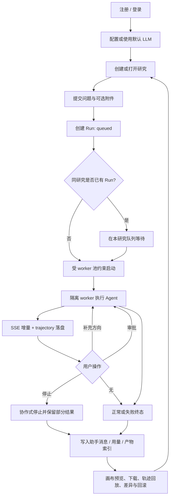
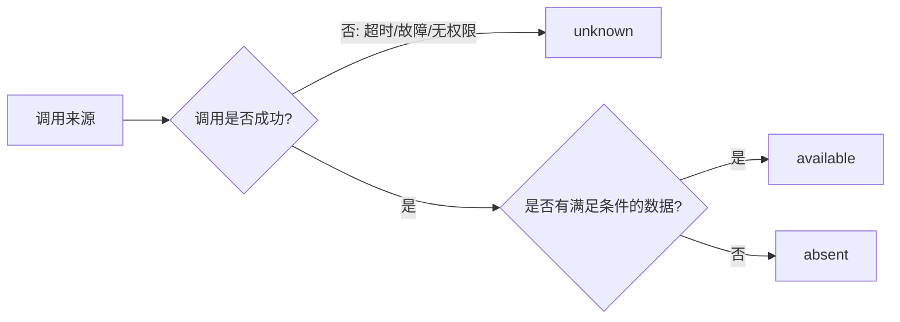
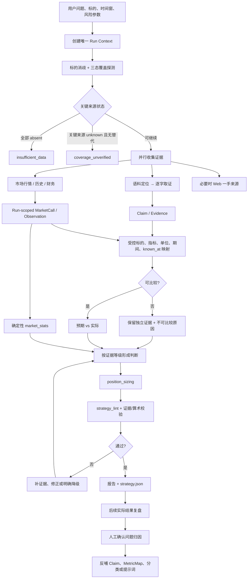

# 投研工作台 · 业务流程与能力边界

| 项 | 内容 |
|---|---|
| 版本 / 状态 | **v1.0 · 产品级流程真源** |
| 更新日期 | 2026-09-12 |
| 上游需求 | [product-requirements.md](product-requirements.md) |
| 目的 | 区分已可执行流程与目标投研闭环，明确降级、证据和责任边界 |

> 本文描述业务阶段与决策，不重复数据库、类或部署细节。当前能力以代码为准，目标能力必须先进入
> [产品需求基线](product-requirements.md) 才能成为实施范围。

## 1. 流程总览

平台有两条相互连接但成熟度不同的主流程：

1. **研究运行流程**：用户进入工作台、发起 Run、观察和控制执行、读取结果。该流程已具备。
2. **证据到判断流程**：语料与市场数据进入同一可比较语义，形成可复核策略并用后来结果复盘。该流程部分具备。

“工具能调用”不是闭环完成；闭环还要求 Web 可达、Run 隔离、证据精确、时间可知、口径可比和确定性计算可重算。

## 2. 当前研究运行流程（As-Is）



### 2.1 运行规则

- 用户身份只从服务端认证上下文取得；客户端不能指定其他用户，也不能随请求传入模型密钥。
- 同一研究中的 Run 串行，避免历史和文件状态相互覆盖；跨研究并行受 worker 池限制。
- 实时增量用于展示，trajectory 用于回放，业务库中的 Run 与消息用于终态恢复；三者不能互相冒充。
- 插话只在安全边界生效；审批只解除当前受控调用；停止应关闭待审批项并保存已经形成的结果。
- 输入只读，输出和工作区隔离；预览、下载和回滚都必须经过所属用户与路径边界校验。

### 2.2 当前产品入口边界

| 能力 | TUI / runtime | Web 工作台 | 结论 |
|---|---|---|---|
| 会话、运行、SSE、停止、插话、审批 | 可用 | 可用 | 已闭合 |
| 附件、产物、预览、下载、diff/revert | 可用 | 可用 | 已闭合 |
| 语料、市场、覆盖、仓位、策略校验工具 | `tui` profile 可用 | 默认 Web profile 未暴露 | 入口未闭合 |
| Claims 抽取与审计 | 离线可用 | 无用户查询入口 | 属数据治理，不是在线研究能力 |
| 用量采集 | 可用 | 无聚合页面 | 数据有、产品入口缺 |

## 3. 当前数据与证据流程

### 3.1 语料链

```text
合法来源的 PDF/DOCX
→ 确定性解析、标准化、去重
→ PostgreSQL 文档与块索引
→ corpus_search 只定位
→ corpus_fetch 取逐字原文
→ evidence 引用文档与定位
```

D2 Claims 是与在线检索并行的数据治理链：

```text
文档块 → 候选分级 → company/industry/macro 抽取
→ 确定性清洗与坐标约束 → Claim + 块级运行台账
→ 完整性/一致性/质量审计 → 后续比较层候选
```

Claim 已落库不代表运行时已经消费 Claim；当前在线 Agent 的证据入口仍是 `corpus_search → corpus_fetch`。

### 3.2 市场链

```text
标的名称/代码
→ market_resolve
→ market_quote / market_history / market_financials
→ 带 as_of、口径与 quote_text 的 Market Observation
→ 可选留痕与离线证据校验
```

当前已完成供应商适配、超时/重试/熔断、错误转译、工具注册和基础 trace 校验，但仍有两个业务断点：

1. service、缓存、熔断和 trace 尚未稳定收口到单 Run 生命周期；
2. market resolver 尚未用逻辑调用 ID 精确限制读取，不能以“同标的任意历史留痕”替代“本 Run 的本次调用”。

### 3.3 覆盖探测

当前 `data_coverage` 给出 `full/partial/research_only/none`，并在各来源中记录 error。目标流程必须先把每个来源归一成三态：



只有 `absent` 能支持“该来源没有数据”；`unknown` 只能支持“覆盖未验证”。

## 4. 目标证据到判断闭环（To-Be）



## 5. 判断分支

| 分支 | 进入条件 | 允许产出 | 禁止行为 |
|---|---|---|---|
| 分析师预测 | 预测 Claim 与实际观测可安全比较 | 预期兑现、偏差和失效条件 | 把单机构预测称为一致预期 |
| 市场事实 | 无可用预测，但财务和市场事实充分 | 经营现状、估值/趋势、条件化策略 | 伪造机构目标价或盈利预测 |
| 行业语境 | 公司事实可用，行业/宏观证据可定位 | 顺逆风、风险条件、观察结论 | 从行业数据推出未证实的公司数字 |
| 确定性情景 | 输入完整且公式、参数、版本可重算 | 乐观/基准/悲观情景 | 把模型情景包装成券商预测 |
| 数据不足 | 必要来源均已确认 `absent` | 数据缺口与补数建议 | 倾向性结论 |
| 覆盖未验证 | 关键来源为 `unknown` 且替代证据不足 | 故障说明、重试和降级路径 | 写成“确定没有数据” |

## 6. 完成定义

目标投研闭环只有在以下条件同时满足时才算完成：

1. Web 默认 Run 可通过真实工具注册链访问允许的 corpus、market 和策略工具。
2. 每条市场 evidence 精确绑定本 Run 的一个逻辑调用，跨 Run、错误 ID 或篡改内容必然失败。
3. 每个来源明确区分 `available/absent/unknown`，失败不再被归入无数据。
4. 研报预测与市场实际只有在标的、指标、单位、期间、口径和 `known_at` 全部兼容时才比较。
5. 市场统计、仓位和差值由确定性模块生成并可用相同输入重算。
6. 产物同时通过 schema、证据和算术校验；失败时补证据、修正或明确降级。
7. 后续复盘先定位是来源、抽取、映射、口径还是判断问题，只有人工确认后的系统性问题才能修改全局规则。

## 7. 文档与实现落点

| 流程部分 | 当前参考 |
|---|---|
| 用户、Run、SSE、文件与控制 | [tech-stack.md](tech-stack.md) 与 `server/` |
| Web 交互 | [design/investment-research-workbench-prd.md](design/investment-research-workbench-prd.md) 与 `web/src/` |
| 语料存储与检索 | [plan/data-layer-architecture.md](plan/data-layer-architecture.md) 与 `plugins/corpus/` |
| Claims 当前有效计划 | [plan/d2-claims-optimization-plan.md](plan/d2-claims-optimization-plan.md) |
| 市场工具边界 | [plan/ths-market-data.md](plan/ths-market-data.md) 与 `plugins/market/` |
| 双数据链闭环执行 | [plan/claims-market-closed-loop-plan.md](plan/claims-market-closed-loop-plan.md) |

专项文档可以记录更多实现细节，但不得重新定义本文的业务阶段、状态语义或完成定义。
