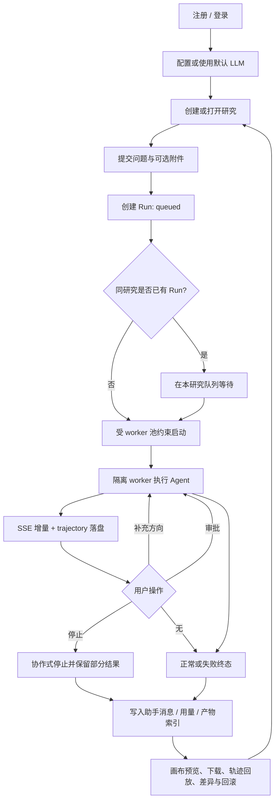
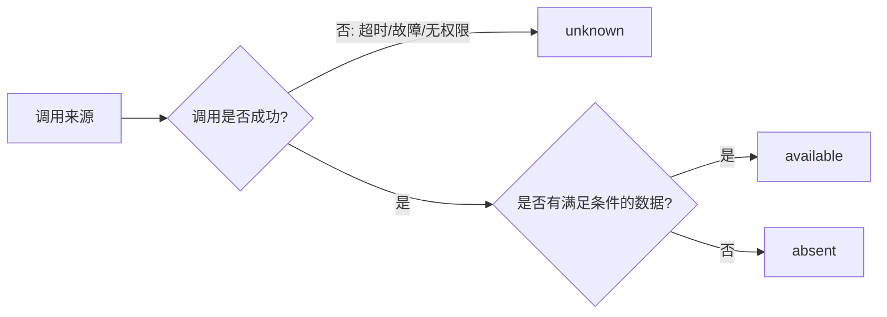
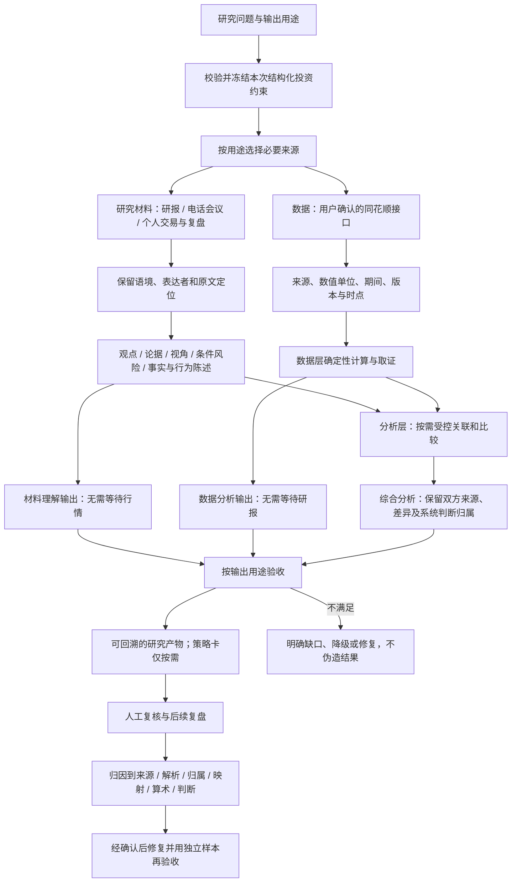

# 投研工作台 · 业务流程与能力边界

| 项 | 内容 |
|---|---|
| 版本 / 状态 | **v1.5 · 产品级流程真源** |
| 更新日期 | 2026-09-23 |
| 上游需求 | [product-requirements.md](product-requirements.md) |
| 检索契约 | [corpus-retrieval.md](corpus-retrieval.md) |
| 目的 | 区分已可执行流程与目标投研闭环，明确降级、证据和责任边界 |

> 本文描述业务阶段与决策，不重复数据库、类或部署细节。当前能力以代码为准，目标能力必须先进入
> [产品需求基线](product-requirements.md) 才能成为实施范围。

## 1. 流程总览

2026-09-14 当前阶段按[需求范围收缩](product-requirements.md#22-当前阶段范围收缩2026-09-14-用户确认)
实施：公司、行业、宏观三类研报为主；电话/会议/交流纪要及业绩会实录退出本阶段默认处理和验收，
个人交易/复盘等仅保留历史与必要兼容回归。下文广义材料与 Web 流程保留长期背景，不构成近期承诺。

近期目标链路为：

```text
来源登记 → 材料类型准入（纳入 / 范围排除 / 待复核）→ 公司/行业/宏观分类
→ 保真解析与结构清洗 → 结构切块 → 候选版本入库/建索引 → 核验并发布
    ├─ 基础证据库：CLI/工具查询、精确版本取证与恢复（零模型）
    └─ R2 语义：复用同源结构 → 有限候选与义务 → 受约束抽取及独立校验
               → 明确覆盖/缺口的语义产物 → CLI 保存、读取和重放
```

范围排除与解析失败分开记账，保留原文件和历史证据；不能只从评分分母删掉纪要，却继续在默认
入库/检索/抽取链路中使用它们。普通研报的问答、条件、否定与引用仍须保留。准入不明时先人工
复核，无法可靠解析时保留具体缺口，不强行补写内容。清洗通过、抽取通过与材料业务可用分别验收。
这条新链路尚待实施；当前程序没有因本次文档更新自动完成筛选或数据库重建。

2026-09-15 评审明确：准入、材料处理覆盖和查询结果分别表达。准入首版依据确认清单，未验证
规则只生成复核建议；基础链路强制零模型、禁止智能 fallback。部分范围处理完成不能称全文完成，
全文检索无命中不能自动推断来源无相关材料。研报发布日期与系统上线时间分开，均不得互相补值。
基础方案仍是待 I0 实际盘点/首次恢复/设计复核的草案，不预先冻结七表或清理对象。

来源到索引见[基础重构设计](plan/corpus-ingestion-rebuild-architecture.md)，范围及语义门见
[三类研报清洗与 R2 收口方案](plan/research-report-cleaning-scope-plan.md)。基础证据库不等待 R2
模型语义通过，语义失败不能自动等同入库失败。本阶段 CLI 验收不等待同花顺或 Web；完整产品和
跨层关联仍保留各自的验收义务。

平台有两条相互连接但成熟度不同的主流程：

1. **研究运行流程**：用户进入工作台、发起 Run、观察和控制执行、读取结果。该流程已具备。
2. **证据到判断流程**：研究材料保留观点、论据与视角，数据层提供结构化观测与计算；分析层按需关联并形成可追溯研究产物。该流程部分具备。

“工具能调用”不是闭环完成；闭环还要求 Web 可达、Run 隔离、证据精确、时间可知、口径可比和确定性计算可重算。

## 2. 当前研究运行流程（As-Is）



### 2.1 运行规则

- 用户身份只从服务端认证上下文取得；客户端不能指定其他用户，也不能随请求传入模型密钥。
- 同一研究中的 Run 串行，避免历史和文件状态相互覆盖；跨研究并行受 worker 池限制。
- 实时增量用于展示，trajectory 用于回放，业务库中的 Run 与消息用于终态恢复；三者不能互相冒充。
- 插话只在安全边界生效；审批只解除当前受控调用；停止应关闭待审批项并保存已经形成的结果。
- 输入只读，输出和工作区隔离；预览、下载和回滚都必须经过所属用户与路径边界校验。

### 2.2 当前产品入口边界

| 能力 | TUI / runtime | Web 工作台 | 结论 |
|---|---|---|---|
| 会话、运行、SSE、停止、插话、审批 | 可用 | 可用 | 已闭合 |
| 附件、产物、预览、下载、diff/revert | 可用 | 可用 | 已闭合 |
| 语料、市场、覆盖、仓位、策略校验工具 | `tui` profile 可用 | 默认 Web profile 未暴露 | 入口未闭合 |
| 结构化买入/仓位输入与 Run 快照 | 仅自然语言追问 | 无业务表单与快照 | 数据真源未建立 |
| Claims 抽取与审计 | 离线可用 | 无用户查询入口 | 属数据治理，不是在线研究能力 |
| 用量采集 | 可用 | 无聚合页面 | 数据有、产品入口缺 |

## 3. 当前数据与证据流程

### 3.1 研究材料链

```text
合法来源的研报、会议纪要、评论、个人交易与复盘材料
→ 确定性解析、标准化、去重
→ PostgreSQL 文档与块索引
→ corpus_search 只定位
→ corpus_fetch 取逐字原文
→ evidence 引用文档与定位
```

结构化材料抽取目前已有独立于旧块检索的统一证据入口：

```text
明确源文件/页范围 → 保真解析与证据包 → 表格或有预算的正文抽取
→ 原文绑定与用途校验 → EvidenceRun 保存/版本查询/取证
→ 可引用的 Claim；限定财务样本可作来源内部复算
```

Claim 已落库不代表运行时已经消费 Claim；当前在线 Agent 的证据入口仍是 `corpus_search → corpus_fetch`。
旧 blocks/claims 不因新证据版本产生而原地改善。数字、预测与 opinion 分类已有基础能力，
但论据关系、视角归属、问答和交易状态的完整理解尚未验收；company/industry/macro 是研究领域，
不能替代研报/电话会议/个人交易等材料类型。无需重建同一套来源存储来表达这些差异。

### 3.2 数据链：现有市场工具与待确认的政府数据

```text
标的名称/代码
→ market_resolve
→ market_quote / market_history / market_financials
→ 带 as_of、口径与 quote_text 的 Market Observation
→ 可选留痕与离线证据校验
```

当前已完成供应商适配、超时/重试/熔断、错误转译、工具注册和基础 trace 校验，但仍有两个业务断点：

1. service、缓存、熔断和 trace 尚未稳定收口到单 Run 生命周期；
2. market resolver 尚未用逻辑调用 ID 精确限制读取，不能以“同标的任意历史留痕”替代“本 Run 的本次调用”。

用户确认政府统计与股票行情等数据由同花顺接口提供，数据推导由数据层承担。
已有行情/历史/财务工具不意味着政府宏观端点、实时性或历史版本已经验收；需根据实际提供的接口单独确认。
接口不可用时，不用研报里的数字静默填补数据层缺口；M2 的 BLS 官网抓取不是默认数据获取方案。

### 3.3 覆盖探测

当前 `data_coverage` 给出 `full/partial/research_only/none`，并在各来源中记录 error。目标流程必须先把每个来源归一成三态：



只有 `absent` 能支持“该来源没有数据”；`unknown` 只能支持“覆盖未验证”。

这里的“没有数据”仅限已验证的指定来源、条件与范围。语料查询另有准入及材料处理覆盖，不能
仅凭 FTS 无命中映射 absent；自由文本搜索无法排除未召回的相关内容。新基础链路拟定枚举与
映射见[重构草案 §7.3](plan/corpus-ingestion-rebuild-architecture.md#73-准入处理覆盖查询结果三轴契约)，
当前 `data_coverage` 实现没有因文档修订自动改变。

### 3.4 精确业务上下文与语料检索分流

用户输入的计划买入价、总资金、风险预算、当前持仓、仓位上限和持有时间窗是业务事实，
不是研究语料。目标流程必须将它们与对话和 corpus 分开：

```text
网页/CLI 结构化输入
→ 服务端校验标的、币种、单位、范围和计划/已成交状态
→ 保存投资计划或实际持仓
→ 创建 Run 时冻结版本化输入快照
→ InvestmentContextResolver 按 user_id + run_id 精确查询
→ 类型化 investment_context 进入 Workflow State
→ 缺少必填字段时发出一次结构化 input_required
→ 字段完整后调用行情、仓位和策略校验工具
```

当前 Web 只把 `prompt` 和 Turn 对话作为跨运行信号，上述结构化快照、Resolver 和
`input_required` 事件尚未实现。在实现前，不得把“聊天里可能提到过”宣称为可靠的仓位召回。

语料证据另走受控工具链：

```text
data_coverage → corpus_search（只定位）→ corpus_fetch（逐字原文）
→ ToolMessage 进入当前 Agent 上下文 → evidence 校验
```

完整协议、现有检索算法和 CLI/TUI/Web 接线状态见
[资料库检索与 Agent 上下文接线](corpus-retrieval.md)。

## 4. 目标证据到判断闭环（To-Be）



## 5. 判断分支

研究材料理解不必先形成投资判断或策略卡。以下用途分别验收：

| 用途 | 最小交付 | 明确限制 |
|---|---|---|
| 材料理解 | 核心观点、论据、视角、表达者、条件风险和原文出处 | 忠实转述不证明来源内容为真，无数字也可有价值 |
| 数据分析 | 接口观测、口径/时点、公式输入和可重算结果 | 没有数据就记录缺口，不从研报替补实际值 |
| 综合分析 | 分别引用前两层，按需比较，说明系统判断和未知项 | 不把同页共现当论证，不把数值差异直接断言为作者错误 |

电话会议须保留问答与转述归属；交易材料须区分计划、来源声称执行和事后解释。
“视角”区分作者明确表达与系统归纳；缺少支持关系时不强行建联。
不同材料的重复转述不是多个独立证据。当前只要求来源忠实性，不默认逐条回查政府网站。

若用户进一步需要判断或策略，沿用以下按证据充分性选择的分支；它们不是阅读材料的前置：

| 分支 | 进入条件 | 允许产出 | 禁止行为 |
|---|---|---|---|
| 分析师预测 | 预测 Claim 与实际观测可安全比较 | 预期兑现、偏差和失效条件 | 把单机构预测称为一致预期 |
| 市场事实 | 无可用预测，但财务和市场事实充分 | 经营现状、估值/趋势、条件化策略 | 伪造机构目标价或盈利预测 |
| 行业语境 | 公司事实可用，行业/宏观证据可定位 | 顺逆风、风险条件、观察结论 | 从行业数据推出未证实的公司数字 |
| 确定性情景 | 输入完整且公式、参数、版本可重算 | 乐观/基准/悲观情景 | 把模型情景包装成券商预测 |
| 数据不足 | 必要来源均已确认 `absent` | 数据缺口与补数建议 | 倾向性结论 |
| 覆盖未验证 | 关键来源为 `unknown` 且替代证据不足 | 故障说明、重试和降级路径 | 写成“确定没有数据” |

## 6. 完成定义

完成分两级，不再把“数值可算”当成所有材料的可用标准：

**小范围业务闭环**：真实材料能忠实保留观点/论据/视角和条件，真实接口样本能独立取证与复算，
需要关联时能保留双方身份及不可比较原因，系统推断与来源陈述分开。开发回归和独立留出分别报告，
材料可先独立验收；数据和综合分析未通过时，不声称整个系统闭环。

**产品可用闭环**：在对应小范围业务验收通过后，还须满足以下入口与治理条件：

1. Web 默认 Run 可通过真实工具注册链访问允许的 corpus、market 和策略工具。
2. 用户输入的计划、实际持仓/成交和 Agent 策略分开存储；每个 Run 使用可回放的 `investment_context` 快照。
3. 每条市场 evidence 精确绑定本 Run 的一个逻辑调用，跨 Run、错误 ID 或篡改内容必然失败。
4. 每个来源明确区分 `available/absent/unknown`，失败不再被归入无数据。
5. 研报预测与市场实际只有在标的、指标、单位、期间、口径和 `known_at` 全部兼容时才比较。
6. 市场统计、仓位和差值由确定性模块生成并可用相同输入重算。
7. 产物同时通过 schema、证据和算术校验；失败时补证据、修正或明确降级。
8. 后续复盘先定位是来源、抽取、映射、口径还是判断问题，只有人工确认后的系统性问题才能修改全局规则。

## 7. 文档与实现落点

| 流程部分 | 当前参考 |
|---|---|
| 用户、Run、SSE、文件与控制 | [tech-stack.md](tech-stack.md) 与 `server/` |
| Web 交互 | [design/investment-research-workbench-prd.md](design/investment-research-workbench-prd.md) 与 `web/src/` |
| 语料检索协议与上下文接线 | [corpus-retrieval.md](corpus-retrieval.md) |
| 语料存储历史选型 | [plan/data-layer-architecture.md](plan/data-layer-architecture.md) 与 `plugins/corpus/` |
| 材料理解与数据分析当前执行计划 | [plan/claims-market-closed-loop-plan.md](plan/claims-market-closed-loop-plan.md) |
| 市场工具边界 | [plan/ths-market-data.md](plan/ths-market-data.md) 与 `plugins/market/` |
| 旧 Claims 规则与验收记录 | [plan/d2-claims-optimization-plan.md](plan/d2-claims-optimization-plan.md)，仅作历史实施参考 |

专项文档可以记录更多实现细节，但不得重新定义本文的业务阶段、状态语义或完成定义。
