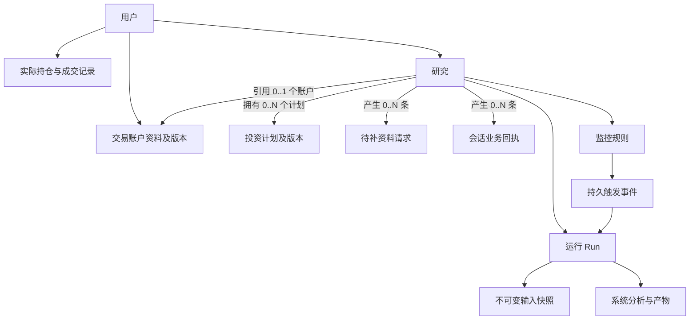

# Web 业务资料、交互与持久化需求规格

| 项 | 内容 |
|---|---|
| 版本 / 状态 | v0.6 · 整体规划稿，尚未实现；明确补数请求与会话业务回执均为单会话归属 |
| 日期 | 2026-10-02；初稿 2026-09-29 |
| 需求来源 | 用户关于资金与交易指标长期保存、上下文成本、价格监控唤醒，以及 Web 整体建设的连续讨论 |
| 产品范围与状态 | [产品需求基线](../product-requirements.md) §4.7；既有 PR-WB-07、PR-DATA-13 |
| 流程依据 | [业务流程](../business-process.md) §3.4–3.5 |
| 既有交互与架构 | [研究工作台](investment-research-workbench-prd.md) · [技术架构](../tech-stack.md) |
| 本文职责 | 细化页面、用户行为、数据归属、持久化契约、异常处理和验收；不另设产品状态或实施进度台账 |
| 任务拆分 | [Web 页面交互任务清单](../plan/web-business-ui-tasks.md)（v1.5 §7）· [数据持久化任务清单](../plan/web-business-persistence-tasks.md)（v1.4 §10）；实施状态与缺口以清单回填节为准，本文只定义需求 |

本文交付的是可讨论、可拆分实施的需求，不代表功能已上线。标为“建议”的默认值和物理实现
仍可调整；未明确的部署容量、行情时效及保留期限不作现成能力承诺。本轮仅规划 Web 专项，
不改变研报清洗等已有工作的实施优先级，不执行数据库迁移。

## 1. 要解决的问题与完成结果

目前用户可以在研究中聊天和提交运行，但资金、买卖价格等只能出现在文本中。页面重开、
跨运行历史裁剪、用户更正数值后，系统缺少独立且精确的业务事实来源。未来行情触发分析时，
也无法可靠确定应该使用哪个账户、哪份计划和哪个版本。

目标是让用户能：

1. 在 Web 中查看、填写和修改业务资料；账户可跨刷新、登录与研究复用，计划只在所属研究内持续可用。
2. 清楚地区分账户资料、投资计划、实际持仓/成交和系统分析；依赖资金与买入价的分析只接受用户如实明确提供的必要输入。
3. 从任意报告追溯当时采用的输入，而不因后来修改资料改变旧报告的含义。
4. 通过聊天或表单完成同样的业务操作，得到一致的保存结果。
5. 在原研究中配置价格监控，条件满足后按已保存的指令自动分析并留下记录。
6. 只把必要资料送入模型上下文，持续监控本身不调用 LLM。

完成标准是“用户可见状态与服务端持久状态一致，运行依据可追溯”，不以资料卡能显示、
聊天里能复述数值或某个工具单独执行成功作为闭环验收。

## 2. 当前基线与建设缺口

以下为代码检查基线，不代表本轮运行过端到端测试。

2026-10-02 补查：存储修复报告已到 v1.5，F01/F08/F19 等已登记关闭，不能把旧缺陷说明当作
当前全部未实现。F12/F15/F20 接口依赖见[持久化任务清单 §8—9](../plan/web-business-persistence-tasks.md)。

2026-10-08 回填：本节原判“投资业务模型、快照 resolver、补数和监控仍属本专项待建设”已被后续
实施覆盖——服务端 DATA-00—15 分批完成并提交，前端业务组件接入真实 API。当前缺口为
UI-03/UI-05/UI-11、供应商时效实测、D 阶段、保留策略与后台受管进程，详见
[持久化清单 §10](../plan/web-business-persistence-tasks.md)与
[页面清单 §7](../plan/web-business-ui-tasks.md)。本文仍只定义需求，不声明放行。

| 能力 | 当前依据 | 本专项需要补齐 |
|---|---|---|
| 用户、研究、消息、Run、产物、用量 | [server/store.py](../../server/store.py) | 业务对象、版本、关联、输入快照 |
| JSON / multipart 发起 Run | [server/routes/runs.py](../../server/routes/runs.py) | 独立结构化参数、版本与幂等校验 |
| 同研究串行、每 Run 独立 worker | [server/orchestrator.py](../../server/orchestrator.py) | 持久待执行任务、事件触发与重启恢复 |
| 跨 Run 回填对话 | [server/history.py](../../server/history.py) | 精确业务上下文；对话回填不能代替资料查询 |
| 运行中插话、停止、工具审批 | [server/steer.py](../../server/steer.py)、[运行路由](../../server/routes/runs.py) | 持久化补数请求；不得复用审批含义 |
| 研究编辑器、画布和导航 | [ResearchComposer.vue](../../web/src/components/ResearchComposer.vue)、[ResearchCanvas.vue](../../web/src/components/ResearchCanvas.vue) | 资料卡、表单、版本展示、监控入口 |
| 市场与策略工具 | [工具白名单](../../plugins/tools/__init__.py) | [server/profile.py](../../server/profile.py) 的 Web 工具接线与真实 Run 验收 |
| per-run SSE 与轨迹 | [server/relay.py](../../server/relay.py) | Run 外的业务事件通知及补读 |

沿用既定 PostgreSQL 业务库及 SQLAlchemy/Alembic；开发配置仍保留 SQLite 路径，不能据此
推断实际部署。本需求不新建第二套独立业务文件库，不把用户资料存入语料库或向量库。

## 3. 业务对象、归属与边界

### 3.1 对象关系

沿用 [CONTEXT.md](../../CONTEXT.md) 中的研究、消息、研究回合、运行和产物术语。
以下为本专项新增对象的工作定义，供实现时统一建模；“交易账户资料”与平台登录账号不同，
也不意味着接入券商账户。



| 关系 | 基数 | 归属规则 |
|---|---|---|
| 账户 → 研究 | `1 : 0..N` | 账户独立存在，可被多个研究引用；第一版每个研究至多引用一个账户 |
| 研究 → 计划 | `1 : 0..N` | 研究拥有多个计划；每个计划必须且只能归属一个研究 |
| 研究 → 当前主计划 | `1 : 0..1` | 只能从该研究自己的计划集合中选择，不是计划的全局属性 |
| 研究 → 待补资料请求 | `1 : 0..N` | 每条请求必须且只能属于一个研究；来源 Run 或事件可以为空，但研究不可为空 |
| 研究 → 会话业务回执 | `1 : 0..N` | 每条回执必须且只能属于一个研究；全局页面只做跨研究汇总 |

- 账户和实际记录归用户独立维护，不从属于研究；第一版一个研究至多引用一个账户，
  同一账户可被多个研究引用，修改后的版本在下一次新快照中生效。
- 投资计划从属于研究：一个研究可拥有多个计划，每个计划必须且只能属于一个研究，不能跨研究共享。
- 研究可从自己的计划中选择一个当前主计划；第一版每次运行只采用该研究的一个计划和一个账户。
- 一个研究可产生多条待补资料请求和会话业务回执，但每条请求、回执都只能属于一个研究；
  全局模块只汇总展示，不产生跨研究共享记录。
- 删除研究不删除共享账户或账户成交记录；该研究所属计划停止新采用并随研究保留历史，
  同时停止本研究的监控与待执行自动任务。
- 系统策略版本保留生成 Run 和产物引用；用户采纳后在当前研究创建/修改计划，不能原地变成用户已成交事实。
- 监控执行是用户预先保存指令的后续触发：属于同一研究，创建新的 Run，不能复活或改写旧 Run。

### 3.2 字段及含义

| 对象 | 必要字段 | 约束 |
|---|---|---|
| 账户资料 | 名称、基础币种、总资金/可用资金、资金口径、数据时点 | 两种资金独立；没有数据不能写成 0；手工数值不标成实时余额 |
| 投资计划 | 所属研究、标的代码/市场/资产类型、方向、计划买入价或区间、计划卖出目标、状态 | 只能属于一个研究；第一版价格监控必须有明确标的和币种；“计划卖出”不等于已卖出 |
| 计划约束 | 风险预算及单位、仓位上限、持有时间窗、止损或失效条件、目标盈亏比及定义 | 按分析用途要求字段；只有买入价和目标价不能推导风险收益比 |
| 实际持仓 | 账户、标的、数量、成本口径、数据时点、来源 | 手工录入标记“用户提供”；不能因添加计划就增加持仓 |
| 成交记录 | 账户、标的、买卖方向、数量、价格、币种、费用、成交时间、来源 | 更正保留前值；凭证核验状态独立于用户声称成交 |
| 研究资料关系 | 研究、关联账户、所属计划集合、当前主计划 | 账户可被多研究引用；计划集合只包含本研究所属计划；不从另一研究带入计划 |
| 待补资料请求 | 所属研究、用途、字段/单位、已知值、原因、状态、可选来源 Run/事件 | 只能属于一个研究；Run/事件可选不代表研究可选 |
| 会话业务回执 | 所属研究、操作对象、操作类型、处理结果、版本、时间、可选 Run | 只能属于一个研究；独立账户页操作结果不强行写成会话回执 |
| Run 输入快照 | schema 版本、账户/计划/持仓版本、解析后的完整有效值、用户明确提供记录、缺失/待澄清项、来源 | 不接受假设资金或假设成交价；只存本次必要字段；不可变；不能只保留指向当前值的 ID |

资金、数量、价格在程序和数据库中使用精确数值；接口使用约定的十进制字符串，避免前端
浮点往返损失精度。比例带单位，`2%` 与 `2` 不得混用。价格精度、最小交易单位和数量限制
由资产规则确定，不用一套股票规则套用所有资产。

盈亏比必须明确是哪一种：计划收益/风险、历史平均盈利/平均亏损或用户另定口径。
系统计算结果同时保存输入引用和公式版本，与用户填写的目标值分列。缺少口径时保留待补充，
不擅自把目标比值当作历史统计。

手工持仓快照与成交记录的合并需有基准时点；第一版不自动用两者叠加重算资金与持仓，
避免同一笔交易计入两次。多币种不自动求和；换算需要汇率来源和时点。

### 3.3 版本、时间与来源

业务对象至少保留：所有者、对象 ID、版本、业务时点 `as_of`、记录时间、更新来源、
来源消息/表单操作 ID、操作者及前一版本。自由文本解释与类型化字段分离。

“用户已明确提供”表示用户将该值作为自己的真实资料提交，不表示平台已从券商或凭证外部核实。
至少区分草稿、待澄清、用户明确提供、外部观测、系统计算，并保留回答/提交记录；历史聊天
抽取结果在明确绑定和校验前只作候选值。字段范围校验通过不能自动晋升为真实或外部核实。

### 3.4 真实资金与买入价格是输入前提（2026-09-29 用户明确要求）

本条替代 v0.1 中“本次情景覆盖”的设计。用户需要如实回答实际资金和买入价格，Agent
不能接受假设值、示例值、疑问中的候选数字或不确定估计作为这些字段的有效输入。

- 询问资金时明确账户、币种、总资金/可用资金口径和时点；询问买入价格时先明确是否已成交。
- 已买入：需要用户提供实际成交价或明确口径的成交均价；不得用现价、计划价或 Agent 建议价替代。
- 尚未买入：如实记录“未成交”，实际成交价为空。若本用途支持计划分析，只采用用户明确说明的
  真实买入计划；计划价不等于实际成交价，依赖实际成本/收益的计算仍不可执行。
- “假设有 8 万”“如果 20 元买入”“大概是 20 元”“是不是按 20 元算”等表述，先询问真实值
  和含义，不建立假设覆盖，不写有效业务字段，不据此调用仓位/收益工具或输出个人数值结论。
- 判断依据是语义和字段来源，不是关键词或问号。用户先明确说“实际成交均价为 20 元”再提出
  分析问题，不因句末有问号就把明确事实退回待澄清。
- 用户不知道、不愿提供或回答仍有歧义时，保持缺失/待澄清并说明需要哪项资料；暂停依赖该项的
  分析，不默认填值、不根据历史候选或模型猜测继续。无关的材料阅读不因此被阻断。
- 已有可用且无冲突的用户明确资料可复用；本轮提出不确定更正时保留旧版本，但不能静默用旧值
  完成本轮受影响计算。先澄清该字段；得到明确回答后再形成新版本或确认沿用原版本。
- 用户已明确如实作答时直接校验和保存，不再增加重复的“是否确认真实”弹窗。系统能记录用户
  声明与来源，不能承诺自动识别所有虚假回答或把用户声明显示成外部核验。

典型追问：“请填写你当前账户实际可用资金及币种”；“你是否已经买入？已买入请提供实际
成交均价；尚未买入请明确说明，计划买入价会单独记录。”不使用“先假设 10 万”一类诱导示例。

## 4. Web 信息架构与交互

### 4.1 保留三栏工作台

| 区域 | 新增内容 | 交互要求 |
|---|---|---|
| 左侧研究导航 | 账户资料入口、监控列表入口；研究项可显示待补资料/监控触发标记 | 登录设置仍称“账号设置”；资金资料称“交易账户资料” |
| 中间对话 | 当前账户/计划摘要、会话计划入口、可折叠资料卡、就地补数表单、保存回执、行情事件回合 | 计划从当前会话创建并自动归属；默认不展开完整历史和技术字段，不挤占对话阅读 |
| 右侧画布 | 报告的“分析依据”、计划详情、修改记录、监控详情 | 切换详情后可返回原报告；保留报告阅读位置 |
| 全局通知 | 保存失败、需处理冲突、监控触发/故障/分析完成 | 可回到所属研究；刷新后从服务端恢复未读状态 |

资料卡展示资金及口径、标的、计划/实际价格、关键约束、更新时间和保存状态。版本、来源、
修改历史放入详情。不存在的功能不能以可点击占位按钮交付。

“交易账户资料”中的计划模块是跨会话关系总览，只展示计划、唯一所属会话、当前主计划和状态，
不提供创建计划或重新绑定会话。创建、修改和设置主计划从具体研究会话的“会话计划”入口进行；
新计划自动归属当前会话，页面不再要求用户二次选择会话。

窄屏以对话为主，资料编辑和报告详情使用可返回的单页/抽屉；375px 下可完成填数、修正错误、
提交和查看保存回执。所有字段有标签、单位、键盘焦点和就地错误信息，不以颜色单独表达状态。

### 4.2 首次建立资料

用户可以先提问，不强制注册后填写完整交易档案。纯材料阅读和一般研究不要求资金数据。
当用户进入仓位计算、交易计划分析等确实依赖这些字段的用途时：

1. 显示当前绑定账户/计划，已有值预填；没有账户时允许创建一个名称清楚的资料记录。
2. 一次收集本用途必要的缺失或待澄清字段，显示币种、数量单位及计划/已成交区分；明确要求填写真实资金和实际价格，不预填假设或示例数值。
3. 支持“保存资料”和“保存并分析”；前者不启动 LLM。
4. 保存成功后展示服务端返回值；再发起分析时显示本次采用的资料摘要。
5. 保存失败时保留当前页面草稿，显示重试；不能出现“已记住”或假成功状态。

### 4.3 自然语言与表单使用同一写入契约

| 用户表达或操作 | 产品行为 | 是否改长期资料 |
|---|---|---|
| 真实资料表单点击保存 | 用户按真实资料提交，校验口径与状态后写入，回显保存时间和修改项 | 是 |
| “把当前账户总资金改为 8 万人民币” | 当前账户唯一且口径明确时直接写入，回执“10 万 → 8 万” | 是，不重复要求批准 |
| “假设本金只有 8 万再算” | 要求用户填写真实资金，回答前暂停依赖资金的计算 | 否，也不进入有效 Run 输入 |
| “如果 20 元买入呢” / “成交价大概 20 元” | 追问成交状态与明确价格，不把候选值当成本价 | 否，保持待澄清 |
| “资金 8 万”且账户/口径不明 | 展示待确认项，只询问存在的歧义 | 否，明确后再写 |
| “我还没买，实际计划是在 20 元买入” | 保存明确的真实计划及未成交状态，不生成实际成交价或持仓 | 是，限计划 |
| “已按 20 元买入 100 股” | 对标的、账户和时间等必要项校验，登记用户提供的成交 | 是，保留来源 |
| 研报/附件中出现“本金 8 万” | 视为材料中的行为或数值陈述 | 否 |
| “按你刚才的方案保存为计划” | 明确采用对象后生成计划新版本，关联原策略/Run | 是，但不是实际成交 |

业务修改应有机器可读命令和执行回执。模型负责理解与提出操作，服务端负责归属、字段、
版本和幂等校验；聊天中的“保存好了”不能代替提交结果。存在多个账户/计划时不得猜目标。

这里的业务回执指会话内操作结果：一个研究可有多条回执，每条回执只属于一个研究。
“待补资料与处理结果”页面是跨研究汇总视图，每条记录必须显示所属研究并可返回该研究；
独立账户页的纯账户操作在账户页反馈，不为进入汇总列表而虚构研究归属。

### 4.4 真实资料校验与运行中修改

表单只提供真实业务资料录入/修改，不提供“仅本次假设”入口。资料卡显示字段的来源、时点和
明确/待澄清状态。必要资金或买入价格尚待澄清时，“保存并分析”不得启动依赖它们的执行，
应定位到需补充字段；允许保存为草稿但不能显示为已可用于分析。

这里“保存为草稿”指用户主动提交到服务端的待补充业务记录，可在刷新后查询；
尚未点击保存的表单内容属于 §5.4 的页面内存草稿，不承诺恢复。两者使用不同保存状态。

- 运行开始后，其快照固定；资料卡可以显示更新后的当前值，同时提示“本次分析使用较早资料”。
- 默认修改影响随后创建的 Run。用户选择“用新资料重算”时，停止旧运行并创建关联的新 Run。
- 排队中的手动 Run 也使用提交时冻结的快照；资料变更后允许取消并重新提交，不暗中替换。
- 用户要求立即改数的插话应走业务修改和重算路径，不能只把新数值追加进旧 Run 让计算依据漂移。
- 文件 `/revert` 不回滚账户资料；业务“撤销修改”产生补偿版本，并检查之后是否已有其他修改。

### 4.5 持久化补充资料请求

补数不同于工具审批，也不同于普通插话。每条请求必须且只能保存一个所属研究，以及来源 Run、用途、所需字段、单位、
已知值及来源版本、状态和回答；建议状态为 `pending/answered/cancelled/expired`。

自动事件在创建分析 Run 前已发现缺数时，请求关联来源事件及研究，来源 Run 可为空。
明确回答后重新校验规则状态、资料版本、时效与预算，再创建后续分析；不为挂接请求而伪造完整输入的 Run。

第一版建议采用“结束当前执行并等待补充，回答后创建后续 Run”：

1. Agent 发现必要信息缺失、带假设或存在疑问，服务端保存 `input_required` 请求，再通知浏览器。
2. 原 Run 保留轨迹并以明确的 `input_required` 停止原因结束；研究显示“待补资料”，
   不把现有 Run 状态伪装为已经支持新的等待状态。
3. 用户提交明确真实回答后，服务端先保存回答和业务变更，再创建完整快照与后续 Run，关联来源 Run 和请求；回答仍含假设/歧义时只保存回答记录，请求保持待补充，不创建依赖该值的后续分析。
4. 原 Run 的快照不修改；界面以“补充后继续分析”连接前后两次执行。
5. 重复提交不创建多个后续 Run；另一浏览器已回答、请求已取消或研究已删除时返回明确冲突。
6. 不依赖进程持续等待；页面重载后仍可回答，服务重启后可以恢复待处理请求。

这一方式把现有交互文档中的“解除 Agent 等待”落实为逻辑续接，不承诺恢复同一个 worker。
若后续选择同 Run 暂停恢复，需要另行设计执行段与快照版本，不能原地改写首个快照。

## 5. 持久化与一致性需求

### 5.1 数据分别放在哪里

| 数据 | 持久位置 | 不作为真源的位置 |
|---|---|---|
| 账户、计划、实际记录、关联、版本 | 现有 PostgreSQL 业务库 | 聊天摘要、浏览器 localStorage、运行工作区 |
| Run 输入快照、补数请求、会话业务回执、修改审计 | 同一业务库；请求和回执必须关联一个研究，来源 Run/事件按场景可选 | worker 全局变量、LLM 缓存 |
| 监控规则、触发事件、待调度记录、通知游标 | 同一业务库 | 仅内存队列或 SSE 连接 |
| 报告文件、输入文件和运行轨迹 | 既有受控文件目录/持久卷，数据库存索引 | 临时前端流式内容 |
| 研究材料、语料索引 | 既有独立语料库 | 用户业务表 |
| 行情数据 | 复用市场数据链；保存触发与分析所需的观测引用和必要原值 | 每笔报价都塞入对话 |

现有 trajectory 仍是 Run 内执行过程真源。新增业务事件用于记录 Run 外的资料修改、监控触发
和调度，不再复制一套模型 token delta 或工具轨迹事件库。

### 5.2 逻辑存储对象（建议命名，不冻结 DDL）

| 对象 | 主要用途 |
|---|---|
| `investment_accounts` / revisions | 账户资料当前版本与历史 |
| `investment_plans` / revisions | 计划当前版本与历史 |
| `position_snapshots`、`trade_records` | 带时点的实际持仓与成交更正链 |
| `research_investment_links` | 研究关联与当前选择 |
| `strategy_versions` | 系统策略版本及 Run/Artifact 引用；避免与计划共用写入口 |
| `run_investment_snapshots` | 本次分析最终解析出的输入和引用版本 |
| `input_requests` | 持久化补数与续接关系 |
| `watch_rules`、`watch_events` | 监控生命周期与触发事实 |
| `dispatch_outbox` | 数据库提交后的待派发任务及重试状态 |

具体拆表可在实现设计阶段合并；版本不可变、所有者校验、唯一性和事务契约不得因此省略。

### 5.3 写入与运行创建

“保存并分析”的逻辑事务包括业务变更、版本/审计记录、Run 输入快照、queued Run 及待派发记录。
任一步失败均不得显示完整成功；worker 在提交后由调度器领取。采用可重试投递和数据库唯一约束，
不能仅依赖一次 `await submit()` 保证不会在进程崩溃时丢任务。

仅保存资料不产生 Run。资料已经保存但派发暂时失败时，界面区分“资料已保存 / 分析等待重试”，
重试复用原 Run，不重复修改资料或扣减任何计量预算。

所有修改携带预期版本；不一致返回冲突及当前版本，允许用户比较后重新提交。同一幂等键和同一
请求返回原结果；相同键携带不同内容应拒绝。持仓/成交、监控和补数提交也遵循同样规则。

### 5.4 生命周期与恢复

- 账户或计划归档后不能被新分析自动采用，历史 Run 快照仍可读；相关监控暂停并给出原因。
- 研究软删除时，停止关联规则，取消尚未执行的自动任务，并按现有控制机制停止活动运行。
- 清除聊天上下文不删除业务资料；删除账户资料与删除研究是两个明确操作。
- “清除未保存草稿”与“删除已保存资料”分开。第一版草稿仅保留于当前页面内存，关闭页面前提示；
  不承诺草稿跨设备恢复，不把资金等敏感数据写进 localStorage。
- 服务重启后核对待派发/活动任务；以租约或等价机制防止两个进程同时执行同一研究。
- 数据库及必要的产物/轨迹持久卷纳入备份与恢复演练；加密密钥单独管理和备份。
- 软删除不宣称物理擦除。保留期、备份保留和物理删除流程在发布前确定；需要清除个人数据时，
  同时处理快照、审计敏感字段、轨迹及产物副本，不能只删除当前资料行。

## 6. Run 上下文与 token 成本

对应 PR-DATA-13、PR-BIZ-05。沿用技术架构提出的 `InvestmentContextResolver`：按服务端
认证身份和 `run_id` 精确读取快照，返回类型化 `investment_context` 与缺失字段。
这里描述目标接口，不表示模块已经存在。

上下文组装顺序建议为：固定规则与工具定义 → 稳定阶段摘要/相关历史 → 本轮问题与输入快照 →
追加的工具调用及结果。明确用户数据是数据，不能作为高优先级指令执行。

1. 快照只包含本次用途需要的字段；不注入其他账户、完整成交账本或全量报价。
2. 工作流显式渲染快照到模型请求；放入 state 或数据库本身不代表模型已读取。
3. 同一 Run 内快照不变，不在每个工具轮次重复追加；压缩时保留或从原快照恢复必要字段。
4. 固定提示词不嵌入每次变化的资金、时间、报价或 Run 路径；动态资料放后部。
5. 业务数值不通过 FTS/向量检索猜测；历史记录按授权、标的、时间和用途精确读取。
6. 缓存读、缓存写、总输入、输出和调用次数分别计量；缓存命中不减少上下文占用。
7. 缓存参数和有效期由供应商适配层处理，本需求不硬编码某个模型的 TTL 或折扣。
8. 长时间监控后缓存失效允许正常重建；不能为维持缓存定期发起无业务价值的 LLM 请求。
9. resolver 显式返回必要字段是否已由用户明确提供、是否存在未解决疑问；缺失或待澄清时，工作流与计算工具均不得用候选值或默认值绕过补数。待澄清回答可以保留在消息记录，但不是可计算输入。

验证以每个完成研究回合的成本、延迟、输入正确率为准；缓存命中率只是辅助指标。

## 7. 价格监控与自动分析

### 7.1 用户入口与规则

用户可在计划详情或对话中创建规则。创建页显示标的、行情口径、币种、阈值、方向、有效期、
触发次数方式、是否自动分析、分析任务及预算限制。自然语言已经明确这些信息时，直接创建并回执；
只有缺失或歧义字段需要补问。

“达到价格后在这个研究里分析”应保存为自动分析指令，不能退化成只通知。仅要求价格提醒时，
不擅自开启自动分析。旧可行性文档关于默认只通知的建议不覆盖本次明确的自动唤醒需求。

建议第一版默认单次触发；支持暂停、恢复、取消和查看最近检查时间。规则修改形成新版本。
阈值默认按创建时保存的数值执行，计划修改不静默改变规则；后续如支持“跟随计划价格”，需显式模式。

### 7.2 触发语义

- 定义向上/向下穿越或进入区间，不依赖浮点相等；19.99 → 20.02 能触发上穿 20。
- 创建时已满足条件，需保存“立即触发”或“等待重新穿越”的选择；建议表单默认立即触发一次，明确展示。
- 对无效、过期、乱序或不匹配标的/币种的报价不触发常规实时分析；行情故障单独通知。
- 行情断线后恢复不假称观察到了断线期间的穿越。首个新报价已满足条件时标记“恢复后条件满足”，
  按规则恢复策略处理；建议单次规则触发一次并标明观测缺口。
- 重复报价去重；重复触发规则需有冷却和重新布防条件，单靠冷却不能避免持续越线时反复触发。
- 轮询可能漏掉两次采样间的短暂触价。界面展示采样方式与频率，不承诺交易所逐笔实时触达。

### 7.3 事件与分析生命周期

监控规则状态和分析结果分开：单次规则已经触发，不因分析失败再次触价。事件可以重试分析，
但必须关联原事件与原失败记录。

```text
行情校验 → 判断条件 → 事务保存触发事件与待调度任务
→ 用户级通知：已触发，待分析
→ 调度领取，核对规则/研究仍有效及预算
→ 按执行时最新有效业务版本创建 Run 和不可变快照
→ 刷新行情并分析 → 写回原研究、产物与完成通知
```

触发事件固定记录：规则版本、前后报价/可用状态、观测时间、接收时间、行情来源、标的、阈值
及触发原因。分析另存开始时观测和 Run 引用。触发事件不是当前行情的永久替代品。

手动 Run 在提交时冻结输入；自动事件先排队，到实际调度创建 Run 时读取最新资料再冻结。
两者都不改变已经创建的快照。事件显示“触发时”与“分析时”两个时点和延迟。

同一研究已有运行时自动分析排队，不并行改写历史；尚未派发的同标的重复事件可合并为一次分析，
但保留每个原始事件及其合并去向。事件超出配置的最大分析延迟时标为过期，用户可手动重新分析。

事件→自动 Run 的创建必须幂等；任务领取采用可恢复租约，崩溃重试不产生重复 Run 或并发执行。
不承诺外部 LLM 请求在网络不确定时绝对只计费一次；此类不确定尝试必须记录，并受重试上限约束。

### 7.4 常驻、预算和可见性

- 关闭浏览器不停止服务端监控；界面注明监控依赖后台部署持续在线。本机休眠/服务停机不能称持续监控。
- 监控进程不占一个长期运行的 Agent worker，不消耗模型轮次。
- 自动分析有每规则/每用户次数、并发和 token 预算配置；额度需在调度时原子预留，所有实际尝试纳入用量。
- 达到限额时保留触发事实，显示“未自动分析：达到限制”，允许调整设置后手动继续。
- 新增用户级业务事件补读与 SSE；沿用 per-run SSE 展示已启动 Run。推送断线不能导致事件丢失。
- 第一版通知以站内为范围；邮件、短信和外部消息渠道不作为此次交付前提。

## 8. 接口与模块契约（拟议）

以下接口均为建议，不能按现有可用 API 对外调用。路径命名可以调整，语义和错误结果需要保留。

DATA-01 已按本节形成冻结草案：[共用数据与操作契约](web-business-data-contract.md) v0.1
（2026-10-02，含数值/来源、错误信封、幂等、用途准入、快照、补数与监控语义及待定项门槛）。
路径与实现以该契约为准；冲突时以契约为准，需求仍以[产品需求](../product-requirements.md)为准。

| 入口 | 业务契约 |
|---|---|
| 账户/计划列表、详情、创建、修改、历史 | 账户独立查询；计划按所属研究查询；当前值与版本分开；修改携带 `expected_revision`；归档不破坏历史 |
| 持仓/成交登记与更正 | 记录来源及时点；更正保留原始记录；不直接触发交易执行 |
| 研究资料关系读写 | 只可引用当前用户的有效账户；计划创建时绑定一个研究，当前主计划只能从该研究所属计划中选择 |
| `POST /api/runs` 扩展 | 独立 `investment_input`：关联对象、预期版本、必要真实字段及来源/明确状态；兼容 JSON/multipart；不支持本次假设覆盖，收到此类结构化请求明确返回校验错误 |
| Run 输入快照查询 | 按 Run 所有者读取冻结值与来源，禁止把当前值冒充该 Run 输入 |
| 补数请求查询/回答/取消 | 回答先持久化，后续 Run 只创建一次；不走 `/approve` |
| 监控规则读写与暂停/恢复/取消 | 规则版本与预算、有效期受控；动作有持久回执 |
| 用户级事件查询/订阅 | 游标续读、所有者隔离、已读状态；游标过期时明确要求重新同步 |

统一失败语义：字段问题返回可定位的校验错误；版本/状态冲突返回冲突信息；无权访问与不存在
不泄漏差异；限额返回原因及可重试条件。网络超时后客户端用幂等键查询/重试，不凭猜测重新建记录。

服务端业务模块收口校验、版本、事务和快照；HTTP 表单与 Agent 工具调用同一模块。
worker 只拿本 Run 必要数据或受限 resolver，不拿全库凭据。所有者 ID 由认证上下文绑定，
不能由模型参数决定。新增工具通过白名单和 server profile 接入，不把业务语义写进通用 ReAct 内核。

敏感业务字段的存储、快照、轨迹和导出统一按用户隔离；日志不写完整资金/持仓正文。
采用字段加密时应同时覆盖历史快照，不能只加密当前表；密钥管理、备份和轮换需在实现设计中明确。

## 9. 分期交付与依赖

这些阶段是专项拆分建议，不是工期承诺，也不改变产品总优先级。

| 阶段 | 用户能完成什么 | 依赖 / 完成门 |
|---|---|---|
| A：资料闭环 | 创建账户/计划、资料卡查看修改、持仓/成交登记、版本历史、跨刷新恢复 | PR-DATA-13、PR-BIZ-01/02/04；先有服务端真源再接 UI |
| B：分析闭环 | 真实资料校验后分析、快照回溯、持久补数、明确聊天修改 | PR-WB-07、PR-BIZ-03/05；Web 工具接线 PR-DATA-04；业务快照跨进程传递 |
| C：监控闭环 | 单标的单阈值触发一次、自动分析写回原研究、站内通知 | PR-WATCH-01/02/03；行情时效与权限、持久调度、预算控制 |
| D：恢复与扩展 | 多规则、冷却/重新布防、服务重启与断线恢复、保留/导出 | PR-WATCH-04、PR-BIZ-06；恢复演练及容量验证 |

基本的事务、幂等、所有者隔离和可恢复派发从 A/B/C 对应阶段首次出现就必须具备，不能以
“D 阶段再加可靠性”为由交付可能丢资料或重复运行的版本。各阶段已有的数据都需可备份恢复。

不在第一版：券商连接/自动下单、团队共享账户、跨账户组合优化、全量交易会计账本、
跨资产统一估值、全量历史聊天自动回填、每 tick 调用模型、邮件短信推送。

## 10. 验收清单

| 编号 | 关联需求 | 场景与通过条件 |
|---|---|---|
| AC-01 | PR-BIZ-01 | 保存独立账户和研究所属计划，刷新、重新登录后关系不变；新研究可复用账户，但不能把其他研究的计划选为本研究计划；无假成功 |
| AC-02 | PR-BIZ-02 | “当前账户实际总资金改为 8 万人民币”可更新；“假设 8 万”触发追问，不改资料、不写有效快照字段、不进行依赖资金的计算 |
| AC-03 | PR-DATA-13 | 计划买入、用户提供的成交、系统策略互不覆盖；缺失值不自动变零 |
| AC-04 | PR-BIZ-04 | 两浏览器基于同一版本修改：第二次冲突；对比后重提不丢第一次结果 |
| AC-05 | PR-BIZ-04 | 相同请求超时后重试：只保存一次；重复“保存并分析”只创建一个 Run |
| AC-06 | PR-DATA-13 | Run A 使用 10 万，资料改成 8 万后 Run B 使用 8 万；A 的依据仍为 10 万 |
| AC-07 | PR-BIZ-02 | 运行中修改显示下次生效；选择重算产生新 Run，旧轨迹与快照保留 |
| AC-08 | PR-WB-07、PR-BIZ-03 | 补数表单在刷新/重启后可见；一次回答生成一次后续 Run；不打开工具审批 |
| AC-09 | PR-BIZ-04 | 用户 B 不能通过账户/计划/快照/事件 ID 读取或修改用户 A 的数据 |
| AC-10 | PR-BIZ-05 | 长对话压缩后仍读取同一 Run 快照；必要金额不靠模型摘要或向量召回 |
| AC-11 | PR-WATCH-01 | 19.99 → 20.02 上穿 20 可触发；同一报价重放只产生一个触发事件 |
| AC-12 | PR-WATCH-01 | 创建时已越线按所选策略处理；无效/乱序/过期行情不伪装成实时触发 |
| AC-13 | PR-WATCH-02 | 明确选择自动分析后，触发无需再次点击即可在原研究排队；同研究不并行 |
| AC-14 | PR-WATCH-02 | 触发价与分析价不同，两者均带时间；计划改版后自动 Run 显示其实际快照 |
| AC-15 | PR-WATCH-03/04 | 浏览器断线可补读事件；保存事件后调度崩溃可恢复，重试不重复建 Run |
| AC-16 | PR-WATCH-03 | 自动分析达到预算：保留触发并说明未分析原因；监控本身没有 LLM 调用 |
| AC-17 | PR-BIZ-06 | 删除研究停止其计划的新采用、相关监控与待调度任务，不删除其他研究仍引用的共享账户资料 |
| AC-18 | PR-BIZ-06 | 备份恢复能核对资料、版本、快照、事件、Run 与产物引用；报告不可读时明确标识 |
| AC-19 | PR-BIZ-01 | 375px 下完成表单与错误修正；键盘可操作；切换研究不串账户/草稿 |
| AC-20 | PR-BIZ-05 | 用同一组多轮任务比较输入正确率、模型调用量和费用；分别报告缓存读写，不只报告命中率 |
| AC-21 | PR-WATCH-04 | 行情断线恢复记录观测缺口；规则取消与派发竞争时重新校验状态，不启动已取消任务 |
| AC-22 | PR-DATA-13 | 旧聊天和附件中的资金只能形成候选，未明确采用不得写入账户资料 |
| AC-23 | PR-BIZ-04 | 业务提交成功但 worker 启动失败：资料已保存、Run 待恢复可见；重试不重复写入 |
| AC-24 | PR-WATCH-02 | 自动分析缺业务字段时生成补数请求而非猜值；回答前不产出依赖缺失输入的计算 |
| AC-25 | PR-BIZ-02/03 | “买入价大概 20 元/是不是 20 元”保持待澄清；用户明确实际成交价后才调用成本/收益工具；过程可追溯 |
| AC-26 | PR-DATA-13 | 用户尚未买入时实际成交价为空；真实计划价可以单独保存，但不能作为已成交成本；现价与 Agent 建议价也不能替代 |
| AC-27 | PR-BIZ-02/04/05 | 前端、聊天工具、JSON/multipart 提交均不能以假设覆盖或默认值绕过必要真实字段校验；用户不提供时不输出依赖这些字段的个性化数值结论 |
| AC-28 | PR-BIZ-02/03 | 用户明确真实资金/成交价后提出问题无需重复确认；历史已有值但本轮更正仍有疑问时不静默采用旧值；“用户明确提供”不显示为外部核验 |

实现时使用固定时钟和可控行情测试穿越、乱序、重放及恢复；用真实 PostgreSQL 验证事务、
唯一约束和并发隔离；用浏览器验证完整用户路径。涉及真实供应商的行情时效另行实测，
模拟行情通过不等于生产实时性已经验收。

## 11. 建议默认值与发布前待定项

| 项 | 规划建议 | 需要明确的限制 |
|---|---|---|
| 首批资产和市场 | 选择现有同花顺接口可验证的一个市场先闭环 | 以实际权限、标的解析、币种和行情口径验证为准 |
| 账户与计划数量 | 用户支持多账户；一个账户可供多研究引用；一个研究可有多计划但计划只属一个研究；首版每 Run 一个账户/计划 | 跨账户与多计划联合计算延后 |
| 补数续接 | 持久请求 + 新 Run 逻辑续接 | 不承诺原 worker 或原 Run 原地恢复 |
| 首次规则 | 单次触发；按用户指令决定提醒或自动分析 | 建立时已满足条件须显示处理选项 |
| 自动分析时效 | 可配置最大排队延迟与报价有效期 | 数值依据行情 SLA 和部署容量，不能先写死“实时” |
| 自动分析预算 | 用户/规则次数与 token 上限 | 第一批默认数值在试运行前确定，必须可见、可暂停 |
| 部署 | 服务端持续在线，浏览器可关闭 | 本机模式不保证休眠期间监控 |
| 留存与删除 | 启用版本、快照、事件备份和恢复演练 | 业务/轨迹/行情/备份保留期限与删除流程在发布前确定 |

后续进入实施设计时，应先确定接口字段、迁移方案与上述配置默认值，再按阶段建立任务和
验收记录。需求文件本身不把任何待实现项标记为完成。
