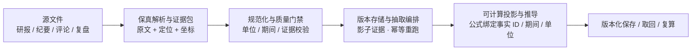
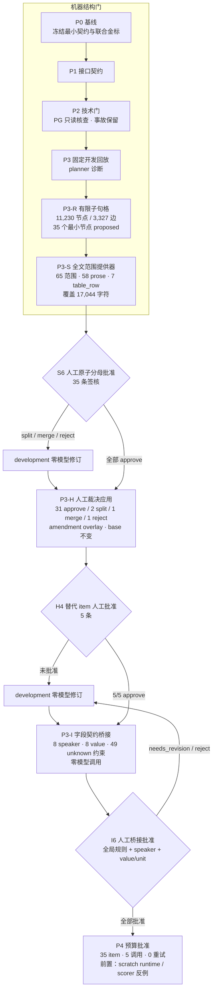
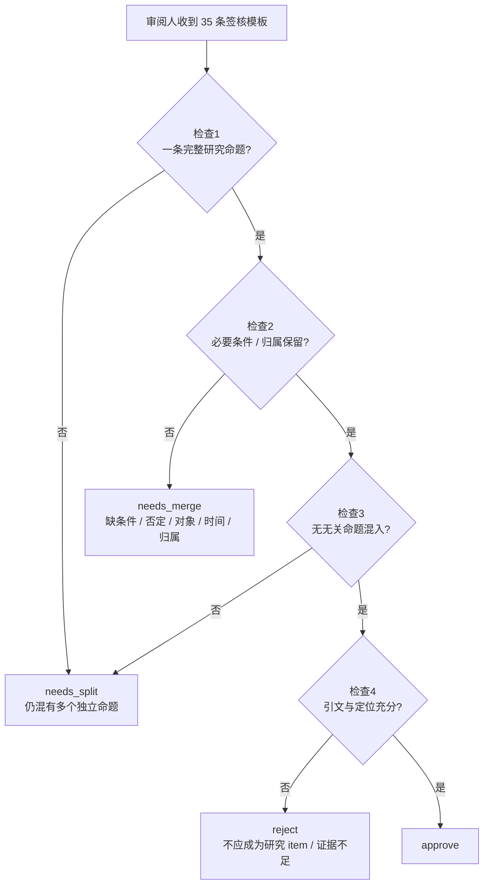
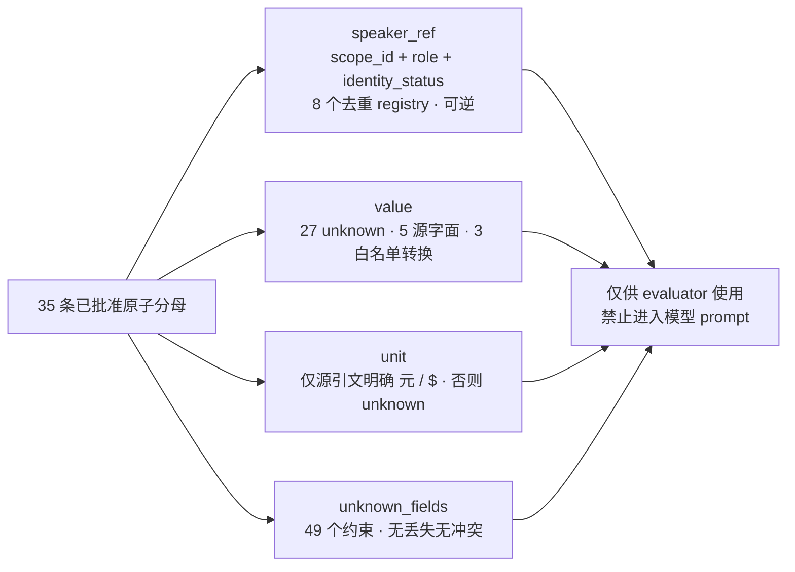

# R2 语料证据流水线 · 流程总图

| 项 | 内容 |
|---|---|
| 版本 / 状态 | v1.0 · 2026-09-14（R2 执行态） |
| 用途 | 展示「语料证据链 → R2 阶段门禁 → 人工复核 → 预算冻结」的完整流程 |
| 配套 | [指导解析](r2-corpus-evidence-pipeline-guide.md) |
| 事实真源 | [spec.md](../../.scratch/corpus-evidence-pipeline/spec.md)、[business-process.md](../business-process.md) |

## 1. 完整证据链（数据 → 可推导证据）

## 2. R2 阶段门禁链（P0 → P4）

## 3. P3-S 人工复核：四项检查与裁决流

## 4. P3-I 字段契约桥接：35 条投影规则

