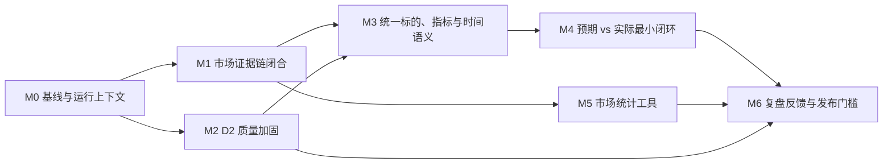

# Claims × 同花顺闭环：整合执行计划

| 项 | 内容 |
|---|---|
| 状态 | **计划草案 · 未开始** |
| 日期 | 2026-09-12 |
| 汇总自 | [D2 Claims 优化改进执行计划](./d2-claims-optimization-plan.md) · [投研双数据链路优化报告](./research-data-closed-loop-optimization-report.md) |
| 总目标 | 构建分层、可降级的数据层策略架构：提升研报抽取质量与市场数据证据链；研报预期可得时，以实际数据验证其兑现；预期缺失时，在满足数据、口径与时点条件下，以多源事实与确定性情景托底，持续形成可验证策略与复盘反馈闭环 |
| 非目标 | 不将同花顺原始响应写入 `claims`；不在 market 模块建设数据仓库；不以 LLM 自由映射财务指标 |

## 1. 完成标准

计划完成不等于“工具能调通”或“claims 能写入数据库”。只有下列条件同时满足，才称为投研闭环完成：

- [ ] 市场 evidence 精确绑定本 run 的逻辑调用，跨 run、错误调用 ID 或篡改 quote 均不能通过验证。
- [ ] D2 claim 的候选、文档类型、指标坐标、单位、期间和时点有可重复的质量审计。
- [ ] 研报预测与市场实际能以统一标的、指标、单位、期间和 `known_at` 安全比较。
- [ ] 系统能够明确返回“可比较结果”或“不可比较原因”，不猜测缺失值、期间或口径。
- [ ] 市场技术指标、仓位计算和预期差均来自确定性模块，并能离线重算或取证。
- [ ] 复盘结果会反哺 D2 别名、分类、坐标和提示词，但不会由单一案例自动改全局规则。

### 1.1 预期缺失时的托底纪律

**公司研报预期不是链路开关。** 没有可用预测 claim 时，系统必须继续评估可用的公司事实、
市场数据、行业/宏观语境和确定性情景；只有所有必要数据都被确认 `absent` 时，才输出
“数据不足，不做判断”。覆盖度为 `unknown` 时应报告“覆盖未验证”并继续尝试其他来源，不能把
接口故障写成无数据。

策略卡必须显式记录 `judgment_basis`，使结论的证据等级可见、可审计：

| `judgment_basis` | 最低证据 | 允许的结论 | 禁止伪装为 |
|---|---|---|---|
| `analyst_forecast` | 可比较的公司预测 claim + 实际市场/财务数据 | 预期是否兑现、预期差 | — |
| `market_facts` | 公司财务事实 + 行情/估值或确定性市场统计 | 经营现状、估值/趋势、条件化策略 | 机构预期或市场一致预期 |
| `industry_context` | 公司市场事实 + 相关行业/宏观证据 | 行业顺逆风、风险条件、观察结论 | 公司盈利预测或目标价 |
| `model_scenario` | 充足的可追溯历史输入 + 确定性公式 | 乐观/基准/悲观情景与触发条件 | 券商预测、市场一致预期 |
| `insufficient_data` | 必要来源均已确认 `absent` | 数据缺口说明 | 倾向性投资判断 |
| `coverage_unverified` | 关键来源为 `unknown`，且尚无足够替代证据 | 覆盖未验证、重试/补数建议 | “确定无数据”或倾向性投资判断 |

`model_scenario` 的每个数值均须带 `computed_by`、公式版本、输入 evidence 和可重算结果；它是
托底情景，不是模型替机构编造预测。

## 2. 依赖与并行关系



| 里程碑 | 可并行项 | 前置条件 | 不满足时不得做 |
|---|---|---|---|
| M0 | D2 基线、市场运行审计 | 无 | 改变抽取/验证行为或全量重跑 |
| M1 | M2 | M0 | 把市场数字视作可验证 evidence |
| M2 | M1 | M0 | 把 claims 用作预期差数据源 |
| M3 | — | M1 + M2 | 连接研报预测与市场实际 |
| M4 / M5 | 可并行 | M3 / M1 | 输出“市场一致预期”或技术指标结论 |
| M6 | — | M2 + M4 + M5 | 标记双链路闭环完成 |

## 3. M0：建立基线与运行事实（P0）

### M0.1 D2 质量基线

- [ ] 新增只读审计入口：输出每个 block 的 triage 结果、原因码、`doc_kind`、表格判定和现有运行状态。
- [ ] 建立至少 180 块的分层金标：公司/行业/宏观各至少 60 块，覆盖评级、数值、表格、长表、目录、免责声明和无信号正文。
- [ ] 记录候选召回率、噪声放行率、分类准确率、表格 precision/recall、字段有效率、空结果率、失败率、token 与耗时。
- [ ] 将公开或脱敏样本纳入 fixture；私有样本仅保留定位和人工标注。

**验收**：对同一语料和参数，审计报告可重复；后续优化均能与基线比较。

### M0.2 市场运行路径审计

- [ ] 明确一次 Agent run 的 `run_id`、市场 trace 目录、service 生命周期和 HTTP client 关闭责任。
- [ ] 核查 factory、四个 market tools、transport、`MarketService`、verify 之间的真实接线。
- [ ] 建立“真实工具路径”测试骨架：`tool registry → market tool → run artifact → strategy.json → verify`。
- [ ] 为供应商原始响应、逻辑调用和聚合 `quote_text` 定义最小留痕格式及保留策略。

**验收**：审计能给出每次市场请求的 run 归属、逻辑调用归属和留痕状态；不能再以直接构造 service 的测试替代真实工具路径。

## 4. M1：闭合市场证据链与生命周期（P0）

### M1.1 Run-scoped MarketContext

- [ ] 引入 `MarketRunContext`，在一次 run 内共享 `MarketService`、transport、circuit breaker、缓存、计数器和 sink。
- [ ] 将同一个 run-scoped sink 同时传给 transport 和 `MarketService`；run 结束时关闭 HTTP client。
- [ ] 保持核心 workflow 不反向 import `plugins.market`；通过已有依赖注入/运行时注册接入上下文。
- [ ] 将默认全局 trace 目录替换为 run 专属目录；禁止跨 run 混读。

### M1.2 精确 evidence 协议

- [ ] 定义 `MarketCall`：逻辑调用 ID、端点、规范参数、供应商 `request_ids`、响应哈希、时点和生成的 `quote_text`。
- [ ] 定义 `EvidenceEnvelope`，让 `market_quote`、`market_history`、`market_financials` 返回可直接写入策略卡的 `source_ref`、`page`、`quote`、`kind`。
- [ ] 对行情 + 估值组合调用使用一个逻辑调用 ID，记录其多个供应商请求 ID；不要假装一个 request ID 覆盖两次请求。
- [ ] `resolve_market_source()` 必须只返回该逻辑调用的留痕，不能按 `thscode` 搜索全部历史记录。
- [ ] trace 写入失败时返回 `trace_status=unverified`；strict 模式下，引用该市场数据必须被拒绝。

### M1.3 安全回归

- [ ] 正确 evidence 通过 `verify`。
- [ ] 错误逻辑调用 ID、同标的跨 run evidence、缺失 trace、篡改 quote、错误时点均失败。
- [ ] 同一 run 的重复请求验证缓存/单飞去重生效；连续失败验证熔断器跨工具调用生效。
- [ ] 验证 client 在 run 结束时关闭，避免长运行中的连接泄漏。

**M1 发布门槛**：市场数据在真实 Agent 路径中可精确取证，才允许将其作为严格策略卡的事实 evidence。

## 5. M2：D2 Claims 质量加固（P0/P1）

### M2.1 修复候选召回

- [ ] 将 triage 拆为“是否候选 + 原因码”：`numeric`、`rating`、`noise`、`no_signal`。
- [ ] 放行无数字的有效评级观点；继续过滤评级说明页、免责声明、联系人和分析师名单。
- [ ] 补中英文评级及噪声反例测试。

**验收**：金标纯评级候选召回率 ≥95%；既有数字类召回不下降；噪声金标不新增误放行。

### M2.2 文档类型与人工覆写

- [ ] 保持 `classify_doc_kind()` 外部接口稳定，增加内部 `kind/reason/confidence` 判定详情。
- [ ] 统一原因码：`manual_override`、`title_ticker`、`single_body_ticker`、`multiple_tickers`、`industry_title`、`macro_title`、`fallback`。
- [ ] 输出低置信度和 `fallback` 文档清单；只建议人工覆写，禁止自动写 `doc_kind_override`。
- [ ] 补策略周报、宏观周报、多公司行业报告、同业比较和无代码文档的 fixture。

**验收**：金标分类准确率 ≥95%；所有覆写优先于规则；分类结果可解释。

### M2.3 指标坐标、表格与长块

- [ ] 定义内部 `MetricCoordinate` 并实现 lint；第一阶段只报告，不迁移 schema。
- [ ] 校验非公司 claim 不带公司 ticker、宏观三态不混用、单位/期间/时点不伪造、同坐标异常冲突可见。
- [ ] 建立表格 fixture 并测量 `is_flat_table()` precision/recall。
- [ ] 实现安全期间等价归一；无法锚定的表格值不进入普通聚合。
- [ ] 对长表使用结构优先压缩，保留标题、表头、单位、期间与数值行。

**M2 发布门槛**：合法 claim 坐标均可解析；不合法坐标被报告；表格金标没有期间错配；D2 输出可以作为比较层候选输入。

## 6. M3：统一比较语义（P0/P1）

### M3.1 领域对象与时间纪律

- [ ] 定义并测试 `InstrumentId`、`MetricId`、`MarketObservation`、`ComparableObservation` 的接口与不变量。
- [ ] 明确并分离 `period_end`、`known_at`、`observed_at`、`retrieved_at`。
- [ ] 财报比较必须以 `report_date_ms` 作为 `known_at`；禁止用报告期末替代披露日。
- [ ] 行情与估值分别保留端点、时点、单位、币种和供应商请求引用；不得用行情时点覆盖估值时点。
- [ ] 数值使用 `Decimal` 或原始文本 + 数值投影；`null` 保持为缺失，不得写为 0。

### M3.2 首批指标映射

- [ ] 仅实现 `eps.basic`、`revenue.operating`、`net_income.parent` 三项 `MetricMap`。
- [ ] 每项映射声明 claims 别名、市场字段、单位换算、适用期间、口径限制和反例。
- [ ] 无映射、单位不明、口径冲突或时点冲突时返回“不可比较原因”。
- [ ] `Claim.kind=opinion` 不参与数值比较，保留为研究论证或反方证据。

### M3.3 覆盖度三态

- [ ] `data_coverage` 由布尔可用性改为 `available / absent / unknown`。
- [ ] 语料库/市场接口不可达、无权限、超时属于 `unknown`，不能描述为“没有数据”。
- [ ] 只有所有必要来源均为 `absent` 时，才输出“数据不足，不做判断”。
- [ ] 关键来源为 `unknown` 且无替代证据时，输出 `coverage_unverified` 和可执行的补数/重试路径，而不是 `insufficient_data`。
- [ ] 覆盖度裁决同时输出建议的 `judgment_basis`、可使用的证据类型、禁止的结论和仍缺的关键证据。
- [ ] 没有公司预测 claim 时，优先落入 `market_facts`、`industry_context` 或满足输入条件的 `model_scenario`，而不是停止链路。

**M3 发布门槛**：给定一个公司、指标和期间，系统要么产生符合时间纪律的可比投影，要么精确说明不可比较原因。

## 7. M4：预期验证与多源托底最小闭环（P1）

- [ ] 新增只读查询/工具：输入公司、指标和期间，返回可比预测、实际、差值、双方 `known_at`、双方 evidence 和不可比较项。
- [ ] 第一阶段按单机构、单文档、单指标、单期间展示；尚未完成 D4 去重和时效规则前，不得称为“市场一致预期”。
- [ ] 完成机构去重、最新预测选择、发布日期切片和离散度规则后，才增加共识视图。
- [ ] 当公司预测 claim 缺失时，输出 `market_facts` 或 `industry_context` 的事实型结论；满足受控输入条件时，才输出 `model_scenario`。
- [ ] `model_scenario` 必须显式展示输入期间、公式、情景参数、`computed_by`、适用范围和失效条件；不得复用“预期差”字段或话术。
- [ ] 建立 fixture：预测兑现、预测偏高、单位不匹配、期间不匹配、财报前视偏差。
- [ ] 增加无公司研报预测的 fixture：公司事实托底、行业语境托底、确定性情景托底、全部来源不足。
- [ ] 将对齐失败按“原始研报差异 / claim 抽取错误 / MetricMap 错误 / 市场口径错误”分类。

**验收**：有预测时可输出预期差；无预测但有可靠事实时链路继续并标明托底依据；只有必要来源均确认缺失时才输出“数据不足”；接口故障或权限问题必须显示为“覆盖未验证”。任何前视偏差、单位冲突或跨口径比较均被拒绝。

## 8. M5：市场-only 路径的确定性分析（P1）

- [ ] 实现 `market_stats`：区间高低、MA5/20/60、年化波动率、最大回撤。
- [ ] 返回输入序列的 `MarketCall` 引用、复权口径、窗口、公式版本和 `computed_by`。
- [ ] 扩展 verify：按相同输入与公式重算市场衍生量；只检查 `computed_by` 不足以防算错。
- [ ] 当无研报但有行情时，允许输出带可重算技术指标的市场-only 报告。
- [ ] 没有确定性计算结果时，策略卡不得引用模型自行计算的均线、波动率和回撤数字。

**验收**：市场-only 报告中的每一个技术指标都有输入引用与重算结果；篡改计算值会被 verify 拦截。

## 9. M6：复盘反馈、运行治理与发布（P1/P2）

- [ ] 将预期差结果写入只读复盘报告，并抽样回链对应 claim、文档块和市场 evidence。
- [ ] 只有经人工确认的系统性问题才进入 `METRIC_ALIASES`、`MetricMap`、triage、分类或提示词规则。
- [ ] dry-run 输出：候选量、triage 原因、文档类型、待覆写文档、预估 token、市场调用/失败/熔断状态。
- [ ] 导出 D2 死信与市场不可验证 evidence 清单，包含错误、版本、调用 ID、文档/运行定位和下一步。
- [ ] 定义市场 run artifact 的权限、留存时长、清理和供应商数据合规要求。
- [ ] 所有 D2 提示词、解析、分类、坐标语义变化均评估并更新 `_EXTRACTOR_REV`；先小范围差异重跑，再批准全量重跑。

**M6 发布门槛**：复盘能区分“研究判断失误”和“数据/抽取/映射错误”；D2 与市场链路均有可操作的失败清单和版本化重跑策略。

## 10. 每次合入的验证清单

```bash
uv run pytest tests/test_corpus_claims.py -q
uv run pytest tests/test_corpus_metadata.py -q
uv run pytest tests/test_market_transport.py tests/test_market_adapter.py tests/test_market_service.py -q
uv run pytest tests/test_market_gate.py tests/test_market_golden.py tests/test_market_isolation.py -q
uv run ruff check plugins/corpus plugins/market plugins/tools tests
uv run pyright
```

与市场 evidence 或运行上下文相关的改动，额外必须验证：

- [ ] 真实 tool registry 路径，而非只直接构造 service；
- [ ] run 隔离、错误调用 ID、篡改 quote、缺失 trace；
- [ ] `strict` 与非 strict 模式的差异；
- [ ] 无 `THS_API_KEY`、`MARKET_ENABLED=false`、429、超时和字段漂移下的降级行为。

## 11. 进度维护规则

1. 每完成一个任务，勾选清单并补充实际测试命令和结果；没有测试结果不得标记完成。
2. 任务受阻时标记 `⛔`，写明阻塞条件与解除方式；不得以跳过硬闸绕过阻塞。
3. M1 与 M2 可并行，但 M4 必须等待 M1、M2、M3 均满足发布门槛。
4. 任一涉及时间、指标、单位或证据协议的范围变化，必须先更新关联设计文档和本清单。
5. 全量 claims 重抽或面向真实任务启用新的市场证据协议前，必须归档差异报告并完成小范围验收。
