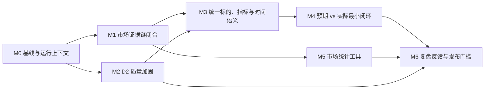

# 研究材料 × 同花顺数据 × 分析：统一执行计划

| 项 | 内容 |
|---|---|
| 状态 | **有效 · 当前唯一跨层执行清单**；已有证据与市场工具基础，完整业务闭环未验收 |
| 日期 | 2026-09-14 |
| 汇总自 | [D2 Claims 优化改进执行计划](./d2-claims-optimization-plan.md) · [投研双数据链路优化报告](./research-data-closed-loop-optimization-report.md) |
| 总目标 | 研究材料提供观点、论据和视角；同花顺接口提供结构化政府/市场观测与数据计算；分析层按需关联，形成来源、作者判断与系统分析分明的研究产物 |
| 非目标 | 不将同花顺原始响应写入 `claims`；不在 market 模块建设数据仓库；不以 LLM 自由映射财务指标 |

> 产品范围、状态语义与完成定义以 [产品需求基线](../product-requirements.md) 和
> [业务流程](../business-process.md) 为准。本文“当前执行清单”是跨层任务和顺序的唯一维护位置。
> 原 M0—M6 详细设计保留在后半部分作历史参考，不再按其旧顺序自动执行；宏观 M1—M6 也不是本项目总计划。

2026-09-14 用户确认：Web 后续开发与接入暂缓，先在 CLI 打通材料、数据、分析链路。
实施细化见 [R2 局部重设计与 CLI 闭环计划](r2-local-redesign-cli-closure-plan.md)；本文继续维护唯一
跨层任务状态。计划已补齐八项执行条件，P0-A 通过、P0-PG 未验证；P1 契约已冻结、合成规划检查
通过；P2技术门完成并保留PG历史不确定性。纯离线P3确认v12/v13旧raw完整但新wire不可回放，
原planner在微范围与全文均0 candidate。P3-R有限子句格随后实现35/35唯一最小定位；P3-S进一步
将全文14/14 packet完整覆盖为65个范围，58个prose范围全部通过子句格，7个table_row保持隔离。
17正/8负关系端点均可引用。首轮人工复核为31 approve、2 split、1 merge、1 reject；P3-H以overlay
应用意见后有效分母为35 item、16正/8负，节点/范围重放通过；5条替代项随后人工5/5 approve，
35条原子分母全部通过。P4预算前检查发现P1/P2 wire的`speaker_ref/unit`与微金标的
`speaker_role/identity_status/unknown_fields`没有冻结桥接，且8条复合value不能由当前规则无损表达。
P3-I的35条evaluation-only字段投影、8个speaker映射、8条value/unit及全局规则已人工全approve。
P4随后冻结最多5调用、零重试单轮预算；实际首批调用1次，8个义务全部返回，4条因semantic枚举
非法被拒，余下27个义务未发送。本轮预算关闭。后续零模型回溯发现P4从gold选原子边界、绕过P2
运行接口、遗漏字段来源契约，G2与G6评分定义也有缺陷；不能把该轮解释为完整R2能力验收。

2026-09-14 最新用户边界：项目处实验阶段，数据库数据可重塑；妨碍目标的旧流程可重整或剔除。
保护对象改为原文可追溯、归属/未知诚实、取证与计算能力，不要求旧表/旧入口/全部源码永久不变。
下一步优先归并主执行链、独立于gold的规划和正确验收；旧兼容模块及实验数据按具体依赖与对象
清单重整。本轮仅诊断，未执行数据迁移或删除。完整依据见
[P4归因与旧流程重整评估](../../.scratch/corpus-evidence-pipeline/r2-p4-root-cause-and-legacy-review.md)。
局部计划plan-v13及以前的冻结边界保留其阶段历史，不覆盖本次用户说明。见
[P0 执行报告](../../.scratch/corpus-evidence-pipeline/r2-p0-baseline-report.md) 与
[P1 执行报告](../../.scratch/corpus-evidence-pipeline/r2-p1-report.md) 与
[P2-B 执行报告](../../.scratch/corpus-evidence-pipeline/r2-p2b-report.md) 与
[执行偏差报告](../../.scratch/corpus-evidence-pipeline/r2-p2b-guard-incident.md)。
P4前置诊断见
[字段契约缺口报告](../../.scratch/corpus-evidence-pipeline/r2-p4-readiness-contract-gap-report.md)。

2026-09-14 非纪要范围复核：本阶段测试范围排除电话/会议纪要，保留公司研报、行业问答研报及个人
交易复盘；源文件与历史结果留存。原v13三范围重评分24/25 item，关键错误仍1个，行业类型12/14；
最新P3-I/P4三范围为24义务，8个已发送中4合法/4非法，16未评估。55项基础取证/财务/接口测试
通过，1项PG测试在离线边界下跳过。新增模型调用0，R2仍未通过；新分母不追溯修改v13。
见[排除纪要后的测试结论](../../.scratch/corpus-evidence-pipeline/r2-nonminutes-report-v1.md)。

2026-09-14 最新实施方向：按用户本轮要求，主要清洗对象收缩为**公司、行业、宏观三类研报**；
电话/会议/交流纪要及业绩会实录退出本阶段默认处理和业务验收。个人复盘等暂作为历史与必要兼容
回归，不占主线新模型预算。书面问答研报仍保留，混合/未知材料先人工准入复核。
本轮已形成[三类研报清洗与 R2 收口方案](research-report-cleaning-scope-plan.md)，并同步产品需求
与业务流程；实际准入、清洗重构和新预算尚未实施。当时提出 R2-S0—S5，历史 P0—P4
记录保留，不再按旧四类分母或旧预算自动继续。

随后完成[清洗与入库回溯诊断](../../.scratch/corpus-evidence-pipeline/cleaning-ingestion-diagnosis-report.md)：
11 个离线检查中 9 个目标契约不满足，涵盖重清洗跳过、解析/检索双路径、局部状态/定位及元数据
失败恢复；P4 协议失败也在无 PG 时重现。既有测试 35 通过、5 项 PG 依赖因离线守卫跳过。
当时建议在 S0—S3 明确来源/解析/活动发布版本及恢复契约，再在 S5 验证真实 PG；这是诊断建议，
未实施重设计、未重建数据，也未改变模型授权。

2026-09-14 后续整体设计：[语料清洗、切块、入库与索引重构](corpus-ingestion-rebuild-architecture.md)
将确定性基础链路拆为 **I0—I5，当前下一步 I0**。保留 PG/中文全文检索及适用读取库，重建统一
来源、保真视图、结构切块、版本化候选与活动发布；真实 PG/CLI 门前移至 I2/I3，**不再等待 R2
模型成功**。R2-S* 只消费同一基础产物并验证语义，不另建解析主链。清理旧派生数据在 I4 按批准
清单执行，先有备份恢复和新链验证；本轮仅形成设计，未改代码、未连库、未删除、未调用模型。

2026-09-15 评审修订：[重构草案 v1.1](corpus-ingestion-rebuild-architecture.md) 将选型/七表/清理
策略明确为待验证候选。I0 拆为 A 实际盘点与逻辑/测试基线、B 首次恢复演练、C 基于证据的物理
设计复核，允许调整或否决候选；I4 还须最新备份恢复及精确清单批准。补齐准入、引用权威、时间、
覆盖、租约和零模型契约及测试资产设计。本轮只改文档，I0-A/B/C 均未执行，新资产/功能未生成。

## 当前职责与非目标

- 研究材料在领域上可包括纪要和个人记录，但本阶段主要交付对象仅为公司、行业、宏观研报。
  材料类型、company/industry/macro 领域、事实/预测/观点/行为语义分别表达。纪要退出默认处理
  与验收；个人复盘等保留必要兼容，不扩展优化。不删除原材料、不重标留出，不因出现问答误排研报。
- 数据层复用既有同花顺行情、历史和财务工具；政府统计的端点、权限、发布时间和版本覆盖待用户接口契约确认。
- 分析层可联系观点与数据，但只在标的、口径、期间及用途要求兼容时比较，保留两个来源身份。
- 研报数字保留为来源论据，已有财务复算保留为来源内部一致性检查；不自动写成数据层事实。
- 不要求材料逐条回查官网；不因数据接口失败阻止普通材料理解；不用材料数字静默填补数据缺口。
- 当前存在service旧R2、P2私有实现和P4 scratch三条路径，需按同一正式接口归并并重新验证。
  用户允许重整实验数据与阻碍目标的旧实现；实际迁移/退休先明确对象与消费方。首次数据库访问
  偏差的历史不确定性保留，不因新授权改写事故。本次没有全库重抽或接入新接口。
- 不建设第二套 claims 规则或观点存储；优先复用现有证据版本、定位、查询及审计能力。

## 当前完成情况（区分实现、实测与放行）

| 能力/旧任务 | 已完成 | 未完成或限制 |
|---|---|---|
| Corpus 01—05、09 | 保真证据、校验、保存、统一 service/CLI、限定财务公式 | 旧 blocks 不原地更新；在线 Agent/Web 全接管未验收 |
| 06—07 | 首次试验及正文响应修复，定点真实取证通过 | 原失败记录保留；不证明所有正文可用 |
| 10、13 | 净利率复核、口径询问草稿 | 作者公式未确认，草稿未发送；源比率不自动纠正 |
| 11、08/14 | 扩大留出已执行，已知错误放行 5/5→0/5，客户表 0/12→12/12，正文数字 2/3→3/3 | 08/14 部分完成；修复样本已是开发集，新的独立留出仍缺；宏观旧规范字段验收仍 0/3 |
| 宏观 M1 | 不可变模型、受控单位转换与应用内存审核机制 | 不是数据接口接通或生产计算放行；不把材料自动晋升为观测 |
| 宏观 M2 | 官方适配器和 60 项离线测试 | BLS 403；真实网页验收按用户决定暂缓，不是验收成功 |
| 同花顺既有实现 | 行情、历史、财务工具及基础 trace/治理 | 不代表政府宏观覆盖或精确 Run 证据链已验收；本轮未探测在线权限 |
| R1 材料契约/金标 | 最小产物、4 份开发 + 2 份独立留出、37 个 item/7 条关系、阈值与预算已冻结 | 电话交流纪要已有开发正样本，但无独立留出；不代表材料理解已放行 |
| R2 材料语义 | 已实现 EvidenceRun 附属 MaterialRun、未入库路径、结构能力分级、有限槽位/终态和受限关系候选；v12 曾达 37/37 终态 | v13 最终轮 9/9 调用，item 34/35、semantic 31/34、关键错误 1，36/37 槽终态；当前设计停止。诊断另确认评分、字段归一化、逐类非回归与共享影响缺口；关系/留出未运行，R3 不启动 |
| 综合分析 | opinion、定性和个人交易候选有基础能力 | 跨层分析尚未验收 |

最近工程记录（2026-09-14 诊断轮）：corpus/market/coverage/sizing/lint 495 项通过、36 项 PG 依赖
跳过、1 项真实语料测试排除，另排除包含真实 PDF 抽样的测试文件；workflow/registry/profile 110 项
通过，共 605 项不重叠用例。R2 禁用故障注入为其中重复子集，169 项通过、1 项跳过。import smoke
336/336 与 385/385、符号检查 435 文件 0 missing。没有真实模型、市场或生产 PG 调用，未运行完整
仓库/CLI 业务 E2E；这些结果不证明真实材料与整条数据链已验收。详见
[流程诊断](../../.scratch/corpus-evidence-pipeline/r2-project-alignment-and-regression-audit-20260914.md)。

## 当前执行清单

| ID | 任务与问题文件 | 需求 | 依赖 | 状态与完成门槛 |
|---|---|---|---|---|
| R1 | [最小输出与联合金标](../../.scratch/corpus-evidence-pipeline/issues/19-material-contract-gold.md) | PR-DATA-09/10、PR-OUT-06/07 | 无外部接口依赖 | **已完成**；契约和联合金标校验通过，电话交流纪要开发覆盖已补，独立留出缺口保留 |
| I0—I5 | [语料基础链路重构](corpus-ingestion-rebuild-architecture.md) | PR-DATA-01/02/09/12、PR-OUT-04/06/07 | 三类范围已明确；候选设计待 I0 证据复核 | **草案 v1.1，I0-A/B/C 均待执行**；强制零模型，独立验收清洗/切块/PG/索引/CLI 取证；物理架构未冻结、未清库，不依赖 R2 语义通过 |
| R2 | [历史语义任务](../../.scratch/corpus-evidence-pipeline/issues/20-material-semantics.md) · [三类研报清洗与收口方案](research-report-cleaning-scope-plan.md) · [归因评估](../../.scratch/corpus-evidence-pipeline/r2-p4-root-cause-and-legacy-review.md) | PR-DATA-01/02/09/12、PR-OUT-06/07 | R1 历史资产 + I 基础接口 + R2-S0 新分母 | **partial / 历史 P4 failed**；后续语义任务未实施，来源准备复用 I 链路，归并执行并修正验收；新模型预算未冻结 |
| R3 | [材料读取与小样本闭环](../../.scratch/corpus-evidence-pipeline/issues/21-material-readout.md) | PR-OUT-06/07、PR-DATA-12 | R2 | 待执行；优先 CLI 正式命令与终端 Agent 材料读取、保存/取证、重放与交付，无同花顺数据亦可验收；Web 暂缓 |
| D1 | [同花顺数据契约与调用证据](../../.scratch/corpus-evidence-pipeline/issues/22-ths-data-contract.md) | PR-DATA-03/06/11/12 | 用户接口资料/合法权限；复用既有工具 | 待确认/执行；先列真实可用能力，再单样本验证数据类型、单位、时间、版本和调用身份 |
| D2 | [数据层受控推导](../../.scratch/corpus-evidence-pipeline/issues/23-data-derivation.md) | PR-OUT-03/07、PR-DATA-11/12 | D1 对应所选输入通过 | 待执行；输入来自数据层，限定公式可重放；缺失、单位/时间错配拒绝，不用材料填补 |
| A1 | [分析层只读关联](../../.scratch/corpus-evidence-pipeline/issues/24-analysis-linking.md) | PR-DATA-07/08/12、PR-OUT-06 | R3、D1；需算术时依赖 D2 | 待执行；作者观点、接口观测和系统分析分开；保留差异与不可比原因 |
| V1 | [独立留出与产品接入验收](../../.scratch/corpus-evidence-pipeline/issues/25-research-acceptance.md) | PR-DATA-04/05、PR-OUT-04/07 | 按 R/D/A 用途分别满足前置 | 待执行；优先 CLI 进程级与终端 Agent 运行/证据/隔离/恢复验收，R/D/A 分别报告；Web 接入项 deferred，不因 CLI 通过宣称 Web 完成 |

**材料分支当前仍停留 R2。** v13 的公司评级因重复短引文在槽位解析前被拒而缺失；进一步诊断发现
内容忠实度与终态可绕过评分、部分规则强填未知、逐类非回归与预算 hash 未完整执行。公司及铜箔
子范围出现退化，不能解释成“只差最后一个评级”。历史各轮分数/失败保留在 issue 20 与样板案例。
有限槽位微实验不等于全文覆盖，旧关系结果也不代表全部关系类型。v13 预算关闭，holdout/R3 未启动。

### 基础链路 I0—I5（当前优先，唯一进度台账）

设计见[重构草案 v1.1](corpus-ingestion-rebuild-architecture.md)。以下均待执行，文档修订不等于过门。

| ID | 当前任务 | 依赖 | 状态 / 放行条件 |
|---|---|---|---|
| I0 | A 实际对象/消费者/共库/准入与开发基线；B 首次恢复演练；C 证据驱动的字段级设计复核 | 用户范围已明确；每阶段明确目标/权限 | **A/B/C 均待执行，下一步 A**；零模型，留出不进入开发，不删除；未决可阻断，允许推翻七表/清理候选 |
| I1 | 统一解析、保真清洗、结构切块与内存执行链 | I0-A 逻辑契约/开发基线冻结 | 待执行；仅纯内存工作可不等 B/C，反例/映射通过不冒充 I0 完成 |
| I2 | 经 I0-C 冻结的 PG 布局、候选写入/索引、原子发布及恢复 | I0-A/B/C + I1 + 显式隔离 PG | 待执行；含租约接管的真实事务/FTS 门不可 skip，不改默认旧库 |
| I3 | 三类各至少两份已使用开发材料的 CLI/真实工具零模型闭环 | I2 + 冻结来源/查询/证据 gold 与评分定义 | 待执行；逐类清洗/文档召回/证据命中及旧财务非回归通过，不等待 R2 |
| I4 | 经复核批准的迁移/清理、重建与切换 | I3 + 最新一致性备份恢复 + 精确清单/批准 | 待执行；I0 演练不能替代最新备份核验；原文/人工/审计保留，无污染，失败可恢复 |
| I5 | 增量、版本升级重建与维护文档，退役旧入口 | I4 | 待执行；重复执行、重解析、重切块和重索引可重复，无双写 |

I3 的开发验证不冒充未见材料泛化验收；I4 全量构建仍逐来源检查。R2 零模型接口工作可以在
基础接口稳定后衔接，但模型预算仍须 R2-S3 独立过门。

### R2 下游语义分阶段状态（唯一进度台账）

完整交付、准入规则与门槛见[三类方案](research-report-cleaning-scope-plan.md)。本轮仅更新计划，
下列实现任务均未标完成；不把上轮的排除重评分视为已部署筛选。

| ID | 当前任务 | 依赖 | 状态 / 放行条件 |
|---|---|---|---|
| R2-S0 | 在 I0 清单上冻结语义开发范围、逐类分母与保护矩阵 | I0 | 待执行；复用准入决定，不读留出；不将个人复盘或旧宏观字段冒充新分母 |
| R2-S1 | 将统一来源单元/清洗视图接入 R2，验证字段保真与结构缺口 | S0 + I1 | 待执行；复用 I 实现，不重写解析；评级/表格/宏观原字段和财务正负控通过 |
| R2-S2 | 归并执行 Interface、字段来源/终态协议、fake/replay 与 CLI 规划入口 | S1 | 待执行；无 gold 可运行，预算容量可算，历史失败正确归类 |
| R2-S3 | 新 scorer、三类开发标注冻结、语义 CLI 进程级与逐类非回归门 | S2 + I3 基础过门 | 待执行；零模型门全通过，才提交单轮模型预算；标注缺口具体交人工 |
| R2-S4 | 单轮有界模型验证，先协议后 item | S3 + 独立预算授权 | **未授权**；建议最多 8 调用含 preflight、零重试，按实际容量另冻；失败关闭余额 |
| R2-S5 | 语义产物 PG 保存/重放、材料 CLI 闭环、必要关系与独立留出 | S4 对应用途通过 + 分项预算/环境门 | 待执行；复用 I 链路已验证 PG/取证，不再承担首次基础入库；不以条目通过代替完整材料或产品验收 |

新主线不能复用“剩余 24 条”作分母：其中个人复盘 4 条转为辅助兼容，公司 7 + 行业 13 = 20 条
仅作开发参照，宏观须另冻结真实小范围标注。宏观旧规范字段 0/3 不是新 R2 原子分母。
原 scorer、金标和历史预算只读；新 scorer 重评可对齐基线与候选，不追溯改写旧结论。

### 历史局部重设计阶段记录（非当前待执行顺序）

以下 P0—P4 保留当时四类/六微范围、保护清单和独立预算的事实。当前执行与保护范围按 I0—I5、R2-S0—S5
及最新用户要求，不能以历史余量、新计划或未评估结果授权调用。

P0 最新执行：冻结 2336 个代码/配置/测试文件和 54 个资产；v12/v13 各 9 份原始响应 hash 全部
匹配。605 项旧工程用例 + 18 项基线工具用例通过，169 项 R2 禁用为重复子集；两次独立进程及
禁用 R2 的行为快照逐字一致。36 项 PG 依赖仍跳过，隔离 PG/扩展未验证，故 P0 总体 partial。
运行时校验与金标开发验收已经在计划中区分；这次没有实现新语义抽取或生成新评分通过结论。

P1 最新执行：前瞻冻结 [Interface/终态/评分契约](r2-p1-interface-contract.md)，新增纯规划可执行
规格与 65 项合成检查（全部通过）。P0 保护复核通过；新的 R2 禁用快照与 P0 完全相同。
结构候选仍不等于已验证原子命题；真实四类覆盖、原子分母裁决、输出级语义反例和预算安全尚待 P2/P3。
本轮没有生产改动或新调用，完整 R2 仍 partial，不以设计完成替代业务验收。

P2-A阶段记录：独立item evaluator及73项合成正反控通过；组合P0/P1既有测试共156通过，旧流程
禁用R2快照不变。评分绑定整条输出/裁决，min/max和十字段轴分开；G4—G7仍未评估且预算授权恒false。
私有执行、fake关系、raw/attempt独立核验及崩溃保存故障未完成，P2整体partial，下一段继续这些项。

P2-B阶段记录：新增3个私有模块、75项离线检查；与P1/P2-A组合213项通过，原2336保护文件不变。
已完成fake/replay执行、八关系类型协议、raw重建校验、预算预留及崩溃/保存故障处理。
首次回归遗漏PG阻断，既有测试连接数据库并执行测试schema写入/删除及真实语料读取；原结果作废。
修复复验605项通过、36项PG跳过，R2禁用169项为重复子集，离线快照不变；这不证明数据库零影响。
该阶段结束时P2保持partial、P3暂停，等待只读影响核查授权；后续结果见下。P0-PG正式隔离门未验证。

随后用户授权的[PG只读核查](../../.scratch/corpus-evidence-pipeline/r2-p2b-pg-readonly-report.md)已完成：
目标是持久化语料库，当前无测试schema残留；89文档/1101块/1318claims，孤立引用和失效索引均0，
旧备份78文档标识/存储哈希全部一致，事件窗主库新增文档/EvidenceRun/入库运行均0。
缺事前快照及完整日志，不能证明历史零影响；不修改数据库、不自动解除P3/PG/模型预算门。

R2→R3 不等待政府数据、行情或 BLS；D1 在用户接口资料具备后独立推进，需补齐 CLI Run/逻辑调用
精确取证，不能仅验证同标的 trace 含有数字。A1 不合并原始来源。上述并行只描述依赖，不创建代理
或后台任务。当前优先 CLI；Web 暂缓，既有平台账户、安全与隔离机制保护不动。

### 最小验收设计

R1 已冻结 4 份开发材料和 2 份未用于旧审计/调规则的独立留出；覆盖研报、个人交易/复盘及一份
用户新增但未入库的专家电话交流纪要。新增纪要按原文件 hash 与 Markdown 行号冻结为开发样本，
不冒充独立留出；`earnings_call` 和电话会议/纪要独立留出仍缺。“十问十答”仍是研报。
精确金标、验收阈值、预算和停止条件见 [R1 契约](../corpus-material-understanding-contract.md)；
旧标注资料只作开发输入，不能改称新留出。

- 材料：关键观点、论据、条件/否定、风险、表达者与行为状态分别计召回和错误；预测后来成真不计作抽取成功。
- 关系：原文明确关系与系统推断分开；问句不算承诺、计划不算成交、事后理由不倒填。
- 数据：调用来源、原值、单位、期间/时点、版本和算术单独验收；价格可能变化，重放比较固定调用而非再次查询的最新价。
- 综合：只读保留双方来源；不因数据冲突改写材料，不把多个转载当多个独立论据，不把系统归纳冒充作者视角。
- 样本关键归属、否定和行为状态不得发生错误放行；允许未知但必须计入未完成项，不能靠全部拒绝取得“零错误”。
- 所有测验同时报告预算、失败、遗漏和任务完成情况；业务验收不由 pytest 通过数替代。

## 旧计划迁移与暂缓项

| 原事项 | 当前归属 |
|---|---|
| D2 Claims 待办、Corpus 08/14 余项 | 语境/语义/独立样本归 R1—R3/V1；大范围 OCR、跨页与全库治理后置，不销毁历史记录 |
| 原总计划 M0/M1 的 Run 市场证据 | D1；历史技术要求保留，但按当前代码重新核验状态 |
| 原总计划 M3/M4 比较、M5 统计、M6 发布 | 分别归 A1、D2、V1；不以数字比较作为所有材料必经步骤 |
| 宏观 M1 | 已有可复用模型；用途由 D1/D2/A1 的真实契约决定 |
| 宏观 M2 | 用户暂缓，不继续爬官网；保留未通过真实验收状态 |
| 宏观 M3 一致预期 | 按需；政府数据和行情接口不等于自动提供一致预期，不在本轮假设覆盖 |
| 宏观 M4—M6 | 不再作为研报数字计算主线；数据计算归 D2、关系比较归 A1、验收接入归 V1 |

### 文档和状态维护

产品范围以产品需求为准，术语只进 CONTEXT，业务流程只进 business-process，本表维护实施顺序。
问题文件记录证据与阻塞，不复制一份相互独立的总优先级。旧报告的失败、样本数和版本不改写。
本次整理任务见 [18](../../.scratch/corpus-evidence-pipeline/issues/18-research-scope-reset.md)。

---

## 历史详细设计（2026-09-12；以下旧编号与勾选不作为当前任务状态）

以下保留原市场证据、比较和治理设计，供对应 R/D/A/V 任务选取复用；不表示重新授权执行。
其中“下一步”“必须等待 M1—M3”等旧顺序已由上面的当前执行清单替代。

## 1. 完成标准

计划完成不等于“工具能调通”或“claims 能写入数据库”。只有下列条件同时满足，才称为投研闭环完成：

- [ ] 市场 evidence 精确绑定本 run 的逻辑调用，跨 run、错误调用 ID 或篡改 quote 均不能通过验证。
- [ ] D2 claim 的候选、文档类型、指标坐标、单位、期间和时点有可重复的质量审计。
- [ ] 研报预测与市场实际能以统一标的、指标、单位、期间和 `known_at` 安全比较。
- [ ] 系统能够明确返回“可比较结果”或“不可比较原因”，不猜测缺失值、期间或口径。
- [ ] 市场技术指标、仓位计算和预期差均来自确定性模块，并能离线重算或取证。
- [ ] 复盘结果会反哺 D2 别名、分类、坐标和提示词，但不会由单一案例自动改全局规则。

### 1.1 预期缺失时的托底纪律

**公司研报预期不是链路开关。** 没有可用预测 claim 时，系统必须继续评估可用的公司事实、
市场数据、行业/宏观语境和确定性情景；只有所有必要数据都被确认 `absent` 时，才输出
“数据不足，不做判断”。覆盖度为 `unknown` 时应报告“覆盖未验证”并继续尝试其他来源，不能把
接口故障写成无数据。

策略卡必须显式记录 `judgment_basis`，使结论的证据等级可见、可审计：

| `judgment_basis` | 最低证据 | 允许的结论 | 禁止伪装为 |
|---|---|---|---|
| `analyst_forecast` | 可比较的公司预测 claim + 实际市场/财务数据 | 预期是否兑现、预期差 | — |
| `market_facts` | 公司财务事实 + 行情/估值或确定性市场统计 | 经营现状、估值/趋势、条件化策略 | 机构预期或市场一致预期 |
| `industry_context` | 公司市场事实 + 相关行业/宏观证据 | 行业顺逆风、风险条件、观察结论 | 公司盈利预测或目标价 |
| `model_scenario` | 充足的可追溯历史输入 + 确定性公式 | 乐观/基准/悲观情景与触发条件 | 券商预测、市场一致预期 |
| `insufficient_data` | 必要来源均已确认 `absent` | 数据缺口说明 | 倾向性投资判断 |
| `coverage_unverified` | 关键来源为 `unknown`，且尚无足够替代证据 | 覆盖未验证、重试/补数建议 | “确定无数据”或倾向性投资判断 |

`model_scenario` 的每个数值均须带 `computed_by`、公式版本、输入 evidence 和可重算结果；它是
托底情景，不是模型替机构编造预测。

## 2. 依赖与并行关系



| 里程碑 | 可并行项 | 前置条件 | 不满足时不得做 |
|---|---|---|---|
| M0 | D2 基线、市场运行审计 | 无 | 改变抽取/验证行为或全量重跑 |
| M1 | M2 | M0 | 把市场数字视作可验证 evidence |
| M2 | M1 | M0 | 把 claims 用作预期差数据源 |
| M3 | — | M1 + M2 | 连接研报预测与市场实际 |
| M4 / M5 | 可并行 | M3 / M1 | 输出“市场一致预期”或技术指标结论 |
| M6 | — | M2 + M4 + M5 | 标记双链路闭环完成 |

## 3. M0：建立基线与运行事实（P0）

### M0.1 D2 质量基线

- [ ] 新增只读审计入口：输出每个 block 的 triage 结果、原因码、`doc_kind`、表格判定和现有运行状态。
- [ ] 建立至少 180 块的分层金标：公司/行业/宏观各至少 60 块，覆盖评级、数值、表格、长表、目录、免责声明和无信号正文。
- [ ] 记录候选召回率、噪声放行率、分类准确率、表格 precision/recall、字段有效率、空结果率、失败率、token 与耗时。
- [ ] 将公开或脱敏样本纳入 fixture；私有样本仅保留定位和人工标注。

**验收**：对同一语料和参数，审计报告可重复；后续优化均能与基线比较。

### M0.2 市场运行路径审计

- [ ] 明确一次 Agent run 的 `run_id`、市场 trace 目录、service 生命周期和 HTTP client 关闭责任。
- [ ] 核查 factory、四个 market tools、transport、`MarketService`、verify 之间的真实接线。
- [ ] 建立“真实工具路径”测试骨架：`tool registry → market tool → run artifact → strategy.json → verify`。
- [ ] 为供应商原始响应、逻辑调用和聚合 `quote_text` 定义最小留痕格式及保留策略。

**验收**：审计能给出每次市场请求的 run 归属、逻辑调用归属和留痕状态；不能再以直接构造 service 的测试替代真实工具路径。

## 4. M1：闭合市场证据链与生命周期（P0）

### M1.1 Run-scoped MarketContext

- [ ] 引入 `MarketRunContext`，在一次 run 内共享 `MarketService`、transport、circuit breaker、缓存、计数器和 sink。
- [ ] 将同一个 run-scoped sink 同时传给 transport 和 `MarketService`；run 结束时关闭 HTTP client。
- [ ] 保持核心 workflow 不反向 import `plugins.market`；通过已有依赖注入/运行时注册接入上下文。
- [ ] 将默认全局 trace 目录替换为 run 专属目录；禁止跨 run 混读。

### M1.2 精确 evidence 协议

- [ ] 定义 `MarketCall`：逻辑调用 ID、端点、规范参数、供应商 `request_ids`、响应哈希、时点和生成的 `quote_text`。
- [ ] 定义 `EvidenceEnvelope`，让 `market_quote`、`market_history`、`market_financials` 返回可直接写入策略卡的 `source_ref`、`page`、`quote`、`kind`。
- [ ] 对行情 + 估值组合调用使用一个逻辑调用 ID，记录其多个供应商请求 ID；不要假装一个 request ID 覆盖两次请求。
- [ ] `resolve_market_source()` 必须只返回该逻辑调用的留痕，不能按 `thscode` 搜索全部历史记录。
- [ ] trace 写入失败时返回 `trace_status=unverified`；strict 模式下，引用该市场数据必须被拒绝。

### M1.3 安全回归

- [ ] 正确 evidence 通过 `verify`。
- [ ] 错误逻辑调用 ID、同标的跨 run evidence、缺失 trace、篡改 quote、错误时点均失败。
- [ ] 同一 run 的重复请求验证缓存/单飞去重生效；连续失败验证熔断器跨工具调用生效。
- [ ] 验证 client 在 run 结束时关闭，避免长运行中的连接泄漏。

**M1 发布门槛**：市场数据在真实 Agent 路径中可精确取证，才允许将其作为严格策略卡的事实 evidence。

## 5. M2：D2 Claims 质量加固（P0/P1）

### M2.1 修复候选召回

- [ ] 将 triage 拆为“是否候选 + 原因码”：`numeric`、`rating`、`noise`、`no_signal`。
- [ ] 放行无数字的有效评级观点；继续过滤评级说明页、免责声明、联系人和分析师名单。
- [ ] 补中英文评级及噪声反例测试。

**验收**：金标纯评级候选召回率 ≥95%；既有数字类召回不下降；噪声金标不新增误放行。

### M2.2 文档类型与人工覆写

- [ ] 保持 `classify_doc_kind()` 外部接口稳定，增加内部 `kind/reason/confidence` 判定详情。
- [ ] 统一原因码：`manual_override`、`title_ticker`、`single_body_ticker`、`multiple_tickers`、`industry_title`、`macro_title`、`fallback`。
- [ ] 输出低置信度和 `fallback` 文档清单；只建议人工覆写，禁止自动写 `doc_kind_override`。
- [ ] 补策略周报、宏观周报、多公司行业报告、同业比较和无代码文档的 fixture。

**验收**：金标分类准确率 ≥95%；所有覆写优先于规则；分类结果可解释。

### M2.3 指标坐标、表格与长块

- [ ] 定义内部 `MetricCoordinate` 并实现 lint；第一阶段只报告，不迁移 schema。
- [ ] 校验非公司 claim 不带公司 ticker、宏观三态不混用、单位/期间/时点不伪造、同坐标异常冲突可见。
- [ ] 建立表格 fixture 并测量 `is_flat_table()` precision/recall。
- [ ] 实现安全期间等价归一；无法锚定的表格值不进入普通聚合。
- [ ] 对长表使用结构优先压缩，保留标题、表头、单位、期间与数值行。

**M2 发布门槛**：合法 claim 坐标均可解析；不合法坐标被报告；表格金标没有期间错配；D2 输出可以作为比较层候选输入。

## 6. M3：统一比较语义（P0/P1）

### M3.1 领域对象与时间纪律

- [ ] 定义并测试 `InstrumentId`、`MetricId`、`MarketObservation`、`ComparableObservation` 的接口与不变量。
- [ ] 明确并分离 `period_end`、`known_at`、`observed_at`、`retrieved_at`。
- [ ] 财报比较必须以 `report_date_ms` 作为 `known_at`；禁止用报告期末替代披露日。
- [ ] 行情与估值分别保留端点、时点、单位、币种和供应商请求引用；不得用行情时点覆盖估值时点。
- [ ] 数值使用 `Decimal` 或原始文本 + 数值投影；`null` 保持为缺失，不得写为 0。

### M3.2 首批指标映射

- [ ] 仅实现 `eps.basic`、`revenue.operating`、`net_income.parent` 三项 `MetricMap`。
- [ ] 每项映射声明 claims 别名、市场字段、单位换算、适用期间、口径限制和反例。
- [ ] 无映射、单位不明、口径冲突或时点冲突时返回“不可比较原因”。
- [ ] `Claim.kind=opinion` 不参与数值比较，保留为研究论证或反方证据。

### M3.3 覆盖度三态

- [ ] `data_coverage` 由布尔可用性改为 `available / absent / unknown`。
- [ ] 语料库/市场接口不可达、无权限、超时属于 `unknown`，不能描述为“没有数据”。
- [ ] 只有所有必要来源均为 `absent` 时，才输出“数据不足，不做判断”。
- [ ] 关键来源为 `unknown` 且无替代证据时，输出 `coverage_unverified` 和可执行的补数/重试路径，而不是 `insufficient_data`。
- [ ] 覆盖度裁决同时输出建议的 `judgment_basis`、可使用的证据类型、禁止的结论和仍缺的关键证据。
- [ ] 没有公司预测 claim 时，优先落入 `market_facts`、`industry_context` 或满足输入条件的 `model_scenario`，而不是停止链路。

**M3 发布门槛**：给定一个公司、指标和期间，系统要么产生符合时间纪律的可比投影，要么精确说明不可比较原因。

## 7. M4：预期验证与多源托底最小闭环（P1）

- [ ] 新增只读查询/工具：输入公司、指标和期间，返回可比预测、实际、差值、双方 `known_at`、双方 evidence 和不可比较项。
- [ ] 第一阶段按单机构、单文档、单指标、单期间展示；尚未完成 D4 去重和时效规则前，不得称为“市场一致预期”。
- [ ] 完成机构去重、最新预测选择、发布日期切片和离散度规则后，才增加共识视图。
- [ ] 当公司预测 claim 缺失时，输出 `market_facts` 或 `industry_context` 的事实型结论；满足受控输入条件时，才输出 `model_scenario`。
- [ ] `model_scenario` 必须显式展示输入期间、公式、情景参数、`computed_by`、适用范围和失效条件；不得复用“预期差”字段或话术。
- [ ] 建立 fixture：预测兑现、预测偏高、单位不匹配、期间不匹配、财报前视偏差。
- [ ] 增加无公司研报预测的 fixture：公司事实托底、行业语境托底、确定性情景托底、全部来源不足。
- [ ] 将对齐失败按“原始研报差异 / claim 抽取错误 / MetricMap 错误 / 市场口径错误”分类。

**验收**：有预测时可输出预期差；无预测但有可靠事实时链路继续并标明托底依据；只有必要来源均确认缺失时才输出“数据不足”；接口故障或权限问题必须显示为“覆盖未验证”。任何前视偏差、单位冲突或跨口径比较均被拒绝。

## 8. M5：市场-only 路径的确定性分析（P1）

- [ ] 实现 `market_stats`：区间高低、MA5/20/60、年化波动率、最大回撤。
- [ ] 返回输入序列的 `MarketCall` 引用、复权口径、窗口、公式版本和 `computed_by`。
- [ ] 扩展 verify：按相同输入与公式重算市场衍生量；只检查 `computed_by` 不足以防算错。
- [ ] 当无研报但有行情时，允许输出带可重算技术指标的市场-only 报告。
- [ ] 没有确定性计算结果时，策略卡不得引用模型自行计算的均线、波动率和回撤数字。

**验收**：市场-only 报告中的每一个技术指标都有输入引用与重算结果；篡改计算值会被 verify 拦截。

## 9. M6：复盘反馈、运行治理与发布（P1/P2）

- [ ] 将预期差结果写入只读复盘报告，并抽样回链对应 claim、文档块和市场 evidence。
- [ ] 只有经人工确认的系统性问题才进入 `METRIC_ALIASES`、`MetricMap`、triage、分类或提示词规则。
- [ ] dry-run 输出：候选量、triage 原因、文档类型、待覆写文档、预估 token、市场调用/失败/熔断状态。
- [ ] 导出 D2 死信与市场不可验证 evidence 清单，包含错误、版本、调用 ID、文档/运行定位和下一步。
- [ ] 定义市场 run artifact 的权限、留存时长、清理和供应商数据合规要求。
- [ ] 所有 D2 提示词、解析、分类、坐标语义变化均评估并更新 `_EXTRACTOR_REV`；先小范围差异重跑，再批准全量重跑。

**M6 发布门槛**：复盘能区分“研究判断失误”和“数据/抽取/映射错误”；D2 与市场链路均有可操作的失败清单和版本化重跑策略。

## 10. 每次合入的验证清单

```bash
uv run pytest tests/test_corpus_claims.py -q
uv run pytest tests/test_corpus_metadata.py -q
uv run pytest tests/test_market_transport.py tests/test_market_adapter.py tests/test_market_service.py -q
uv run pytest tests/test_market_gate.py tests/test_market_golden.py tests/test_market_isolation.py -q
uv run ruff check plugins/corpus plugins/market plugins/tools tests
uv run pyright
```

与市场 evidence 或运行上下文相关的改动，额外必须验证：

- [ ] 真实 tool registry 路径，而非只直接构造 service；
- [ ] run 隔离、错误调用 ID、篡改 quote、缺失 trace；
- [ ] `strict` 与非 strict 模式的差异；
- [ ] 无 `THS_API_KEY`、`MARKET_ENABLED=false`、429、超时和字段漂移下的降级行为。

## 11. 进度维护规则

1. 每完成一个任务，勾选清单并补充实际测试命令和结果；没有测试结果不得标记完成。
2. 任务受阻时标记 `⛔`，写明阻塞条件与解除方式；不得以跳过硬闸绕过阻塞。
3. M1 与 M2 可并行，但 M4 必须等待 M1、M2、M3 均满足发布门槛。
4. 任一涉及时间、指标、单位或证据协议的范围变化，必须先更新关联设计文档和本清单。
5. 全量 claims 重抽或面向真实任务启用新的市场证据协议前，必须归档差异报告并完成小范围验收。
