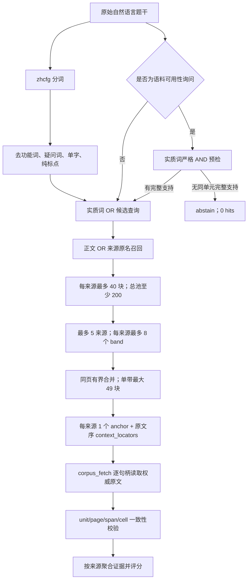

# M6 检索召回、证据完整性与负例拒答修复方法

日期：2026-09-23  
适用链路：`corpus_search → corpus_fetch → scoring` 真实注册工具路径

## 1. 修复目标与不可变条件

本轮处理三个连续但不同的问题：先让正确文档进入候选池，再让候选文档中的完整证据进入
取证结果，最后阻止“只有弱相关材料、没有实质答案”的查询被当成正例。

为避免通过改验收口径制造通过结果，本轮固定以下输入：

- 30 道冻结问题，其中 24 道可回答、6 道无答案；
- 金标、评分器、`top_k=5`、逐类 95% 门槛和 `max_false_positives=0`；
- 产品公开调用仍使用原始题干和默认 `limit=10`；
- 8 份活动来源不变；
- 生产逻辑不读取 `answer_existence`、`relevant_sources`、`evidence_targets` 或评分结果。

因此，下面的提升来自检索和取证实现，未通过修改题目、答案或阈值获得。

## 2. 如何诊断召回问题

### 2.1 先跑真实产品基线

第一步没有用手工关键词替代产品输入，而是把 30 道原始题干逐条送入注册的
`corpus_search`，再按返回句柄调用 `corpus_fetch`。基线结果如下：

| 配置 | 可回答题 QuestionPass | 可回答题 EvidencePass | 6 条负例误报 | 诊断含义 |
|---|---:|---:|---:|---|
| 原始题干、默认检索 | 0/24 | 0/24 | 0 | 查询约束过严，正例与负例一起归零 |
| r5d 显式 OR 诊断 | 22/24 | 17/24 | 6 | 放宽候选能恢复大部分正例，但弱相关负例也会进入 |
| 全内容词 OR、单锚点取证 | 24/24 | 13/24 | 6 | 文档召回已经解决，证据上下文仍不完整 |
| 全内容词 OR、有界证据区 | 24/24 | 24/24 | 6 | 同页上下文补齐后，证据问题独立关闭 |
| 最终产品路径、意图拒答开启 | **24/24** | **24/24** | **0** | 三个问题全部关闭 |

这里有两组性质不同的实验。`r5d 显式 OR` 是旧实现上的初步定位实验；后面三行是在新候选
路径上依次隔离“候选召回、证据区、负例判定”。它们用于定位因果，不把诊断查询冒充最终
产品结果。

### 2.2 做全文词元覆盖检查

对每道题先取 PostgreSQL `zhcfg` 词元，再扫描 8 份活动文档的完整文本，统计每份文档
覆盖了多少题面实质词元。这一步回答两个问题：

1. 是语料根本没有答案，还是答案存在但 SQL 没召回；
2. 相关文档是否会被另一份长文档的高频词压过。

`company-002` 是一个代表性样本：

| 文档 | 命中题面词元 | 覆盖率 | 是否金标相关文档 |
|---|---:|---:|---|
| 另一份公司报告 | 7/8 | 87.5% | 否 |
| 贵州茅台报告 | 5/8 | 62.5% | 是 |

正确报告的正文没有完整复述题面中的 `2026H1`、`2026Q2` 等写法，而文件名包含
“贵州茅台”。只对正文做全局排名时，错误来源反而更容易排在前面。这证明需要把来源原名
加入候选与排序，而不是继续提高正文关键词权重。

### 2.3 用单变量探针拆分三个故障层

诊断时每次只改一个变量：

1. **查询连接方式探针**：自然题干、显式 OR、实质词 OR；观察 QuestionPass。
2. **候选池探针**：正文候选、正文加来源原名、全局池、每来源限额池；观察正确来源是否进入。
3. **取证范围探针**：单命中块、选中 band、同页稀疏 band 合并；观察 EvidencePass 和缺失目标数。
4. **拒答探针**：关闭拒答、对所有查询严格拒答、只对语料可用性询问严格拒答；同时观察正例损伤和负例误报。

关键分层数据如下：

| 领域 | 全内容词 OR：QuestionPass | 全内容词 OR：EvidencePass | 缺失证据目标 | 加有界证据区后的 EvidencePass | 最终负例误报 |
|---|---:|---:|---:|---:|---:|
| company | 8/8 | 5/8 | 8 | 8/8 | 0/2 |
| industry | 8/8 | 5/8 | 8 | 8/8 | 0/2 |
| macro | 8/8 | 3/8 | 10 | 8/8 | 0/2 |
| 合计 | **24/24** | **13/24** | **26** | **24/24** | **0/6** |

这组数据说明：候选召回达到 24/24 后仍缺 26 个证据目标，所以 EvidencePass 低并不是
“搜索没找到文档”，而是“只取了文档中的一个相关性锚点，未取回锚点所属的完整证据区”。

## 3. 如何提高召回率

### 3.1 把自然题干转换成实质词 OR 候选查询

公开工具仍接收原始题干。服务内部用 `zhcfg` 分词，剔除功能词、疑问词、单字和纯标点，
再把剩余词元统一转换为带引号的 OR 查询。

实际样本 `company-004`：

```text
原始题干：光力科技2026—2028年股权激励的营业收入触发值和目标值各是多少？

内部候选查询：
"2026" OR "2028" OR "收入" OR "激励" OR "目标值" OR
"科技" OR "股权" OR "营业" OR "触发"
```

原始题干继续用于覆盖状态和拒答意图判断；OR 查询只用于扩大候选，不改变用户输入，也不
进入评分器。这一改动消除了自然问题被 PostgreSQL `websearch_to_tsquery` 当作近似 AND
查询时“一项附加词不存在就整题归零”的问题。

### 3.2 正文和来源原名共同召回

SQL 候选条件调整为：

```text
chunk.search_tsv 命中 OR source.original_names 命中
```

排序分数为正文 `ts_rank` 加两倍来源原名 `ts_rank`。明确点名公司、报告或证券机构时，
文件名信号可以把正确来源拉入候选池；没有点名来源时，正文相关性仍是主要信号。

### 3.3 防止长文档占满全局候选池

候选池使用三层约束：

| 层级 | 约束 | 作用 |
|---|---:|---|
| 单来源 SQL 候选 | 最多 40 块 | 防止一份长文档占满池子 |
| 服务内部候选池 | 至少 200 块 | 给后续跨来源选择留下空间 |
| 最终来源选择 | 最多 5 个来源 | 保持原 `top_k=5` 验收口径 |

来源先按该来源最高得分排序，来源内部再按分数、`build_id`、`chunk_id` 稳定排序。查询只连接
活动 publication 的 build，同一来源出现多个活动 build 会 fail-closed。

## 4. 如何保证证据完整性

### 4.1 从“一个锚点”改为“锚点加有界证据区”

搜索结果仍只为每个来源返回一个相关性锚点，以保持公开 `limit` 语义；同时增加
`context_locators`，列出该来源被结构选择器选中的原文序块。取证器必须逐个通过
`corpus_fetch` 获取权威原文，不能直接引用搜索 snippet。

band 选择约束保持固定：

| 参数 | 值 | 含义 |
|---|---:|---|
| `gap` | 1 | 相邻命中间最多容忍 1 个非命中块 |
| `expand` | 1 | 每个证据带两端各扩展 1 块 |
| `band_cap` | 8 | 每来源最多选择 8 个证据带 |
| `pool_cap` | 24 | 单带最多包含 24 个命中锚 |
| 可证单带最大宽度 | 49 块 | `(24-1)×(1+1)+1+2×1` |

同一非空 PDF 页上的稀疏 band 可以合并，但合并后仍必须满足 49 块宽度和 24 个池锚上限；
跨页 band 永不合并。这样能补齐表头、行名、列名和相邻说明，又不把整份文档无界返回。

### 4.2 保持权威原文顺序

相关性最高的锚点可能位于证据区中间。如果先取锚点、再取前后块，长句和表格会被重排。
现在 `context_locators` 按文档原始块序输出；观测器保留该顺序，并在同一来源内聚合文本。

### 4.3 对结构化 cell 做单元级验证

`corpus_fetch` 返回：

- 权威原文 `text`；
- 每个 `unit_id` 的页码；
- 每个 unit 在 `text` 中的精确 `start/end` span；
- 从权威 unit 网格派生的 `row/col/cell`。

cell 被接受前必须同时满足：

```text
cell.unit_id 存在
AND cell.page == unit.page
AND cell.text 位于该 unit 自己的 span
```

旧逻辑只检查 `cell.text` 是否出现在整个 chunk，值出现在相邻 unit 时也可能被错误归属。
新增测试把 cell 的 `unit_id` 故意改到同块另一 unit；旧检查会通过，新检查按预期拒绝。

## 5. 如何解决负例拒答

### 5.1 为什么不能对所有问题做严格 AND

24 道正例中 23 道包含“多少、如何、哪些”等疑问词，这些词通常不会出现在答案单元。
旧严格拒答对所有查询执行全词 AND，结果是 24/24 正例全部被拒绝。另一方面，完全关闭拒答
时，OR 候选会让 6/6 负例都返回弱相关文档。

### 5.2 先识别“语料可用性询问”，再严格判定

只有题面同时包含以下三类信号才进入严格拒答：

1. 语料主体：材料、报告、资料、语料、文档；
2. 可用性形式：能否、是否、有没有、能不能、可否；
3. 提供形式：给出、披露、提供、包含、记载、查到、找到。

普通研究问题直接走召回路径。语料可用性询问则把剔除疑问词后的实质词元组成严格 AND：

- DB 预检无命中：立即返回 `query_status=abstain`；
- DB 仍有命中：读取权威 unit，要求至少一个 unit 同时包含全部实质词元；
- 没有这样的 unit：拒答；存在则放行。

负例 `company-009` 的真实数据：

```text
题干：这六份开发材料能否给出光力科技2027年经审计的全年实际归母净利润（不是预测值）？
意图识别：语料可用性询问 = true
严格词元：2027、不是、全年、净利润、实际、科技、经审、预测值
结果：query_status=abstain，hits=0
调用：corpus_search 1 次，corpus_fetch 0 次
```

因此，拒答基于“同一权威单元能否支持请求事实”，而不是基于题目是否被金标标成负例。

## 6. 最终数据流



## 7. 一次真实正例调用展示

对 `company-004` 使用原始题干、默认 `limit=10`、拒答开启，实际得到：

| 指标 | 实际值 |
|---|---:|
| `corpus_search` 调用 | 1 |
| 返回来源 | 5 |
| 各来源 `context_locators` | 91、32、36、67、151 |
| `corpus_fetch` 调用 | 377 |
| 最终 QuestionPass | 通过 |
| 最终 EvidencePass | 通过 |

第一来源是正确的光力科技报告，锚点标题为“公告了新一期股权激励计划，其设定的
2026—2028 年的营业收入触发…”。其锚点位于证据区内部，但 `context_locators` 从文档前序
开始按原文顺序提供，避免重排证据。

这也暴露出一个性能特征：当前实现优先保证证据完整性，单题可能产生较多逐块 fetch。
每个公开 hit 的 context 有 400 个句柄硬上限，来源数仍受 `top_k=5` 限制；后续可以通过
批量 fetch 或在不降低 EvidencePass 的前提下压缩证据区来降低调用数。该性能优化不属于
本次 M6 正确性门，也没有被隐藏在通过结论中。

## 8. 验证与防回归

| 验证层 | 结果 | 覆盖内容 |
|---|---:|---|
| 最终 30 题产品链 | 24/24 QP，24/24 EP，0 FP | 原始题干、默认 limit、真实注册工具 |
| PostgreSQL authority 集成 | 12 passed | 自然问题召回、拒答、权威取证与版本身份 |
| PostgreSQL 搜索集成 | 11 passed | 正文/标题候选、活动 build、来源限额、稳定顺序 |
| 相关非 PG 测试 | 92 passed，5 skipped | 查询重写、band 合并、cell 单元归属、工具协议 |
| 全仓 pytest | 2961 passed，2 failed，17 skipped | 两项失败为既有市场时间夹具和旧 finance profile |
| 静态门 | 全部通过 | Ruff、Pyright、import smoke、symbol closure |
| 冻结链 | r5e + r5f 通过 | 产品验收与校验器 supersession |

机器可读数据：

- [最终产品汇总](../../.scratch/m6-retrieval-fix-20260923/product-summary.json)
- [最终逐题结果](../../.scratch/m6-retrieval-fix-20260923/product-raw-default-details.json)
- [全内容词 OR 诊断](../../.scratch/m6-retrieval-fix-20260923/all-lexeme-or-details.json)
- [有界证据区诊断](../../.scratch/m6-retrieval-fix-20260923/band-context.json)
- [8 份来源重建结果](../../.scratch/m6-retrieval-fix-20260923/rebuild-report.md)
- [M6 修复验收报告](../../.scratch/m6-retrieval-fix-20260923/report.md)

