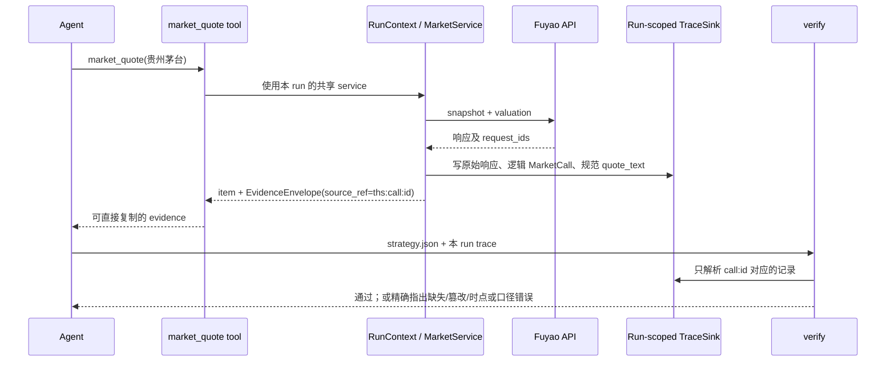

# 投研双数据链路优化报告：Claims × 同花顺

| 项 | 内容 |
|---|---|
| 状态 | **评审草案** |
| 日期 | 2026-09-12 |
| 目标 | 将“研报观点”和“市场实际”从两条并列取数链路，升级为可追溯、可比较、可被现实证伪的投研闭环 |
| 关联方案 | [D2 Claims 设计](./d2-claims-design.md) · [D2 Claims 优化改进执行计划](./d2-claims-optimization-plan.md) · [同花顺接入设计](./ths-market-data.md) |
| 本期边界 | 不把同花顺原始响应写入 `claims` 表；不在 market 模块内建设数据仓库；保留 market 取回即用的原则 |

## 1. 执行结论

Claims 抽取和同花顺工具接入各自已经形成了有价值的深模块：前者把非结构化研报转为带定位的
论断，后者把受治理的外部行情、财务和历史序列交给 Agent。当前缺的不是第三个数据源，而是把
两者放在同一**事实、时间与证据契约**下的连接层。

因此，项目当前状态应定义为：

> **两个数据源链路已完成；“研报预期 → 市场实际 → 策略验证/复盘”的闭环尚未完成。**

最先修复的不是指标算法，而是市场证据链的生产路径：每条市场 evidence 必须精确绑定本次 run
内的一次逻辑调用，不能只证明“同一股票的某次历史调用中出现过该数字”。闭环可信后，才接入
预期差与技术指标。

## 2. 现状与核心断点

```text
已完成的两条链路

研报文件 ──> blocks ──> D2 Claim ──> claims 表 / 块级审计
同花顺 API ──> MarketService ──> @tool 返回 ──> 策略卡 evidence

当前唯一交汇

data_coverage：判断“优先查研报”或“优先查市场”

尚未形成的连接

统一标的 ──> 统一指标 ──> 时间可比 ──> 精确证据 ──> 预期 vs 实际 ──> 复盘反馈
```

### 2.1 P0：市场证据链的生产路径与测试路径不一致

市场设计要求在 run 目录留痕，并以 `ths:<thscode>:<request_id>` 验证市场数字。代码中存在三个
需要优先确认和修复的断点：

1. [factory.py](../../plugins/market/factory.py) 将 `FileSink` 只传给 transport，却没有传给
   `MarketService`；而规范 `quote_text` 的聚合留痕由
   [service.py](../../plugins/market/service.py) 的 `_trace_quote()` 写出。生产工具路径因此可能没有
   `quote_text` 留痕。
2. 四个市场工具返回值没有携带 Agent 可直接复制的 `source_ref` 或逻辑调用 ID；模型不能可靠构造
   `ths:` evidence。
3. [trace_store.py](../../plugins/market/trace_store.py) 解析了 `request_id`，但解析后并未用于筛选；
   resolver 实际按 `thscode` 返回该代码的所有留痕。默认目录也不是 run 专属目录。

现有黄金测试通过直接给 `MarketService` 与 transport 注入 `FileSink` 验证，因此不能覆盖
`factory → tool → run trace → verify` 的真实运行路径。该问题应当被视为“设计已具备、生产接线待
闭合”，而非单纯测试不足。

### 2.2 P0：治理对象的生命周期过短

每一次 `market_resolve`、`market_quote`、`market_history`、`market_financials` 调用都会重新构造
service 与 transport。这会使缓存、单飞去重、熔断器、调用计数和 HTTP client 生命周期仅限于一次
工具调用，无法覆盖一整次 Agent 运行。

后果是：连续调用仍可能重复请求；限流后不会在下一次调用快速失败；可观测数据无法代表一次任务；
连接关闭责任不明确。

### 2.3 P0/P1：两条链路尚未共享可比较的领域语义

`data_coverage` 目前探测的是 corpus 检索覆盖和市场端点可用性，不读取 D2 claims，也没有把“EPS”
“营业收入”等研报指标映射到财务字段。因此它只能决定路径，不能回答：

- 某份研报对某期间的预测后来是否兑现；
- 当前价与目标价、预测盈利和估值是否在同一时点和口径下可比；
- 哪个机构、行业或指标的预测误差最大；
- 什么样的 claim 抽取错误会导致预期差结论失真。

## 3. 优化后的领域模型

不要合并原始数据表；需要的是一个轻量、只读的比较模型。

| 术语 | 定义 | 归属 |
|---|---|---|
| `Claim` | 研报中可以定位的事实、预测或观点；观点不一定可数值比较 | D2 corpus |
| `MarketObservation` | 供应商在特定端点、特定时点返回的实际观察值 | market run artifact / 工具返回 |
| `ComparableObservation` | 经过受控标的、指标、单位与时间映射后，可参与比较的数值投影 | 连接层，只读 |
| `MarketCall` | 一次逻辑市场动作；可包含行情和估值等多个供应商请求 | 单次 run |
| `EvidenceEnvelope` | 策略卡可直接引用的 `source_ref`、定位、原样 quote、时点和口径 | 工具返回 |
| `MetricMap` | 将 D2 标准指标映射到市场字段的受控规则 | 连接层配置/代码 |

### 3.1 统一标的和指标，而非统一原始记录

最小可比较投影应具备：

```text
ComparableObservation
  instrument_id       # 例如 600519.SH
  metric_id           # 例如 eps.basic / revenue.operating / net_income.parent
  value               # Decimal 或 NULL，禁止以 0 代表缺失
  unit + currency
  period_end          # 数值所属报告期
  known_at            # 决策当时是否已知
  observed_at         # 行情快照时点；非行情可为空
  source_kind         # corpus_forecast / corpus_fact / market_financial / market_quote
  provenance          # 文档块定位或 MarketCall 引用
```

时间字段必须分开：

| 场景 | 可比的时间语义 |
|---|---|
| 研报预测 | `period_end` 是预测期；`known_at` 是报告发布日期/预测时点 |
| 研报事实 | `period_end` 是事实期；`known_at` 是文档发布日期或原文明确时点 |
| 财务报表 | `period_end` 是报告期末；`known_at` 必须是 `report_date_ms`（披露日） |
| 行情/估值 | `observed_at` 是供应商快照时点；行情与估值各自保留自己的时点 |

任何历史验证均要求：`known_at <= 决策时点`。禁止用报告期末替代披露日，禁止把现价快照当作
历史决策时已经可知的数据。

### 3.2 首批只支持三项可控映射

先只建立并审计以下映射，禁止以 LLM 自由匹配所有财务指标：

| `MetricId` | claims 标准指标 | 市场字段 | 主要风险 |
|---|---|---|---|
| `eps.basic` | 每股收益 / EPS | `basic_eps`（以实际响应字段确认） | 单位“元/股”、稀释口径差异 |
| `revenue.operating` | 营业收入 | `operating_income` | 单位、合并范围、季度/年度混淆 |
| `net_income.parent` | 归母净利润 | 经确认的归母净利润字段 | 非归母/扣非/持续经营口径误配 |

每条 `MetricMap` 都必须声明：适用文档类型、别名、单位换算、允许期间、不可映射的反例及测试样本。

## 4. 优化后的完整流程图

```mermaid
flowchart TD
    subgraph Offline[离线语料链路：D2 与质量治理]
        A[研报/PDF 入库] --> B[Document 与 Block]
        B --> C{triage\n数字或评级信号？}
        C -- 否 --> C0[记录跳过原因]
        C -- 是 --> D[doc_kind 判定\n公司/行业/宏观]
        D --> E[LLM Claim 抽取]
        E --> F[确定性清洗\nDecimal、单位、期间、as_of、ticker]
        F --> G[claims + claim_block_runs\n同一事务]
        G --> H[语料审计\n覆盖、坐标、冲突、溯源]
        H --> I[可用的 Claim / MetricMap 候选]
    end

    subgraph Run[一次 Agent 运行：唯一 RunContext]
        J[用户问题 + 风险参数] --> K[创建 RunContext\nrun_id、MarketService、CircuitBreaker、Sink]
        K --> L[market_resolve\n得到 InstrumentId]
        L --> M[data_coverage\nresearch/market = available | absent | unknown]
        M --> N{覆盖度裁决}
        N -- unknown --> N0[说明覆盖未验证\n不把故障说成无数据]
        N -- 全部 absent --> N1[数据不足，不做判断]
        N -- 可继续 --> O[并行收集证据]

        O --> P[corpus_search / corpus_fetch\n读取原文与定位]
        P --> Q[Claim 查询与可比较投影]
        O --> R[market_quote / history / financials]
        R --> S[MarketCall\n逻辑调用ID + 供应商request_ids]
        S --> T[run 专属原始留痕\n+ 聚合 quote_text]
        T --> U[MarketObservation\n字段级 source、unit、currency、time]
        Q --> V[ComparableObservation]
        U --> V
        V --> W{可否按标的、指标、期间、known_at 对齐？}
        W -- 否 --> W0[保留为独立证据\n明确不可比较原因]
        W -- 是 --> X[Expectation vs Actual\n预期差、时效、反方证据]
        U --> Y[market_stats\n均线、波动、回撤等确定性计算]
        X --> Z[研究判断]
        Y --> Z
        Z --> AA[position_sizing]
        AA --> AB[strategy_lint]
        AB --> AC[策略卡 + report]
        AC --> AD[verify]
        AD --> AE{三类校验}
        AE --> AF[Corpus：原文定位与 quote]
        AE --> AG[Market：精确 MarketCall 引用\nrequest_id 集合、quote、时点、口径]
        AE --> AH[Arithmetic / schema\n计算来源、前视偏差、复权一致]
        AF --> AI{通过？}
        AG --> AI
        AH --> AI
        AI -- 否 --> AJ[修正、补证据或明确降级]
        AJ --> Z
        AI -- 是 --> AK[输出可审计策略卡]
    end

    subgraph Feedback[复盘与反馈：不必由 market 模块落库]
        AK --> AL[后续披露的实际财务 / 市场表现]
        AL --> AM[预期兑现与误差分析]
        AM --> AN[反哺 MetricMap、别名、doc_kind、triage 与提示词]
        AN --> H
    end
```

### 4.1 市场调用的精确留痕流程



## 5. 分阶段优化任务

### P0-A：闭合真实市场证据链

- [ ] 引入 run 专属 `MarketRunContext`，在一次运行中共享 `MarketService`、transport、sink、熔断器和计数器。
- [ ] 同一个 sink 同时注入 transport 与 `MarketService`；运行结束统一关闭 HTTP client。
- [ ] 将 `MarketCall` 写为结构化 run artifact，记录逻辑调用 ID、端点、规范化参数、全部供应商 `request_id`、响应哈希和生成的 `quote_text`。
- [ ] 四个市场工具返回可直接写入策略卡的 `EvidenceEnvelope`；Agent 不再手写 `ths:` 引用。
- [ ] `resolve_market_source()` 必须按逻辑调用 ID 精确匹配，不得忽略 request ID 或跨 run 搜索。
- [ ] 留痕写入失败必须显式返回 `trace_status=unverified`；strict 模式下，引用该市场数值不得通过硬闸。

**验收**：通过真实 tool registry 发起 `market_quote`，再生成策略卡并调用 `verify`；正确 evidence 通过，
同标的另一 run 的 evidence、错误 call ID、篡改 quote 均必须失败。

### P0-B：建立比较语义，不建立混合数据表

- [ ] 定义 `InstrumentId`、`MetricId`、`MarketObservation`、`ComparableObservation` 的接口及不变量。
- [ ] 明确 `period_end`、`known_at`、`observed_at`、`retrieved_at` 的定义和使用场景。
- [ ] 实现并测试首批三项 `MetricMap`；无映射、单位不明、口径冲突一律返回“不可比较”。
- [ ] Claim 的 `opinion` 不参与数值比较；保留为研究论证和反方证据。

**验收**：对同一公司、同一财年，能列出“预测、实际、差值、预测当时可知时间、实际披露时间、双方证据”；
任何时间穿越或单位冲突均被拒绝。

### P1-A：完成最小“预期 vs 实际”纵切

- [ ] 新增只读查询/工具：指定公司、指标、期间，返回全部可比预测、实际值、差值及不可比较原因。
- [ ] D4 聚合成熟前，先按“单机构、单文档、单指标、单期间”展示；不得伪装成市场一致预期。
- [ ] 引入机构去重、发布日期切片与最新预测选择规则后，再输出共识和离散度。
- [ ] 把预期偏差结果作为 D2 审计输入，识别指标别名、单位和期间抽取错误。

**验收**：至少三份真/脱敏研报 fixture 覆盖正确兑现、预测偏高、口径不匹配三种结果。

### P1-B：让市场-only 路径可观察且可重算

- [ ] 实现 `market_stats`：区间高低、MA5/20/60、年化波动率、最大回撤。
- [ ] 返回输入 bars 的调用引用、复权口径、计算窗口、公式版本、`computed_by`。
- [ ] `verify` 对市场衍生量按相同输入和公式重算；仅声明 `computed_by` 不足以防算错。

**验收**：无研报但有行情时，Agent 可生成带确定性技术指标和来源的报告；模型自行计算指标的策略卡被拦截。

### P1-C：提高可用性与运行事实表达

- [ ] `data_coverage` 改为 `available / absent / unknown` 三态；失败不可伪装成“无数据”。
- [ ] 市场 quote 分别保留行情与估值的时点、端点与 request ID；禁止以行情时点覆盖估值时点。
- [ ] 数值使用 `Decimal` 或明确的原始文本 + 数值投影；返回字段带 unit、currency、source。
- [ ] 定义 run artifact 的访问权限、保留期限、清理策略和供应商数据合规约束；“不是数据库”不等于“不需要生命周期治理”。

### P2：D2 质量加固与反馈闭环

- [ ] 按 [D2 Claims 优化改进执行计划](./d2-claims-optimization-plan.md) 完成纯评级召回、原文证据、分类理由、坐标 lint、表格期间锚定和长块压缩。
- [ ] 对预期差结果抽样回链：错误是研报预测失误、claim 抽取错误、MetricMap 错误，还是市场口径错误。
- [ ] 只把确认后的反馈写入别名、映射或分类规则；不得用单个案例扩张成全局字符串规则。

## 6. 验证矩阵

| 层级 | 必须验证的场景 |
|---|---|
| Provider contract | 响应字段、`null`、错误码、端点参数、时间戳变化；CI 使用固定响应，受控环境可跑 live smoke |
| Market runtime | 同一 run 缓存/熔断生效；不同 run 不串留痕；运行结束关闭 client |
| Evidence | 正确逻辑调用通过；错误调用 ID、跨 run、篡改数值、缺失留痕均失败 |
| Time semantics | 财报披露日前不可被历史决策使用；行情和估值不同时间不得伪装为同一快照 |
| Metric mapping | 三个首批指标的别名、单位、期间、反例与不可比较理由 |
| End-to-end | `tool registry → strategy.json → verify`；而非只测试直接构造的 service |
| Claims regression | 纯评级、行业/宏观分类、表格期间、JSON 截断、单位/负号、`as_of` 回填 |

## 7. 明确不做的事

- 不将同花顺原始 API 响应伪装成研报 claim，也不把其写入 `claims` 表。
- 不以 LLM 自由文本判断财务字段是否等价；映射必须受控、可测试、可拒绝。
- 不在证据链闭合前，把市场工具的单元测试通过等同于真实投研流程已可验证。
- 不因需要复盘就立即引入市场数据库；先以 run artifact 和只读比较模型验证需求。
- 不把供应商暂时失败、无权限或语料库不可达描述成“确定没有数据”。

## 8. 完成定义

当且仅当以下条件同时成立，才将双数据链路标记为“完成闭环”：

1. 每一条市场证据可精确定位到**本 run 的本次逻辑调用**，篡改或串 run 必然失败；
2. 每一条可比较的研报预测与市场实际都具备统一标的、指标、单位、期间和 `known_at`；
3. 系统能输出“可比较结果”或“不可比较原因”，绝不静默猜测；
4. 预期差、市场技术指标和仓位计算均有确定性来源，并可离线复核；
5. D2 的质量审计能接收复盘反馈，避免错误数据持续进入后续结论。

届时，系统的核心能力将不再只是“查到研报、查到行情”，而是：

> **在当时可获得的信息下形成判断，并在后来用实际结果与可追溯证据检验它。**
