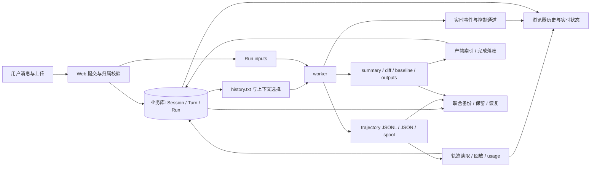

# Web 存储链路全面复核记录

| 项 | 内容 |
|---|---|
| 状态 | 有效审核记录 · 已执行隔离检查，未修复/未迁移 |
| 日期 | 2026-09-29 |
| 范围 | Web 输入、业务库、执行文件、回放、文件读取/回滚、生命周期及部署配置 |
| 关联 | [修复报告 v1.4](web-runtime-trace-repair-report.md)；[21 项任务](../../.scratch/web-runtime-trace-hardening/spec.md)；[环境准备与执行边界](web-storage-validation-environment.md) |
| 基线 | 当前非干净工作区；本轮记录时 HEAD `1770155a9c1227562a31044c8ca9fbcfee37e2c7`；上轮报告基线不同，核验文件哈希见 [source-manifest.json](../../.scratch/web-runtime-trace-hardening/audit/source-manifest.json) |

## 结论

目录移出源码树仍是必交付项，但单独迁移不能修好整条存储链路。本轮补充 F15—F21，
并将多个此前静态发现提升为隔离可复现缺陷。多用户上线优先阻断 F08 会话归属问题；
迁移前必须核定实际部署，补齐与迁移相关的可信路径、恢复和备份清单；
不把全部消息/模型/前端修复一律设成目录迁移前置。具体门槛见环境准备方案。

本轮使用 diagnosing-bugs 的隔离复现方法。只修改报告、任务和审计脚本，没有修改运行代码，
没有启动真实 worker、调用模型、连接业务数据库、读取用户轨迹正文或迁移数据。
测试 wrapper 禁止网络连接与子进程，使用临时 SQLite、目录和合成用户；HTTP 通过 ASGI 进程内调用。
前端验证执行实际 TypeScript 方法，但响应式环境/HTTP 为替身，不冒充真实浏览器验收。
另只读查看 Docker 容器名称和目录权限元数据，未读取容器环境变量、密钥或数据库内容。

## 存储与读取关系



数据库拥有业务身份和状态，轨迹拥有已记录的运行过程；文件存在、DB 终态、消息回填、
产物可读与用量完成必须分别核验，不能由其中一个信号推断其余全部完成。

## 覆盖矩阵

| 层/资产 | 写入与读取路径 | 本次结果 | 后续验收 |
|---|---|---|---|
| 会话归属、Run 准入 | submit → ensure_session/create_run → history | F08 双用户 ASGI 复现；读取外部 Run 的 404 保护通过 | 默认会话、删除状态与 PG 约束 |
| 用户消息与顺序 | append_turn → MAX(seq)+1 → list_turns | F14 未来消息污染、F16 并发重复 seq 复现 | 事务重试、跨进程并发 |
| 模型/启动快照 | 默认连接 → worker；Run 快照/started_at | F20 快照缺失、状态仍 queued 复现 | 配置变更/fallback 与执行快照一致 |
| 输入上传 | multipart → run/inputs → prompt_addendum | F12 批次失败遗留复现；无模型调用 | 总量、取消、同名与故障补偿 |
| Run 根与文件定位 | config/run_dir_for → 多路读取/控制 | F01 UUID 变体复现；默认仍源码树 | 迁移、权限、卷与完整恢复 |
| worker 工作区与临时文件 | 环境目录 → ws/outputs、spill、run | 源码核对；native 权限未做攻击验证 | 身份/挂载、只读输入、跨 Run 隔离 |
| 轨迹 JSONL/JSON/spool | observer → relay/usage/历史详情 | F04 ID 丢失复现；F06 流式/磁盘故障契约仍需验收 | SIGKILL、ENOSPC、半行、格式兼容 |
| summary/diff/完成记录 | worker 文件与 stdout → 多次 DB 提交 | F15 恢复消息/索引缺失、重复终态写入复现 | 提交各边界故障、幂等与原子文件 |
| 轨迹接口/敏感字段 | /trace 与 SSE 脱敏出口 | F03 合成凭据在 trace 原样返回 | 嵌套字段、错误、diff/导出等全出口 |
| SSE 游标/结束 | live 队列 + trajectory tail → client | F09 迟订阅不结束、steer 游标混用复现 | 一行多事件断线、终态排空、重启 |
| 前端视图/用量 | store applyEvent/reconcile | F10/F11 共 4 个实际源码方法失败断言 | 真浏览器重连、切换与长历史体验 |
| 产物与基线 | scan/hash → artifacts；revert → 文件 | F17 根/基线链接越界、F18 哈希陈旧及绝对路径回滚失败复现 | inode 竞态、索引版本、迁移后回滚 |
| 数据库 schema/约束 | Alembic/ORM；SQLite WAL/FK | 空库迁移表列匹配通过；外键未启用复现 | 生产 PG 迁移/并发及历史坏数据 |
| 就绪与异常 | lifespan/init/reconcile → healthz | F19 无存储就绪信号复现 | 错版本、只读卷、磁盘满、DB 断连 |
| 审批与用户纠正 | stdin / in-memory gate/inbox → SSE | F21 源码确认，未做完整动态恢复测试 | 采用状态、待审批恢复、下一轮事实 |
| 镜像/部署卷 | Docker COPY/ignore/VOLUME/Compose | F02 静态确认；当前 Docker 仅见 corpus-db、pg，无 Web API 容器 | 合成 sentinel 镜像构建、真实挂载 |
| 删除/保留/备份 | soft-delete + 文件与 DB 独立存储 | F07 运维闭环未验收，不能断言外部无备份 | 联合恢复、活动 Run、密钥与保留边界 |


## 可重复执行的证据

| 检查 | 结果 | 证据 |
|---|---|---|
| 后端新增契约检查 | **24 个：21 失败、3 通过** | [源码](../../.scratch/web-runtime-trace-hardening/audit/test_storage_chain.py)、[结构化结果](../../.scratch/web-runtime-trace-hardening/audit/audit-results.json) |
| 前端源码行为检查 | **5 个：5 失败** | [脚本](../../.scratch/web-runtime-trace-hardening/audit/frontend-audit.mjs)、[结果](../../.scratch/web-runtime-trace-hardening/audit/frontend-results.json) |
| 已有相关回归测试 | **57 通过、5 未选入** | [结果](../../.scratch/web-runtime-trace-hardening/audit/baseline-results.json) |

失败断言证明当前路径不满足所写的期望契约；其中包含已规定功能的缺陷，也包含新增的恢复/
可观测性目标。须按代码事实、隔离复现、真实环境复现和目标契约分别归类，
不能把每个失败都直接称为已确认生产故障，或未经契约核定就列为强制修复。
24+5 个检查不是 29 个独立缺陷，多个检查映射同一 F 编号。3 个正向项是外部 Run 读取拒绝、
产物子路径越界拒绝、空 SQLite 经 Alembic 升级后表列与 ORM 匹配。
已有测试覆盖常规行为；其中部分测试容许未关联实体写入或将缺失用量视为零，
因此“57 通过”不抵消本轮发现。

在仓库根运行（使用现有虚拟环境，不安装依赖）：

```bash
.venv/bin/python .scratch/web-runtime-trace-hardening/audit/run_audit.py
node .scratch/web-runtime-trace-hardening/audit/frontend-audit.mjs
.venv/bin/python .scratch/web-runtime-trace-hardening/audit/run_audit.py \
  --audit-report baseline-results.json \
  tests/test_history_t26.py tests/test_orphan_run_reconcile.py \
  tests/test_artifacts_t29.py tests/test_usage_t211.py \
  tests/test_upload_t210.py tests/test_web_p2_diff.py \
  -k 'not worker and not scans_outputs_and_downloads and not metered_from_trajectory and not reaches_agent'
```

本机 Node 使用 `/home/administrator/.nvm/versions/node/v24.21.0/bin/node`。
本机非交互 WSL PATH 未找到 uv，故使用既有 `.venv/bin/python`，未安装/更新依赖。
脚本默认只收集本次 audit 文件，不进入常规 CI；两条 audit 命令当前预期非零退出，供后续修复逐项转绿。
结果中故障路径与密钥样例均为临时/合成值。

检查过程中曾因 wrapper 参数仅有选项而误收集默认测试，已主动中断并修正目标选择；
[中断记录](../../.scratch/web-runtime-trace-hardening/audit/interrupted-run.json)不计入上述结果。
隔离及禁止网络/子进程保护在该次运行同样生效，真实 worker 启动被阻止。

## 重点失败事实与定位

- F08：B 向 A 会话提交得到 202，A 会话增加 1 条 B 消息；查询外部 Run 的 404 测试仍通过。
- F01：相同 Run 的 hex ID 返回记录，带连字符 ID 返回空记录。
- F03/F04：合成凭据原样出现在 trace；供应商调用 ID 变为 `call_1_0`。
- F09：完成后订阅无法结束；实际 SSE 客户端把 steer 的 10 当作轨迹游标。
- F10/F11：完整回放后文本仍为 `com`；usage 可得到 0 而非 10，或 20 而非 10；A 摘要污染 B。
- F12/F14：被拒批次留下 1 个文件；A 的历史出现尚未执行的 B 消息。
- F15：恢复后会话消息 0 条，产物索引 0 行，用量为空；终态重复生成 2 条助手消息；队列失败只处理首项。
- F16：并发 seq 出现重复；SQLite 外键状态为 0。重复分布随调度变化，不能依赖固定序列值。
- F17：产物根链接被接受；回滚将外部合成基线复制到 outputs，普通子链接拒绝仍有效。
- F18：回滚成功但哈希未变；合法绝对快照路径被回滚器拒绝。
- F19：将数据库探活替身设为失败，healthz 仍为 200/ok；未断开真实 DB，证明的是就绪信号缺口。
- F20：模型快照空；处理合成 run_started 帧后 DB 仍 queued、started_at 空，未启动真实 worker。
- F21：目前为源码证据；控制动作完整恢复与各轨迹格式的保留范围需要专门测试。

## 迁移前的闭环要求

1. 先复用原环境核实服务身份、有效配置、数据目录/挂载及备份；F08/F17 按相关测试边界处理。
2. F15/F18 中影响迁移的恢复与相对定位/索引必须有验证方案；F16/F20 可并行推进，
   不把数据库约束重构和模型快照一概列为迁移前提。
3. F01 盘点旧目录及数据库引用、停写或排空、备份、dry-run、校验后切换；处理 diff/base、
   manifest、outputs_baseline、messages.spool 等容易遗漏的文件，不能只搬轨迹 JSONL。
4. F02 排除镜像；F19 校验数据目录、schema 就绪；F07 在独立环境恢复库、文件和所需密钥。
5. 验收旧 Run、新 Run、上传、下载、回滚、回放、用量和下一轮历史，并记录切换后新数据的回退办法。

## 未覆盖或未获生产证据的部分

> 后续执行准备核查补正：Docker 中没有 Web API 容器，不代表本机没有运行 Web 服务。
> 已只读验证 `127.0.0.1:8000/healthz` 为 200、`/openapi.json` 标识为
> FrontierAgent 投研平台 0.1.0，`127.0.0.1:5173/` 返回投研 Agent 平台页面。
> 这些只证明服务可访问；没有提交真实 Run、验证其数据库/模型连接，也没有证明当前进程加载的
> 代码与工作区一致。此前检查仅到容器清单，环境核查不完整，此处明确补正。

- PostgreSQL 实例的 schema、锁、RLS、约束、备份任务和恢复演练未检查，避免以测试连接触碰业务库；
  本次 SQLite 验证不能代替 PG 验收。
- 当前 Docker 名称清单仅有 `corpus-db` 与 `pg`，未看到 Web API 容器；不能核验 Web 实际卷、
  重建和重启后的数据存活。未构建镜像，不宣称已证明历史镜像泄露。
- 目录元数据显示本地 `server/runs`、`uploads` 为 755；没有读取内部用户文件权限/正文，
  不能据此推出所有文件都公开，也不能推出服务多租户隔离成立。
- 未做真实断电、SIGKILL worker、ENOSPC、文件系统 IO 故障、TOCTOU 攻击或容量压测；
  部分故障注入在函数/ASGI 边界完成，不等价于整机验收。
- 未做真实浏览器视觉/交互测试；未验证未暴露工具能否创建 F17 所需链接。F17 是已验证的
  服务端边界弱点，远程可利用条件需结合 native 身份/工具准入另验。
- 价格监控、账户事实版本、业务快照仍属待建设需求；其存储模型必须遵循本报告修正后的契约。

本次完成的是全链路代码审查与有边界的动态复核，不是生产可靠性签收。

## 后续真实链路验证的执行准备

此前将整套隔离栈列为统一前提，现已纠正；唯一执行准备口径见
[环境准备与执行边界](web-storage-validation-environment.md)，不在此维护第二份环境清单。

顺序改为：E0 复用现有环境只读核验 → E1 专用测试账号走正常真实链路 →
按需 E2 同 PG 实例独立测试库/第二 API → 仅实例故障采用 E3 独立实例/卷 →
相关验收通过后 E4 在原部署正式切换存储。

新端口不等于隔离；第二个 API 不能连接原业务库，否则启动恢复可能误标其他进程的活跃 Run。
父子进程配置、PG 版本/库、前端代理、模型来源和清理清单必须核定；
原 SQLite 审计命令不能作为 PG/真实 worker 验收入口。
基础设施可用不代表配置与真实冒烟已经通过。本轮纠正方案，没有新建实例、重启服务或迁移数据。
