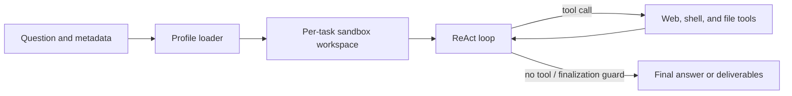

# Stateful ReAct Agent

`stateful-react-agent` runs one ReAct agent in a per-task workspace. It is the
default pipeline for the single-agent benchmark families, including research and
file benchmarks. It supersedes the removed `react_base` workflow while retaining
web research, mounted-input inspection, and persistent deliverables under
`/outputs`.

## Architecture



The workflow uses the shared `run_agent_loop` kernel with stateful observers for
wall-clock enforcement, context compaction, repeated-text detection, stuck-target
handling, and final-answer recovery. A no-tool assistant response is terminal.

## Experimental terminal semantic queries

The terminal `react` mode defaults to the unchanged `tui` workflow profile.
Explicitly selecting `REACT_WORKFLOW_PROFILE=tui-semantic` in a new process derives
its tools from `tui` and adds the read-only `corpus_semantic_query`; terminal
profiles do not maintain a second tool list. The workflow also binds the
`corpus_submit_manifest` companion, retaining `corpus_fetch` for source fallback.
Set `CORPUS_STRUCTURED_ROOT` to an explicitly approved, published store visible
from the research process. Querying never performs extraction or repairs.
Explicit caller `agent_tools` overrides are applied last, including a narrowed
allowlist; choosing the experiment must not silently re-add a removed tool.

The experiment refuses an existing writable store **before the first model
request**. A `0600`/`0444` file mode is not sufficient for a same-user researcher:
the owner could change permissions or replace files. Run the entire research
process with a read-only store mount and no writable aliases, not merely its
shell tools. Writable nested mounts are rejected as well. Missing root
configuration or an unavailable path retains the existing source-fallback path.

Before handing off the store, the writer must call
`plugins.corpus.structured.store.prepare_readonly_access(store_root=...)` after
its publication/retirement connections have closed. This prepares SQLite WAL/SHM
sidecars; it neither changes business rows nor freezes the index with
`immutable=1`, so subsequent withdrawals remain visible. Repeat preparation after
later writer mutations before resuming readers. Missing sidecars fail closed;
the reader does not create them on the writer's behalf.

A Linux launcher can use bubblewrap with `/` bound read-only, only the separate
research workspace bound writable, a fresh PID namespace and `/proc`, and the
approved store explicitly bound read-only after all writable bindings. Then run
the installed `frontier-agent --native --mode react --cwd <research-workspace>`
inside that outer boundary. The inner `native` mode is not itself the boundary.
Container read-only volumes with equivalent alias restrictions also work. The
launcher must never expose another writable path to the same store.

Complete semantic evidence confirmed in the actual model request can support the
report without another fetch. Missing dependencies, inaccessible stores and stale
publications must produce a gap, a fresh query, source fallback or a revised
conclusion; final A4 verification still applies. `A4_ENFORCE=1` adds the existing
user-visible downgrade for unverified reports; observe mode records verification
without changing the answer. Neither mode makes an unverified report verified.

`tests/test_corpus_structured_react_replay.py` exercises formal publication in a
writer process and a fresh `TerminalSession` research process with synthetic
provider responses and network/model/production-database denial guards. The
research child runs under bubblewrap with a read-only host tree, writable research
cwd, and separate PID/network namespaces. Tests fail if bubblewrap is unavailable
(no native fallback or silent skip). Actual `bash` tool probes verify that index,
sidecars, manifests and objects cannot be opened for writing, directories cannot
receive new files, and permissions cannot be changed. A separate external writer
performs the controlled withdrawal; the researcher cannot become a writer.
Optional tokenizer downloads are disabled at their external transport boundary;
the real token estimator uses its existing offline fallback on a cache miss.
These tests establish **replay wiring and this store's read-only boundary**, not
live-model quality or a general security certification of native mode.
Starting the normal terminal still calls the configured main model: live trials
require their own approved model, source scope and budget.

## Loop guardrails

Three profile keys arm the reasoning-runaway watchdog; absent or `0` leaves each
one off.

| Key | Shipped value | Effect |
|---|---:|---|
| `reasoning_only_timeout_s` | 120 | Abort a streamed reply that has produced only reasoning for this long |
| `reasoning_only_max_tokens` | 16384 | Abort it at this many estimated reasoning tokens |
| `logical_call_timeout_s` | 900 | Bound one logical LLM call across admission wait, every physical attempt, and retry backoff |

Setting either `reasoning_only_*` key puts the loop on the streaming request
path, which is the only place the watchdog can see reasoning arrive. Protocols
that never stream (`anthropic`, `responses`, `bedrock`) ignore all three; the
post-hoc reduced-cap resample remains the floor there.

Repetition stop-loss is observer-side:

| Observer | Signal | Action |
|---|---|---|
| `DuplicateQueryRollbackObserver` | A `web_search` request already executed in this loop **and returned content** | Pops the turn before the search runs and re-samples, without spending a `max_turns` slot. Never pops a batch carrying a terminal tool |
| `RepetitionGuard` | Consecutive turns with byte-identical tool calls | Hint at 3; stop at `stop_after` where stopping is affordable |
| `TextRepetitionGuard` | Near-verbatim assistant prose across turns | Hint, then stop where stopping is affordable |

`RepetitionGuard` is the only one of the three that can end a loop whose
repetition lives entirely in the tool channel: the rollback's budget expires
into permanent let-through, and `TextRepetitionGuard` needs visible prose,
which a `thinking_format: tag` model does not produce while looping. Its
`stop_after` is therefore enabled wherever a truncated run is recoverable.

The reasoning token cap is load-invariant; `reasoning_only_timeout_s` is wall
clock and its token-equivalent shrinks as endpoint concurrency rises. Trust
the token cap when tuning.

## Profiles

| Profile | Compaction | Tool-result retention | Model configuration |
|---|---|---:|---|
| `simple` | Off (deterministic keep-last) | Last 5 | `OPENAI_*` |
| `benchmark` | Tiered, spill off | Last 5 before summary | `OPENAI_*` |
| `tui` | Tiered | Last 5 | `OPENAI_*`, aligned web tools, task board |

`simple` only blanks old tool-result bodies and never summarizes conversation
history. `benchmark` adds tiered LLM summarization under context pressure but
keeps filesystem spill disabled for comparable runs. `tui` additionally enables
session-scoped spill for product resilience.

The retired names resolve to these: `keep5` → `benchmark` and `Apodex1.1-solve`
→ `tui` are plain renames. `default` → `simple` additionally restores
`keep_last_k: -1`, the retained-everything behaviour the `default` profile had,
so the benchmark commands still pinned to `--profile default` keep measuring
what they measured before the consolidation. Pass `--profile simple` for the
last-5 retention.

## Run

```bash
uv sync --extra eval --extra sandbox --extra document-readers
cp .env.example .env

uv run python -m benchmarks.public.runner.run_subprocess \
  --benchmark browsecomp --pipeline stateful-react-agent \
  --profile simple --limit 1 --concurrency 1 \
  --out ./results/stateful-smoke
```

For file tasks:

```bash
uv run python -m benchmarks.public.runner.run_subprocess \
  --benchmark officeqa --pipeline stateful-react-agent \
  --profile benchmark --fs-mode --limit 1 --concurrency 1 \
  --out ./results/officeqa-smoke
```

The runner mounts benchmark inputs read-only at `/inputs`, gives the agent a
per-question `/workspace`, and preserves `/outputs` for grading when the benchmark
requests deliverables.

## Sandbox modes

`SANDBOX_BACKEND=auto` selects bubblewrap when available and otherwise fails with
setup guidance. `bwrap` requires Linux user namespaces. `container` is only safe
when FrontierAgent already runs inside an isolated task container; it must not be
used as an unisolated host fallback. See [framework sandboxing](../../docs/framework.md#sandboxing).

Set `REACT_NO_WEB=1` to remove web tools and `BASH_ALLOWLIST_MODE` to override the
profile's shell command policy. Authorization and sandbox failures are fail-closed.
